# KS0399 KS0400 KS0401 Keyestudio 37 in 1 Sensor Kit V2.0 for Arduino

# 1. Introduction

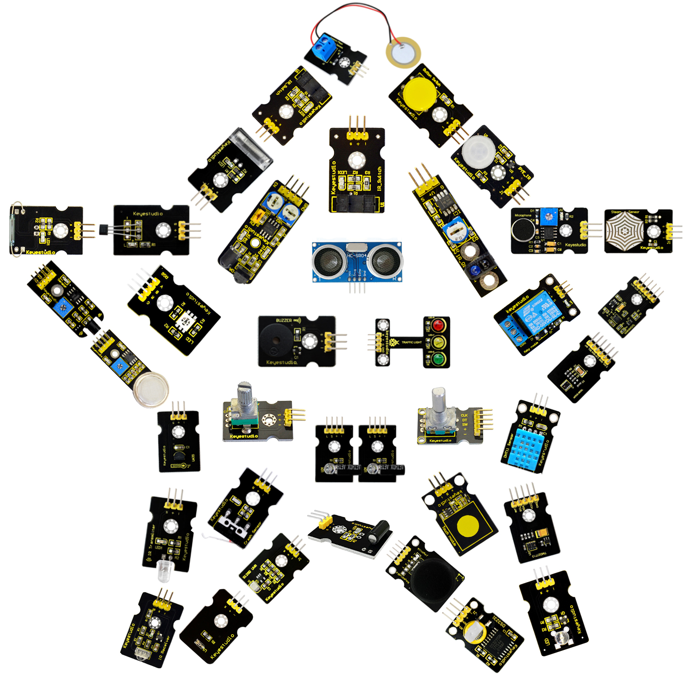

This is a 37 in 1 sensor learning kit for Arduino, rolled out by Keyestudio.

Inside this kit are digital/analog sensors, as well as some special modules such as ultrasonic module, joystick, relay module and acceleration modules, etc.

For each module, we provide a clear connection diagram and a sample code. Although you are a beginner, you can readily pick up how sensors work.

The sample codes for this sensor kit are based on Arduino. In addition, you have an alternative to apply this kit to other MCU development platform, such as 51, STM32, Raspberries Pi since the working principle is almost same.

Now, let’s start from the basic lessons.

# 2. Kit List 

**(Note: KS0399 kit with no board; KS0400 kit with V4.0 R3; KS0401 with 2560 MEGA R3)**

| **No.** | **Item**                                                     | **Quantity** | **Picture**                                                  |
| ------- | ------------------------------------------------------------ | ------------ | ------------------------------------------------------------ |
| 1       | White LED module                                             | 1            | 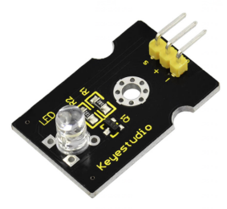 |
| 2       | RGB LED module                                               | 1            | 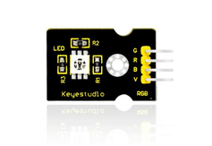 |
| 3       | Traffic light module                                         | 1            | 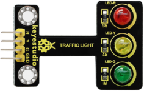              |
| 4       | Button switch module                                         | 1            | 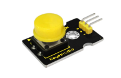              |
| 5       | Passive buzzer module                                        | 1            | 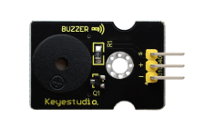              |
| 6       | Capacitive touch module                                      | 1            | 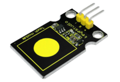              |
| 7       | Crash sensor                                                 | 1            | 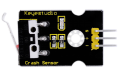              |
| 8       | Knock sensor                                                 | 1            | 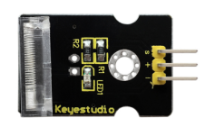              |
| 9       | Photo interrupter module                                     | 1            | 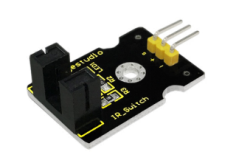              |
| 10      | Ball Tilt switch sensor                                      | 1            | 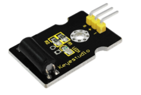              |
| 11      | PIR motion sensor                                            | 1            | 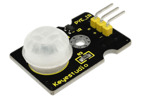 |
| 12      | Reed switch module                                           | 1            | 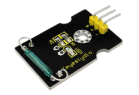 |
| 13      | Hall magnetic sensor                                         | 1            | 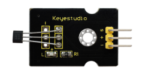              |
| 14      | Line tracking sensor                                         | 1            | 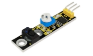                                       |
| 15      | Flame Sensor                                                 | 1            | 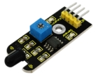                                       |
| 16      | Obstacle avoidance sensor                                    | 1            | 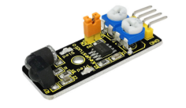              |
| 17      | Photo-resistor sensor                                        | 1            | 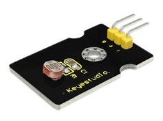 |
| 18      | Microphone sound sensor                                      | 1            | 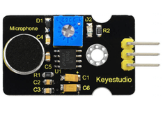 |
| 19      | Rotary encoder sensor                                        | 1            | 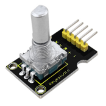              |
| 20      | MQ2 gas sensor                                               | 1            | 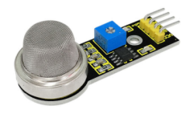              |
| 21      | Steam sensor                                                 | 1            | 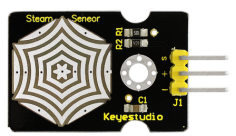              |
| 22      | TEMT 6000 sensor                                             | 1            | 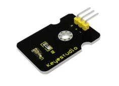             |
| 23      | LM35 temperature sensor                                      | 1            | 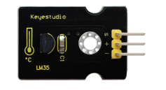              |
| 24      | DHT11 Temperature and Humidity Sensor                        | 1            | 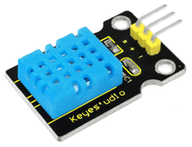 |
| 25      | Magical light cup module                                     | 2            | 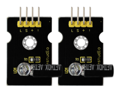              |
| 26      | IR receiver module                                           | 1            | 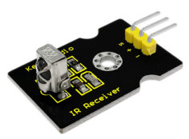              |
| 27      | IR transmitter module                                        | 1            | 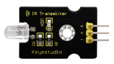              |
| 28      | Ceramic vibration sensor                                     | 1            | 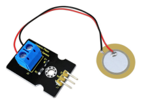              |
| 29      | GUVA-S12SD 3528 Ultraviolet Sensor                           | 1            | 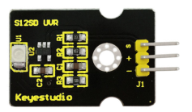              |
| 30      | MMA8452Q Module Acceleration Tilt Sensor                     | 1            | 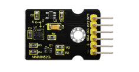              |
| 31      | TMD27713 sensor ALS Infrared LED Optical Proximity Detection Module | 1            | 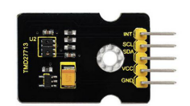              |
| 32      | APDS-9930 Attitude Sensor Module                             | 1            | 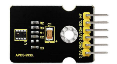              |
| 33      | Potentiometer sensor                                         | 1            | 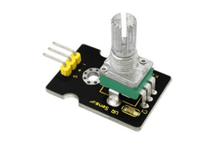 |
| 34      | DS3231 Clock module                                          | 1            | 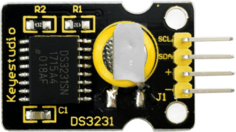 |
| 35      | Joystick module                                              | 1            | 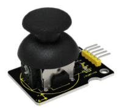              |
| 36      | Single relay module                                          | 1            | 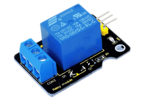 |
| 37      | HC-SR04 ultrasonic sensor                                    | 1            | 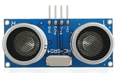 |

**KS0400 kit includes:**

|      | USB Cable                   | 1    | 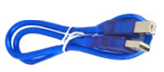              |
| ---- | --------------------------- | ---- | ------------------------------------------------------------ |
| 1    | keyestudio V4.0 BOARD       | 1    | 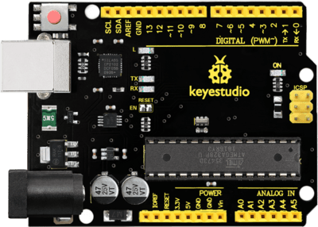 |
| 2    | Dupont Line                 | 40   | 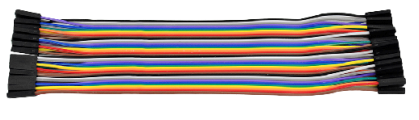              |
| 3    | Keyestudio Sensor Shield V5 | 1    | 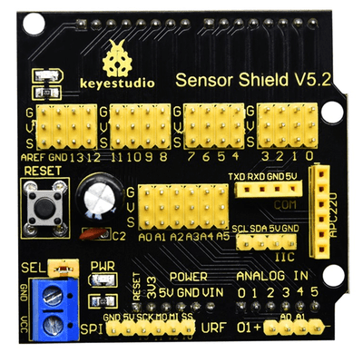 |

**KS0401 kit includes:**

|      | USB Cable                     | 1    |   |
| ---- | ----------------------------- | ---- | ------------------------------------------------ |
| 1    | Keyestudio Mega 2560 R3       | 1    |  |
| 2    | Dupont Line                   | 40   |   |
| 3    | Keyestudio V1.0 Sensor Shield | 1    | 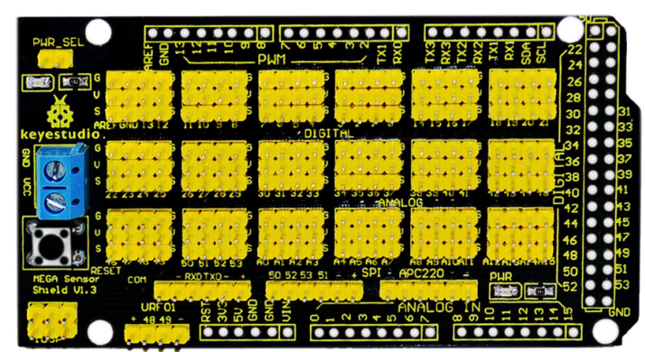  |

# 3. Install Arduino IDE and Driver

**(1) Installing Arduino IDE**

**Click the link to start learning how to download software, install drivers, upload code, and install library files.**

**[https://getting-started-with-arduino.readthedocs.io](https://getting-started-with-arduino.readthedocs.io/en/latest/Arduino%20IDE%20Tutorial.html)**

**（2）Keyestudio V4.0 Development Board**

We need to know keyestudio V4.0 development board, as a core of this sensor kit.

keyestudio V4.0 development board is an Arduino board, which is based on ATmega328P MCU, and with a cp2102 Chip as a UART-to-USB converter.

It has 14 digital input/output pins (of which 6 can be used as PWM outputs), 6 analog inputs, a 16 MHz quartz crystal, a USB connection, a power jack, 2 ICSP headers and a reset button.

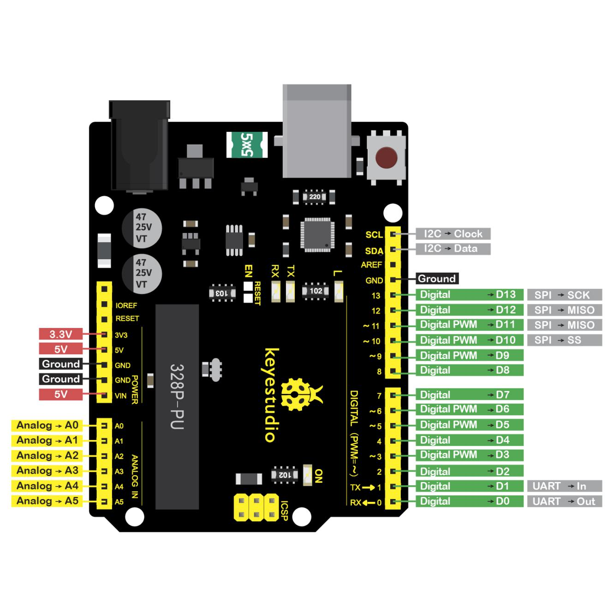

It contains everything needed to support the microcontroller; simply connect it to a computer with a USB cable or power it via an external DC power jack (DC 7-12V) or via female headers Vin/ GND(DC 7-12V) to get started.

| Microcontroller             | ATmega328P-PU                                            |
|-----------------------------|----------------------------------------------------------|
| Operating Voltage           | 5V                                                       |
| Input Voltage (recommended) | DC7-12V                                                  |
| Digital I/O Pins            | 14 (D0-D13) (of which 6 provide PWM output)              |
| PWM Digital I/O Pins        | 6 (D3, D5, D6, D9, D10, D11)                             |
| Analog Input Pins           | 6 (A0-A5)                                                |
| DC Current per I/O Pin      | 20 mA                                                    |
| DC Current for 3.3V Pin     | 50 mA                                                    |
| Flash Memory                | 32 KB (ATmega328P-PU) of which 0.5 KB used by bootloader |
| SRAM                        | 2 KB (ATmega328P-PU)                                     |
| EEPROM                      | 1 KB (ATmega328P-PU)                                     |
| Clock Speed                 | 16 MHz                                                   |
| LED_BUILTIN                 | D13                                                      |

**（13）keyestudio MEGA 2560 Board**

Keyestudio Mega 2560 R3 is a microcontroller board based on the ATMEGA2560-16AU , fully compatible with ARDUINO MEGA 2560 R3.

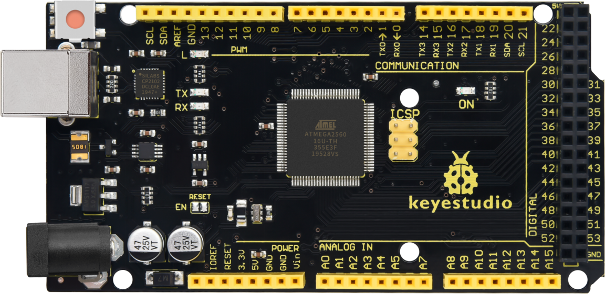

It has 54 digital input/output pins (of which 15 can be used as PWM outputs), 16 analog inputs, 4 UARTs (hardware serial ports), a 16 MHz crystal oscillator, a USB connection, a power jack, 1 ICSP header, and a reset button. The built-in ICSP port can burn the firmware for ATMEGA2560-16AU directly. This chip is burnt the firmware well before leaving the factory, therefore, we hardly use it. We can power on by USB wire, DC head and Vin GND pins. To facilitate wiring, a 0.5m USB wire is provided for you.

Specialized Functions of Some Pins:

1\. Serial Communication: D0 (RX0) and D1 (TX1); Serial 1: D19 (RX1) and D18 (TX1); Serial 2: D17 (RX2) and D16 (TX2); Serial 3: D15 (RX3) and D14 (TX3). Used to receive (RX) and transmit (TX) TTL serial data. Pins 0 and 1 are also connected to the corresponding pins of the CP2102 USB-to-TTL Serial chip.

2\. PWM Pins (Pulse-Width Modulation): D2 to D13, and D44 to D46. Provide 8-bit PWM output with the analogWrite() function.

3\. External Interrupts: D2 (interrupt 0), D3 (interrupt 1), D18 (interrupt 5), D19 (interrupt 4), D20 (interrupt 3), and D21 (interrupt 2). These pins can be configured to trigger an interrupt on a low level, a rising or falling edge, or a change in level. See the attachInterrupt() function for details.

4\. SPI communication: D53 (SS), D52 (SCK), D51 (MOSI), D50 (MISO). These pins support SPI communication using theSPI library. The SPI pins are also broken out on the ICSP header, which is physically compatible with the Arduino Uno.

5\. IIC communication: D20 (SDA); D21 (SCL). Support TWI communication using the Wire library.

# 4. Project Details

## Project 1: LED Flash

**Introduction:**

LED has wide applications. Most signal lights we saw in our daily life use LED as its major light source. In today’s experiment, we are going to use Arduino to make LED module flashing.

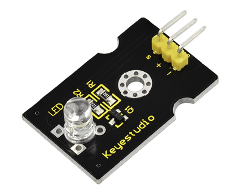

**Components list:**

-   Control board \* 1

-   keyestudio Sensor Shield V5\* 1

-   USB Cable\* 1

-   LED module \* 1

-   Dupont Line \*3

**Components Introduction:**

This is a special LED module. When you connect it to ARDUINO development board, after program, it can emit beautiful light. Of course, you can also control it using PWM. It will be like fireflies at night. Isn’t cool? We can also combine it with other sensors to do interesting interactive experiments.

**Specifications:**

-   Control interface: Digital

-   Operating voltage: DC 3.3-5V

-   Pin pitch:2.54mm

-   Emitting color: white

**Hardware Connection**

Connect the negative pin of LED module to GND, positive pin to VCC (3.3-5V), Signal pin to digital pin 7.

**For V4.0 connection:**

Stack the Sensor Shield V5 onto the V4.0 board, then connect the LED module.

**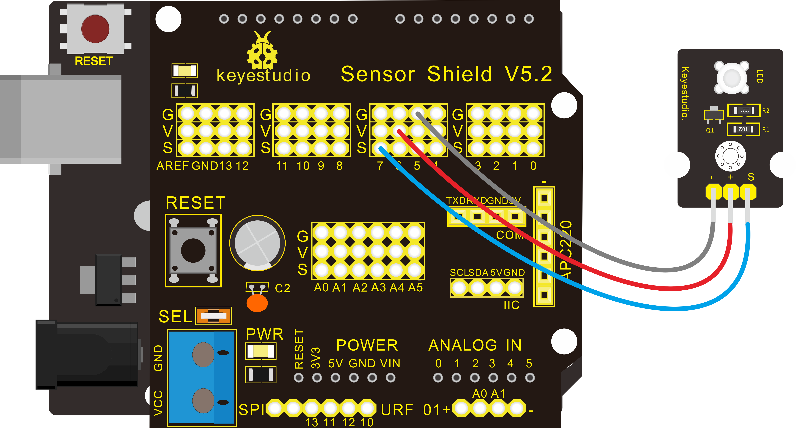**

**For Mega 2560 connection:**

Stack the Sensor Shield V1.0 onto the Mega 2560 board, then connect the LED module.

**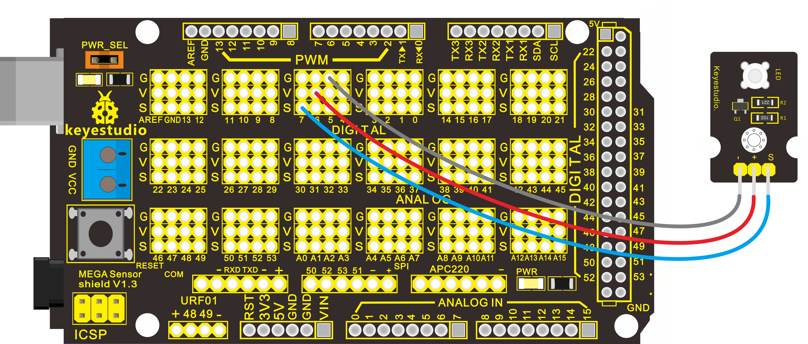**

**Sample Code:**

<iframe src=https://create.arduino.cc/editor/keyestudio/3dd3ac24-286b-4c13-be02-e12897fca5f8/preview?embed style="height:510px;width:100%;margin:10px 0" frameborder=0></iframe>

**Experiment
Result:**

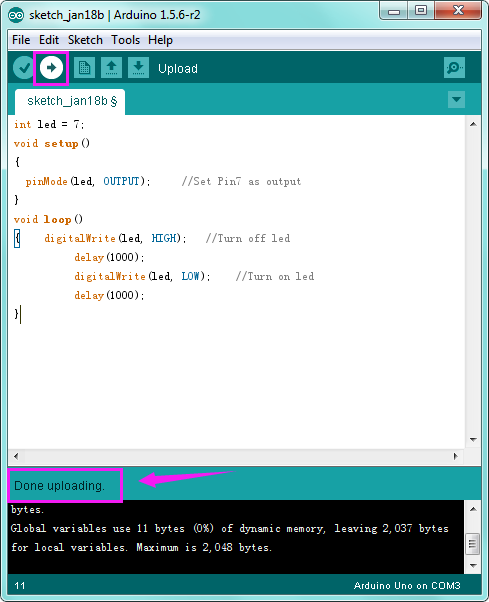

Done uploading the code, you can see the LED on the module flashing for one second then off for one second, repeatedly.

If it is not, go back and check your operations.

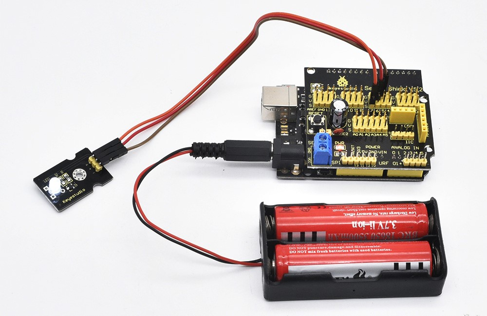

## Project 2: RGB LED

**Introduction:**

This is a full-color LED module, which contains 3 basic colors－red, green and blue. They can be seen as separate LED lights.

After program, we can turn them on and off by sequence. We can also use PWM analog output to mix the three colors to generate different colors.

**Specification:**

-   Color: red, green and blue

-   Brightness: High

-   Voltage: 5V

-   Input: digital level

**Hardware Connection**

To begin with, you need to prepare the following parts before connection:

-   Control board \* 1

-   keyestudio Sensor Shield V5\* 1

-   USB Cable\* 1

-   RGB LED module \* 1

-   Dupont Line \*4

Connect the R pin of RGB module to Digital 10 of V4.0 board, connect the B pin to Digital 9, G pin to Digital 11, GND pin to ground port.

**For V4.0 connection:**

Stack the Sensor Shield V5 onto the V4.0 board.

**For 2560 R3 connection:**

Stack the Sensor Shield V1.0 onto the 2560 R3 board

**Sample Code:**

<iframe src=https://create.arduino.cc/editor/keyestudio/712dd628-ea02-4556-b401-b7d3b0feef7d/preview?embed style="height:510px;width:100%;margin:10px 0" frameborder=0></iframe>

**Experiment Result:**

You can see the RGB LED flashing in various colors.

## Project 3: Traffic Light

**Description:**

When learning the microcontroller, you may usually use three LEDs, namely red, green and yellow lights to simulate the traffic light blinking via external connection.

This time we specially design this module which is very convenient for wiring, and on the module you can see the red, yellow and green LED.

This traffic light module is fully compatible with Arduino microcontroller and Raspberry Pi system.

**Specifications:**

-   Working Voltage: 3.3-5V

-   Interface Type: digital

-   Pin Pitch: 2.54mm

**Hardware Connection**

First, you need to prepare the following parts before connection:

-   Control board \* 1

-   keyestudio Sensor Shield V5\* 1

-   USB Cable\* 1

-   Traffic light module \* 1

-   Dupont Line \*4

Connect the R pin of module to Digital 3 of V4.0 board, connect the Y pin to Digital 4, G pin to Digital 5, GND pin to ground port.

**For V4.0 connection:**

Stack the Sensor Shield V5 onto the V4.0 board

****

**For 2560 R3 connection:**

Stack the Sensor Shield V1.0 onto the 2560 R3 board

****

**Sample Code:**

Copy and paste the below code to Arduino software.

<iframe src=https://create.arduino.cc/editor/keyestudio/e99bbac5-a80b-4f3a-9061-67ad6df6e33a/preview?embed style="height:510px;width:100%;margin:10px 0" frameborder=0></iframe>

**Experiment Result:**

Done uploading the code, powered up, three LEDs on the module will automatically simulate the traffic light on and off, alternatively.

## Project 4: Push Button

**Introduction:**

This is a basic application module integrated with a push button. You can simply plug it into an IO shield to have your first taste of Arduino.

**Advantages:**

-   Wide voltage range from 3.3V to 5V

-   Interface: Digital

-   Standard assembling structure

-   Icons illustrate sensor function clearly

-   High quality pin

-   Easy to plug and operate

-   Large button keypad and high-quality button cap

-   Achieve interesting and interactive work

**Components Introduction:**

**Momentary Push button Switch**

This is a common component for controlling electronic devices. It is mostly used to connect or cut off control circuit so that it can achieve motor or other electronic equipment control.

Momentary Pushbutton Switch usually stays open. When it is pressed down, circuit connected; when it is released, it will bounce back to the status of disconnection.

Momentary Pushbutton Switch has 4 footers which can be divided into 2 groups:
footer 1 short connected with footer 2, footer 3 short connected with footer 4.

**Hardware Connection**

To begin with, you need to prepare the following parts:

-   Control board \* 1

-   keyestudio Sensor Shield V5\* 1

-   USB Cable\* 1

-   Button module \* 1

-   Dupont Line \*3

**For V4.0 connection:**

Stack the Sensor Shield V5 onto the V4.0 board

**For 2560 R3 connection:**

Stack the Sensor Shield V1.0 onto the 2560 R3 board

**Sample Code:**

<iframe src=https://create.arduino.cc/editor/keyestudio/19f196e9-d581-47e9-93d5-21291539b6e7/preview?embed style="height:510px;width:100%;margin:10px 0" frameborder=0></iframe>

**Experiment
Result:**

Done uploading the code, powered up, when you push the digital button, the Led 13 on V4.0 board will be on. When release the button, the led is off. Shown as below.

**Think:**

If we want to connect more an LED module, light an LED when press down the button, and turn off LED when release the button, then how to program? You can have a try.

## Project 5: Passive Buzzer

**Introduction:**

We can use Arduino to make many interactive works of which the most commonly used is acoustic-optic display.

All the previous experiment has something to do with LED. However, the circuit in this experiment can produce sound. Normally, the experiment is done with a buzzer or a speaker while buzzer is simpler and easier to use.

The buzzer we introduced here is a passive buzzer. It cannot be actuated by itself, but by external pulse frequencies. Different frequencies produce different sounds. We can use Arduino to code the melody of a song, which is quite fun and simple.

**Specification:**

-   Working voltage: 3.3-5v

-   Interface type: digital

**Hardware Connection**

To begin with, you need to prepare the following parts:

-   Control board \* 1

-   keyestudio Sensor Shield V5\* 1

-   USB Cable\* 1

-   Passive buzzer module \* 1

-   Dupont Line \*3

**For V4.0 connection:**

Stack the Sensor Shield V5 onto the V4.0 board

**For 2560 R3 connection:**

Stack the Sensor Shield V1.0 onto the 2560 R3 board.

**Sample Code:**

<iframe src=https://create.arduino.cc/editor/keyestudio/23a92f84-cb04-43f6-9376-5e549ab39f41/preview?embed style="height:510px;width:100%;margin:10px 0" frameborder=0></iframe>

**Experiment Result:**

After downloading the program, buzzer experiment is complete. You should hear the buzzer ringing.

## Project 6: Capacitive Touch

****

**Introduction:**

Are you tired of clicking mechanic button? Well, try our capacitive touch sensor. We can find touch sensors mostly on electronic device. So upgrade your Arduino Project with our new version touch sensor and make it cool!!

This little sensor can "feel" people and metal touch and feedback a high/low voltage level. Even isolated by some cloth and paper, it can still feel the touch. Its sensitivity decrease as isolation layer gets thicker.

**Specification:**

-   Supply Voltage: 3.3V to 5V

-   Interface: Digital

**Hardware Connection**

To begin with, you need to prepare the following parts:

-   Control board \* 1

-   keyestudio Sensor Shield V5\* 1

-   USB Cable\* 1

-   Capacitive touch sensor module \* 1

-   Dupont Line \*3

**For V4.0 connection:**

Stack the Sensor Shield V5 onto the V4.0 board.

**For 2560 R3 connection:**

Stack the Sensor Shield V1.0 onto the 2560 R3 board.

**Sample Code:**

<iframe src=https://create.arduino.cc/editor/keyestudio/3870242d-ec33-46c2-a6e5-1073075c34d1/preview?embed style="height:510px;width:100%;margin:10px 0" frameborder=0></iframe>

**Experiment Result:**

Done wiring and powered up, upload well the code, then touch the sensor with your finger, both D2 led on the sensor and D13 indicator on V4.0 board are on. Otherwise, those two indicators are turned off.

**Think:**

If we want to connect more an LED module, light an LED when touch the sensor, and turn off LED when not touch the sensor, then how to program?

## Project 7: Collision Flash

**Description:**

Crash sensor, also known as electronic switch, is a digital on-off input module necessary for elementary electronic learning. By programming, it can realize to control over light, sound device, key choice function of LCD display, etc.

You can install the sensor to 4WD mobile robot platform to realize crash detection function. It is indeed convenient and efficient.

**Details:**

1\. If collision happens upfront of where collision module is installed, module outputs low level signal; no collision, outputs high level signal.

2\. Module reserves M3 mounting hole, convenient for fixation on a car.

3\. With switch indicator light, if there is collision, light is on; no collision, light is off.

**Pins definition:**

-   **Positive pin (+):** connect to 3v-12v power supply

-   **Negative pin (-):** connect to GND

-   **Signal pin (S):** connect to High-Low level output

**Hardware Connection**

To begin with, you need to prepare the following parts:

-   Control board \* 1

-   keyestudio Sensor Shield V5\* 1

-   USB Cable\* 1

-   Crash module \* 1

-   Dupont Line \*3

**Note:** You can make a collision flasher using collision module and built-in LED on interface 13. Connect the collision sensor to Digital pin 3.

When the crash sensor senses a collision signal, the LEDs on both Arduino board and crash sensor will light up simultaneously.

**For V4.0 connection:**

Stack the Sensor Shield V5 onto the V4.0 board.

**For 2560 R3 connection:**

Stack the Sensor Shield V1.0 onto the 2560 R3 board.

**Sample Code:**

Copy and paste the below code to Arduino software.

<iframe src=https://create.arduino.cc/editor/keyestudio/13a33514-362d-4dde-bc0e-41dd218bef28/preview?embed style="height:510px;width:100%;margin:10px 0" frameborder=0></iframe>

**Example Result:**

Upload the code to the board.

When an object crashes the switch of sensor, both the led on the sensor and led 13 on the V4.0 board are turned on.

## Project 8: Knock Sensor

**Introduction:**

This is a knock sensor module. When you knock it, it can send a momentary signal. We can combine it with Arduino to make some interesting experiment, e.g. electronic drum.

Note: the working voltage of this module is 5V.

**Hardware Connection**

To begin with, you need to prepare the following parts:

-   Control board \* 1

-   keyestudio Sensor Shield V5\* 1

-   USB Cable\* 1

-   Knock sensor module \* 1

-   Dupont Line \*3

Connect the S pin to digital 3, negative pin to GND port, positive pin to 5V port.

**For V4.0 connection:**

Stack the Sensor Shield V5 onto the V4.0 board.

**For 2560 R3 connection:**

Stack the Sensor Shield V1.0 onto the 2560 R3 board.

**Sample Code:**

<iframe src=https://create.arduino.cc/editor/keyestudio/fafac6ff-d33e-4891-ac66-5e21778ccb3b/preview?embed style="height:510px;width:100%;margin:10px 0" frameborder=0></iframe>

**Example Result:**

Upload the code to the board.

When the sensor detects a knock signal, both the led on the sensor and led 13 on the V4.0 board are turned on.

**Think:**

If not easy to see the test result, you can connect an external LED module. Light an LED when knock the sensor, then how to program? Think about it.

## Project 9: Photo Interrupter

**Introduction:**

Upright part of this sensor is an infrared emitter and on the other side, it’s a shielded infrared detector. By emitting a beam of infrared light from one end to other end, the sensor can detect an object when it passes through the beam.

It is used for many applications including optical limit switches, pellet dispensing, general object detection, etc.

**Specification:**

-   Supply Voltage: 3.3V to 5V

-   Interface: Digital

**Hardware Connection**

To begin with, you need to prepare the following parts:

-   Control board \* 1

-   keyestudio Sensor Shield V5\* 1

-   USB Cable\* 1

-   Photo Interrupter module \* 1

-   Dupont Line \*3

Connect the S pin to digital 3, negative pin to GND port, positive pin to 5V port.

**For V4.0 connection:**

Stack the Sensor Shield V5 onto the V4.0 board.

**For 2560 R3 connection:**

Stack the Sensor Shield V1.0 onto the 2560 R3 board.

****

**Sample Code:**

<iframe src=https://create.arduino.cc/editor/keyestudio/b91cad4a-db75-472a-b34c-65fa261bc9fe/preview?embed style="height:510px;width:100%;margin:10px 0" frameborder=0></iframe>

**Example Result:**

Upload the code to the board. When an object passes through the groove joint of photo interrupter module, the signal is interrupted, led will flash.

**Think:**

If not easy to see the built-in led status, you can connect an external LED module, then how to program? Think about it.

## Project 10: Digital Tilt Sensor

**Introduction:**

Tilt Sensor is a simple digital tilt switch.

Simply plug it to our IO/Sensor shield or Arduino board, you can make interesting and interactive projects.

Tilt sensors (tilt ball switch) allow you to detect orientation or inclination. They are small, inexpensive, low-power and easy-to-use.

If used properly, they will not wear out. Their simplicity makes them popular for toys, gadgets and appliances.

Sometimes, they are referred to as "mercury switches", "tilt switches" or "rolling ball sensors" for obvious reasons.

They are usually made up of a cavity of some sort (cylindrical is popular, although not always) with a conductive free mass inside, such as a blob of mercury or rolling ball.

One end of the cavity has two conductive elements (poles).

When the sensor is oriented so that that end is downwards, the mass rolls onto the poles and shorts them, acting as a switch throw.

While not as precise or flexible as a full accelerometer, tilt switches can detect motion or orientation. Another benefit is that the big ones can switch power on their own. Accelerometer, on the other hand, output digital or analog voltage that must then be analyzed using extra circuitry.

**Specification:**

-   Supply Voltage: 3.3V to 5V

-   Interface: Digital

**Hardware Connection**

To begin with, you need to prepare the following parts:

-   Control board \* 1

-   keyestudio Sensor Shield V5\* 1

-   USB Cable\* 1

-   Tilt ball switch module \* 1

-   Dupont Line \*3

Connect the S pin to digital 3, negative pin to GND port, positive pin to 5V port.

**For V4.0 connection:**

Stack the Sensor Shield V5 onto the V4.0 board.

**For 2560 R3 connection:**

Stack the Sensor Shield V1.0 onto the 2560 R3 board.

**Sample Code:**

<iframe src=https://create.arduino.cc/editor/keyestudio/a007920f-a19f-4779-bbf7-739434721231/preview?embed style="height:510px;width:100%;margin:10px 0" frameborder=0></iframe>

**Example Result:**

Upload the code to the board. Then tilt the sensor, you will see the led on the sensor is turned on. Shown as below.

**Think:**

Or you can connect more an external LED module, then how to program? Think about it. The LED will turn on when tilt the sensor, and the LED will turn off when the sensor is not tilted.

## Project 11: PIR Motion Sensing

**Introduction:**

Pyroelectric infrared motion sensor can detect infrared signals from a moving person or moving animal, and output switching signals.

It can be applied to a variety of occasions to detect the movement of human body.

Conventional pyroelectric infrared sensors require body pyroelectric infrared detector, professional chip, complex peripheral circuit, so the size is bigger, with complex circuit, and lower reliability.

Now we launch this new pyroelectric infrared motion sensor, specially designed for Arduino.

It uses an integrated digital body pyroelectric infrared sensor, has smaller size, higher reliability, lower power consumption and simple peripheral circuit.

**Specification:**

-   Input Voltage: 3.3 \~ 5V, 6V Maximum

-   Working Current: 15uA

-   Working Temperature: -20 \~ 85 ℃

-   Output Voltage: High 3V, low 0V

-   Output Delay Time (High Level): About 2.3 to 3 Seconds

-   Detection angle: 100 °

-   Detection distance: 7 meters

-   Output Indicator LED (When output HIGH, it will be ON)

-   Pin limit current: 100mA

**Hardware Connection**

To begin with, you need to prepare the following parts:

-   Control board \* 1

-   keyestudio Sensor Shield V5\* 1

-   USB Cable\* 1

-   PIR motion sensor\* 1

-   Dupont Line \*3

Connect the S pin to digital 3, negative pin to GND port, positive pin to 5V port.

**For V4.0 connection:**

Stack the Sensor Shield V5 onto the V4.0 board.

**For 2560 R3 connection:**

Stack the Sensor Shield V1.0 onto the 2560 R3 board.

**Sample Code:**

<iframe src=https://create.arduino.cc/editor/keyestudio/fc6fb6b9-5c94-43fa-9290-bec1f5b62df6/preview?embed style="height:510px;width:100%;margin:10px 0" frameborder=0></iframe>

**Example Result:**

Done wiring and powered up, upload well the code, if the sensor detects someone moving nearby, D13 indicator on V4.0 board will light up, and "Somebody is in this area!" is displayed on the serial monitor.

If no detecting the movement, D13 indicator will turn off, and "No one!" is displayed on the serial monitor.

## Project 12: Reed Switch

**Description:**

Reed Switch is a special switch and a main component for reed relay and proximity switch. Reed switch is usually comprised of two soft magnetic materials and metal reed contacts which will disconnect itself when there is no magnetic.

In addition, some reed switches are also equipped with another reed acting as the third normally-closed contact. These reed contacts are encapsulated in a glass tube fulled of inert gases(such as nitrogen and helium) or in a vacuum glass tube.

The reeds encapsulated in the glass tube are placed in parallel with ends overlapped. Certain amount of space or mutual contact will be reserved to constitute the normally-open or normally-closed contacts of the switch.

Reed switch can be used as for count, limit or other purposes. For instance, a kind of bike-kilometer is constituted by sticking magnetic to the tire and mounting reed switch aside. You can also mount reed switch on the door for alarming purpose or as switches.

Reed switch has been widely applied in household appliances, cars, communication, industry, healthcare and security areas.

Furthermore, it can also be applied to other sensors and electric devices such as liquidometer, door magnet, reed relay, oil level sensor and proximity sensor(magnetic sensor). It can be used under high-risk environment.

**Specification**

-   Working voltage: DC 3.3V-5V

-   Working current: ≥20mA

-   Working temperature: －10℃ to＋50℃

-   Detection distance: ≤10mm

-   IO Interface: 3Pin (-/+/S)

**Hardware Connection**

To begin with, you need to prepare the following parts:

-   Control board \* 1

-   keyestudio Sensor Shield V5\* 1

-   USB Cable\* 1

-   Reed switch sensor\* 1

-   Dupont Line \*3

Connect the S pin to digital 3, negative pin to GND port, positive pin to 5V port.

**For V4.0 connection:**

Stack the Sensor Shield V5 onto the V4.0 board.

**For 2560 R3 connection:**

Stack the Sensor Shield V1.0 onto the 2560 R3 board

**Sample Code**

Copy and paste the below code to Arduino software.

<iframe src=https://create.arduino.cc/editor/keyestudio/c353243e-7e7c-4351-85cc-8fe888ae1f5f/preview?embed style="height:510px;width:100%;margin:10px 0" frameborder=0></iframe>

**Example Result**

Done wiring and powered up, upload well the code to the board. You can see the D13 led on V4.0 board is on.

Then we put some magnetic balls close to the sensor. When the sensor detects the magnetic field signal, the led on the sensor will be turned on but D13 led will be turned off.

## Project 13: Hall Magnetic Sensor

**Introduction:**

This is a Magnetic Induction Sensor. It senses the magnetic materials within a detection range up to 3cm.

The detection range and the strength of the magnetic field are proportional.

The output is digital on/off. This sensor uses the SFE Reed Switch - Magnetic Field Sensor.

**Specification:**

-   Sensing magnetic materials

-   Detection range: up to 3cm

-   Output: digital on/off

-   Detection range and magnetic field strength are proportional

**Hardware Connection**

To begin with, you need to prepare the following parts:

-   Control board \* 1

-   keyestudio Sensor Shield V5\* 1

-   USB Cable\* 1

-   Hall Magnetic sensor\* 1

-   Dupont Line \*3

Connect the S pin to digital 3, negative pin to GND port, positive pin to 5V port.

**For V4.0 connection:**

Stack the Sensor Shield V5 onto the V4.0 board.

**For 2560 R3 connection:**

Stack the Sensor Shield V1.0 onto the 2560 R3 board.

****

**Sample Code:**

<iframe src=https://create.arduino.cc/editor/keyestudio/cc20f65a-bef3-45be-8b44-0b027fbc71ce/preview?embed style="height:510px;width:100%;margin:10px 0" frameborder=0></iframe>

**Example Result**

Wire it up and upload well the code to board, you will see that D13 indicator on V4.0 board is off, and led on the module is also off.

But if put a magnetic ball close to the hall module, you will see the D13 indicator on V4.0 board is turned on, and led on the module is also turned on.

## Project 14: Line Tracking

**Introduction:**

This Line Tracking Sensor can detect white line in black and black line in white. The single line-tracking signal provides a stable output signal TTL for a more accurate and more stable line. Multi-channel option can be easily achieved by installing required line-tracking robot sensors.

**Specification:**

-   Power supply: +5V

-   Operating current: \<10mA

-   Operating temperature range: 0°C \~ + 50°C

-   Output interface: 3Pin interface (1 - signal, 2 - power, 3 - power supply negative)
    
-   Output Level: TTL level

**Hardware Connection**

To begin with, you need to prepare the following parts:

-   Control board \* 1

-   keyestudio Sensor Shield V5\* 1

-   USB Cable\* 1

-   Line tracking sensor\*1

-   Dupont Line \*3

Connect the S pin to digital 3, negative pin to GND port, positive pin to 5V port.

**For V4.0 connection:**

Stack the Sensor Shield V5 onto the V4.0 board.

**For 2560 R3 connection:**

Stack the Sensor Shield V1.0 onto the 2560 R3 board.

**Sample Code:**

<iframe src=https://create.arduino.cc/editor/keyestudio/9856b938-1fd9-40bb-9262-8d535db6fb40/preview?embed style="height:510px;width:100%;margin:10px 0" frameborder=0></iframe>

**Example Result**

Done uploading the code to board, open the serial monitor and set the baud rate to 9600, then you can see the data from the sensor. Shown below.

## Project 15: Flame Sensor

**Introduction:**

This flame sensor can be used to detect fire or other lights whose wavelength stands at 760nm \~ 1100nm. In the fire-fighting robot game, the flame plays an important role in the probe, which can be used as the robot's eyes to find fire source.

**Specification:**

-   Supply Voltage: 3.3V to 5V

-   Detection range: 20cm (4.8V) \~ 100cm (1V)

-   Rang of Spectral Bandwidth: 760nm to 1100nm

-   Operating temperature: -25℃ to 85℃

-   Interface: digital

**Hardware Connection**

To begin with, you need to prepare the following parts:

-   Control board \* 1

-   keyestudio Sensor Shield V5\* 1

-   USB Cable\* 1

-   Flame sensor\*1

-   Dupont Line \*3

Connect the S pin to digital 2, negative pin to GND port, positive pin to 5V port.

**For V4.0 connection:**

Stack the Sensor Shield V5 onto the V4.0 board.

**For 2560 R3 connection:**

Stack the Sensor Shield V1.0 onto the 2560 R3 board.

**Sample Code:**

<iframe src=https://create.arduino.cc/editor/keyestudio/36626d85-690b-41d0-a5d1-814c1d7bd552/preview?embed style="height:510px;width:100%;margin:10px 0" frameborder=0></iframe>

**Example Result**

Done wiring and powered up, upload well the code to the board.

Then if you put a lighter close to the sensor, when the sensor detects the flame, another led on the sensor is turned on.

## Project 16: Infrared Obstacle Avoidance

****

**Introduction:**

Infrared obstacle avoidance sensor is equipped with distance adjustment function and is especially designed for wheeled robots.

This sensor has strong adaptability to ambient light and is of high precision. It has a pair of infrared transmitting and receiving tube.

When infrared ray launched by the transmitting tube encounters an obstacle (its reflector), the infrared ray is reflected to the receiving tube, and the indicator will light up; the signal output interface outputs digital signal.

We can adjust the detection distance through the potentiometer knob (effective distance: 2～40cm, working Voltage: 3.3V-5V ).

Thanks to a wide voltage range, this sensor can work steadily even under fluctuating power supply voltage and is suitable for the use of various micro-controllers, Arduino controllers and BS2 controllers.

A robot mounted with the sensor can sense changes in the environment.

**Specification：**

-   Working voltage: DC 3.3V-5V

-   Working current: ≥20mA

-   Working temperature: －10℃—＋50℃

-   Detection distance: 2-40cm

-   IO Interface: 4 wire interface (-/+/S/EN)

-   Output signal: TTL voltage

-   Accommodation mode: Multi-circle resistance regulation

-   Effective Angle: 35°

**Hardware Connection**

To begin with, you need to prepare the following parts:

-   Control board \* 1

-   keyestudio Sensor Shield V5\* 1

-   USB Cable\* 1

-   Infrared obstacle avoidance sensor\*1

-   Dupont Line \*3

Connect the S pin to digital 2, negative pin to GND port, positive pin to 5V port.

**For V4.0 connection:**

Stack the Sensor Shield V5 onto the V4.0 board.

**For 2560 R3 connection:**

Stack the Sensor Shield V1.0 onto the 2560 R3 board

**Sample Code:**

<iframe src=https://create.arduino.cc/editor/keyestudio/399ef579-09ff-45b2-8726-d420de6d8f05/preview?embed style="height:510px;width:100%;margin:10px 0" frameborder=0></iframe>

**Example Result**

Done uploading the code to board, if we put a foam block in front of the sensor, this time when sensor detects the obstacle, sled on the sensor will be turned on.

## Project 17 : Photocell sensor

**Introduction:**

Photocell is commonly seen in our daily life and is mainly used in intelligent switch, also in common electronic design. To make it easier and more effective, we supply corresponding modules.

Photocell is a semiconductor. It has features of high sensitivity, quick response, spectral characteristic, and R-value consistence, maintaining high stability and reliability in environment extremes such as high temperature, high humidity.

It’s widely used in automatic control switch fields like cameras, garden solar lights, lawn lamps, money detectors, quartz clocks, music cups, gift boxes, mini night lights, sound and light control switches, etc.

**Specification:**

-   Interface type: analog

-   Working voltage: 5V

**Hardware Connection**

To begin with, you need to prepare the following parts:

-   Control board \* 1

-   keyestudio Sensor Shield V5\* 1

-   USB Cable\* 1

-   Photocell sensor\*1

-   Dupont Line \*3

Connect the S pin to analog A0, negative pin to GND port, positive pin to 5V port.

**For V4.0 connection:**

Stack the Sensor Shield V5 onto the V4.0 board.

**For 2560 R3 connection:**

Stack the Sensor Shield V1.0 onto the 2560 R3 board.

**Sample Code:**

<iframe src=https://create.arduino.cc/editor/keyestudio/876aa919-b155-4060-99f2-e4b2a6e0dad4/preview?embed style="height:510px;width:100%;margin:10px 0" frameborder=0></iframe>

**Example Result**

Done wiring and powered up, upload well the code, then open the serial monitor; if cover the photocell on the sensor with your hand, you will see the analog value decrease.

## Project 18: Analog Sound Sensor

**Introduction:**

Analog Sound Sensor is typically used in detecting the loudness in ambient environment. The Arduino can collect its output signal by imitating the input interface. The sensor comes with a potentiometer, so that you can adjust the sensitivity. You can use it to make some interesting interactive works, such as a voice operated switch.

**Specification:**

-   Supply Voltage: 3.3V to 5V

-   Interface: Analog

-   Detecting sound intensity

**Hardware Connection**

To begin with, you need to prepare the following parts:

-   Control board \* 1

-   keyestudio Sensor Shield V5\* 1

-   USB Cable\* 1

-   Sound sensor\*1

-   Dupont Line \*3

Connect the S pin to analog A0, negative pin to GND port, positive pin to 5V port.

**For V4.0 connection:**

Stack the Sensor Shield V5 onto the V4.0 board.

**For 2560 R3 connection:**

Stack the Sensor Shield V1.0 onto the 2560 R3 board.

**Sample Code:**

<iframe src=https://create.arduino.cc/editor/keyestudio/4a8a1619-5739-46d5-b028-0b614f71f096/preview?embed style="height:510px;width:100%;margin:10px 0" frameborder=0></iframe>

**Example Result**

Done wiring and powered up, upload well the code, then open the serial monitor and set the baud rate to 9600, you will see the analog value.

When talking toward the micro head, the value will increase. Shown below.

You can the potentiometer to adjust the sensitivity.

## Project 19: Rotary Encoder

****

**Introduction:**

The rotary encoder can count the pulse outputting times during the process of its rotation in positive and reverse direction by rotating. This rotating counting is unlimited, not like potential counting. It can be restored to initial state to count from 0 with the button on rotary encoder.

Combined with other sensors, we can make interesting projects by reading the analog value from the IO port.

**Specification:**

-   Supply Voltage: 3.3V to 5V

-   Interface: Analog

**Hardware Connection**

To begin with, you need to prepare the following parts:

-   Control board \* 1

-   keyestudio Sensor Shield V5\* 1

-   USB Cable\* 1

-   Rotary encoder sensor\*1

-   Traffic light module\*1

-   Dupont Line \*8

**For V4.0 connection:**

Stack the Sensor Shield V5 onto the V4.0 board.

**For 2560 R3 connection:**

Stack the Sensor Shield V1.0 onto the 2560 R3 board.

**Sample Code:**

<iframe src=https://create.arduino.cc/editor/keyestudio/2ff88f60-7e22-4830-a173-99de1d4ea001/preview?embed style="height:510px;width:100%;margin:10px 0" frameborder=0></iframe>

**Example Result**

Wiring well and uploading the above code, you can rotate the encoder module to turn two LEDs on the traffic light module on and off.

## Project 20: Analog Gas Sensor

**Introduction:**

This analog gas sensor - MQ2 is used in gas leakage detecting equipment in consumer electronics and industrial markets.

This sensor is suitable for detecting LPG, I-butane, propane, methane, alcohol, Hydrogen and smoke. It has high sensitivity and quick response.

In addition, the sensitivity can be adjusted by the potentiometer.

**Specification:**

-   Power supply: 5V

-   Interface type: Analog

-   Wide detecting scope

-   Quick response and High sensitivity

-   Simple drive circuit

-   Stable and long lifespan

**Hardware Connection**

To begin with, you need to prepare the following parts:

-   Control board \* 1

-   keyestudio Sensor Shield V5\* 1

-   USB Cable\* 1

-   Analog gas sensor\*1

-   Dupont Line \*3

Connect the S pin to analog A0, negative pin to GND port, positive pin to 5V port.

**For V4.0 connection:**

Stack the Sensor Shield V5 onto the V4.0 board.

**For 2560 R3 connection:**

Stack the Sensor Shield V1.0 onto the 2560 R3 board.

**Sample Code:**

<iframe src=https://create.arduino.cc/editor/keyestudio/d0f3d82e-ecb5-4216-a335-705939bf5768/preview?embed style="height:510px;width:100%;margin:10px 0" frameborder=0></iframe>

**Example Result**

Done wiring and powered up, upload well the code, then open the serial monitor and set the baud rate as 9600, you will see the analog value.

When detecting the gas, the value will make a change.

## Project 21: Steam Moisture

**Introduction:**

Vapor Sensor is an analog sensor and can make a simple rainwater detector and liquid level switch. When humidity on the face of this sensor rises, output voltage will increase.

Caution: connection parts is non-waterproof, so please don’t put them into water.

**Specification:**

-   Working Voltage: 3.3V or 5V

-   Working Current: \<20mA

-   Range of Working Temperature: －10℃～＋70℃

-   Interface Type: Analog Signal Output

**Pins Definition:**

-   **S pin:** for Signal Output

-   **Positive pin (+):** for Power Supply (VCC)

-   **Negative pin (-):** for Ground (GND)

**Hardware Connection**

To begin with, you need to prepare the following parts:

-   Control board \* 1

-   keyestudio Sensor Shield V5\* 1

-   USB Cable\* 1

-   Steam sensor\*1

-   Dupont Line \*3

Connect the S pin to analog A0, negative pin to GND port, positive pin to 5V port.

**For V4.0 connection:**

Stack the Sensor Shield V5 onto the V4.0 board.

**For 2560 R3 connection:**

Stack the Sensor Shield V1.0 onto the 2560 R3 board.

**Sample Code:**

<iframe src=https://create.arduino.cc/editor/keyestudio/ccb4a9e9-7fa5-49c2-b44d-7d2c4e05ba2d/preview?embed style="height:510px;width:100%;margin:10px 0" frameborder=0></iframe>

**Example Result**

When detecting different degrees of humidity, the sensor will get the feedback of different current value. Shown as the following picture.

Due to the limited condition, you can put a drop of water on the sensor, the moisture value will be changed on serial monitor of Arduino software.

## Project 22: TEMT6000 Ambient Light

**Introduction:**

**Hooking It Up**

This is an incredibly simple part, just connect power and ground, and the signal pin to your favorite analog input and you are done, the sensor will output analog voltage, that ramps up when it gets brighter. You can power this off of 3.3v if you would like, the output value will just be lower.

Firstly you need to prepare the following parts before connection.

-   Control board \* 1

-   keyestudio Sensor Shield V5\* 1

-   USB Cable\* 1

-   TEMT6000 ambient light sensor\*1

-   Dupont Line \*3

Connect the S pin to analog A0, negative pin to GND port, positive pin to 5V port.

**For V4.0 connection:**

Stack the Sensor Shield V5 onto the V4.0 board.

**For 2560 R3 connection:**

Stack the Sensor Shield V1.0 onto the 2560 R3 board.

**Code**

You can not get more simple than this – This just reports the reading from the sensor to the serial terminal: 0-1023 with 1023 being very bright, and 0 being very dark.

<iframe src=https://create.arduino.cc/editor/keyestudio/d36bf2e1-c7b7-4f14-bceb-69268333e37d/preview?embed style="height:510px;width:100%;margin:10px 0" frameborder=0></iframe>

**Example Result**

Wiring well and uploading the code above, open the serial monitor.

Then cover the sensor with your hand or a paper, the light becomes weak, finally you will see the value showed on monitor decrease.

## Project 23: LM35 Linear Temperature

****

**Introduction:**

LM35 Linear Temperature Sensor is based on semiconductor LM35 temperature sensor. It can be used to detect ambient air temperature. This sensor offers a functional range among 0 degree Celsius to 100 degree Celsius. Sensitivity is 10mV per degree Celsius. The output voltage is proportional to the temperature.

This sensor is commonly used as a temperature measurement sensor. It includes thermocouples, platinum resistance, thermal resistance and temperature semiconductor chips. The chip is commonly used in high temperature measurement thermocouples. Platinum resistance temperature sensor is used in the measurement of 800 degrees Celsius, while the thermal resistance and semiconducto temperature sensor is suitable for measuring the temperature of 100-200 degrees or below, in which the application of a simple semiconductor temperature sensor is good in linearity and high in sensitivity.

The LM35 linear temperature sensor is easily connected to Arduino shield.

**Specification:**

-   Based on the semiconductor LM35 temperature sensor

-   Can be used to detect ambient air temperature

-   Sensitivity: 10mV per degree Celcius

-   Functional range: 0 degree Celsius to 100 degree Celsius

**Hardware Connection**

To begin with, you need to prepare the following parts:

-   Control board \* 1

-   keyestudio Sensor Shield V5\* 1

-   USB Cable\* 1

-   LM35 temperature sensor\*1

-   Dupont Line \*3

Connect the S pin to analog A0, negative pin to GND port, positive pin to 5V port.

**For V4.0 connection:**

Stack the Sensor Shield V5 onto the V4.0 board.

**For 2560 R3 connection:**

Stack the Sensor Shield V1.0 onto the 2560 R3 board.

**Sample Code:**

<iframe src=https://create.arduino.cc/editor/keyestudio/a11268dd-614b-4a1d-9eae-280f50628898/preview?embed style="height:510px;width:100%;margin:10px 0" frameborder=0></iframe>

**Example Result**

Upload well the code to the board, then open the serial monitor and set the baud rate to 9600, finally you will see the current temperature value shown below. The value may be slight difference due to different places and weather.

## Project 24: DHT11 Temperature and Humidity

**Introduction:**

This DHT11 sensor features calibrated digital signal output with the temperature and humidity sensor complex. Its technology ensures high reliability and excellent long-term stability. A high-performance 8-bit microcontroller is connected.

This sensor includes a resistive element and a sense of wet NTC temperature measuring devices. It has excellent quality, fast response, anti-interference ability and high cost performance advantages.

Each DHT11 sensor features extremely accurate calibration data of humidity calibration chamber. The calibration coefficients stored in the OTP program memory, internal sensors detect signals in the process, and we should call these calibration coefficients.

The single-wire serial interface system is integrated to make it quick and easy. Qualities of small size, low power, and 20-meter signal transmission distance make it a wide applied application and even the most demanding one. Convenient connection, special packages can be provided according to users need.

**Specification:**

-   Supply Voltage: +5 V

-   Temperature range: 0-50 °C error of ± 2 °C

-   Humidity: 20-90% RH ± 5% RH error

-   Interface: Digital

**Hardware Connection**

To begin with, you need to prepare the following parts:

-   Control board \* 1

-   keyestudio Sensor Shield V5\* 1

-   USB Cable\* 1

-   DHT11 Temperature and Humidity Sensor\*1

-   Dupont Line \*3

Connect the S pin to digital D4, negative pin to GND port, positive pin to 5V port.

**For V4.0 connection:**

Stack the Sensor Shield V5 onto the V4.0 board.

**For 2560 R3 connection:**

Stack the Sensor Shield V1.0 onto the 2560 R3 board.

**Sample Code:**

Please download the [DHT11Lib](https://github.com/RobTillaart/Arduino/tree/master/libraries/DHTlib) firstly.Or, [see the website](http://playground.arduino.cc/Main/DHTLib)

<iframe src=https://create.arduino.cc/editor/keyestudio/6badddb6-f548-4d60-b7e7-fbc233f92da0/preview?embed style="height:510px;width:100%;margin:10px 0" frameborder=0></iframe>

**Example Result**

Wire it up well and upload the above code to V4.0 board. Then open the serial monitor and set the baud rate to 9600, you will see the current temperature and humidity value.

## Project 25: Magical Light Cup

****

**Introduction**

Magic light cup module is able to interact with ARDUINO. The principle is based on PWM dimming. The mercury switch on the module can provide a digital signal and trigger PWM regulation. The brightness of two modules will be changed together through the program design, finally you can see the changing effect that two set of cups are pouring the light.

**Specification**

Supply Voltage: 3.3V to 5V

Interface: Digital

**Connection Diagram**

Firstly you need to prepare the following parts.

-   Control board \* 1

-   keyestudio Sensor Shield V5\* 1

-   USB Cable\* 1

-   Light cap module\*2

-   Dupont Line \*8

For one light cap module, connect its Signal pin to Digital header 2, L pin to Digital pin 3. For another one, connect its Signal pin to Digital port 8, L pin to Digital 9.

Connect the positive pin to anode row of breadboard, lead off the row to 5V port of V4.0 board; connect the negative pin to cathode row, lead off the row to ground port.

**For V4.0 connection:**

Stack the Sensor Shield V5 onto the V4.0 board.

**For 2560 R3 connection:**

Stack the Sensor Shield V1.0 onto the 2560 R3 board.

**Sample Code**

Copy and paste the code below to Arduino software.

<iframe src=https://create.arduino.cc/editor/keyestudio/87e2ea70-e2b3-45b9-971f-2cf2c3c73056/preview?embed style="height:510px;width:100%;margin:10px 0" frameborder=0></iframe>

**Example Result**

Wire it up as the above diagram and upload well the code to the board, then you can see one cap lights up while the other one is off.

When tilt these two caps towards the same side, one cap is gradually become bright, another bright cap is gradually off.

****

## Project 26: Digital IR Transmitter

**Introduction:**

IR Transmitter module is designed for IR communication which is widely used for operating the television device from a short line-of-sight distance. The remote control is usually contracted to remote.

Since infrared (IR) remote controls use light, they require line of sight to operate the destination device. The signal can, however, be reflected by mirrors, just like any other light source.

If operation is required where no line of sight is possible, for instance, when controlling equipment in another room or installed in a cabinet, many brands of IR extenders are available for this on the market. Most of these have an IR receiver, picking up the IR signal and relaying it via radio waves to the remote part, which has an IR transmitter mimicking the original IR control.

Infrared receivers also tend to have a more or less limited operating angle, which mainly depends on the optical characteristics of the phototransistor. However, it’s easy to increase the operating angle using a matte transparent object in front of the receiver.

**Specification:**

-   Power Supply: 3-5V

-   Infrared center frequency: 850nm-940nm

-   Infrared emission angle: about 20 degrees

-   Infrared emission distance: about 1.3m (5V 38Khz)

-   Interface: 3PIN

-   Mounting hole: inner diameter is 3.2mm, spacing is 15mm

**Hardware Connection**

To begin with, you need to prepare the following parts:

-   Control board \* 1

-   keyestudio Sensor Shield V5\* 1

-   USB Cable\* 1

-   IR transmitter module\*1

-   Dupont Line \*3

Connect the S pin to digital 3, negative pin to GND port, positive pin to 5V port.

**Note:** This IR transmitter module is not compatible with Mega2560 main board because **IRremoteInt.h** has no PWM port for \_AVR_ATmega2560_device; but V4.0 is default using pin3.

**Sample Code:**

<iframe src=https://create.arduino.cc/editor/keyestudio/bf4de612-93a4-4771-96f0-5c30295811e6/preview?embed style="height:510px;width:100%;margin:10px 0" frameborder=0></iframe>

In the darkness of the environment, you are going to see blinking blue light on phone's screen when using camera to shoot the infrared LED.

Upload well the above code to the board, the led on the sensor will blink red light.

In the following, let’s move on to an interactive example between IR receiver and IR transmitter module.

**Infrared Remote/Communication:**

**Hardware Required**

-   Arduino R3 x2

-   Digital IR Receiver x1

-   IR Transmitter Module x1

**Note:** here if you have no two main boards, you can replace it with the breadboard for connection, may be more easier and convenient.

-   Get Arduino library [Arduino-IRremote](https://github.com/shirriff/Arduino-IRremote) and install it

**Connection Diagram:**

**For IR Transmitter:**

Notice: Arduino-IRremote only supports D3 as transmitter.

**For IR Receiver:** connect the signal pin to D11 port.

**Upload code to the V4.0 connected with IR Transmitter:**

<iframe src=https://create.arduino.cc/editor/keyestudio/56be8411-669a-49e4-aa79-8fb0131592ca/preview?embed style="height:510px;width:100%;margin:10px 0" frameborder=0></iframe>

**Upload code to the V4.0 connected with IR Receiver:**

<iframe src=https://create.arduino.cc/editor/keyestudio/ef812ecb-ca2e-4bf1-b86c-c201c42a8b00/preview?embed style="height:510px;width:100%;margin:10px 0" frameborder=0></iframe>

**Result:**

When IR Receiver module receives the infrared signal from IR Transmitter, D1 led on the IR Receiver module will blink. Shown as below figure.

## Project 27: Digital IR Receiver

****

**Introduction:**

IR is widely used in remote control. With this IR receiver, Arduino Project is able to receive command from any IR remoter controller if you have the right decoder. Well, it will be also easy to make your own IR controller using IR transmitter.

**Specification:**

-   Power Supply: 5V

-   Interface type: Digital

-   Modulate Frequency: 38Khz

-   Interface: 3PIN

**Wiring Diagram**

To begin with, you need to prepare the following parts:

-   Control board \* 1

-   keyestudio Sensor Shield V5\* 1

-   USB Cable\* 1

-   IR receiver module\*1

-   Dupont Line \*3

Connect the S pin to digital 11, negative pin to GND port, positive pin to 5V port.

**For 2560 R3 connection:**

NOTE: In the sample code below Digital pin 11 is in use, you may either change your wiring or change the sample code to match.

**Sample Code:**

<iframe src=https://create.arduino.cc/editor/keyestudio/57c45e05-19f9-4de2-adf7-c87f99e7e41a/preview?embed style="height:510px;width:100%;margin:10px 0" frameborder=0></iframe>

**Note:** before compiling the code, do remember to place the library into libraries directory of Arduino IDE. Otherwise, compiling will fail.

IR Remote Library includes some sample codes for sending and receiving.

<https://github.com/shirriff/Arduino-IRremote>

**Result:**

Done wiring and uploading the code, then control the IR receiver module by an infrared remote control, D1 led will flash. Shown as below.

## Project 28: Analog Ceramic Vibration

****

**Description**

This vibration sensor is based on piezoelectric ceramic chip analog vibration. It makes use of the anti-conversion process that piezoelectric ceramic vibration will generate the electric signals. When vibrating the piezoelectric ceramic chip, the sensor’s signal terminal will generate electrical signals.

The sensor can be used with Arduino dedicated sensor shield, and Arduino analog port can perceive weak vibration signals, so that it can make interactive works related to vibration, such as electronic drum.

Connect the vibration sensor to the analog port A0 of Control board. When vibrating the sensor in different degrees, you will see the different output value is displaying on serial monitor of Arduino software.

**Specification**

-   Supply Voltage: 3.3V to 5V

-   Working Current：\<1mA

-   Working Temperature Range：－10℃～＋70℃

-   Output Signal：analog signal

**Connection Diagram**

First, you need to prepare the following parts before connection:

-   Control board \* 1

-   keyestudio Sensor Shield V5\* 1

-   USB Cable\* 1

-   vibration sensor\*1

-   Dupont Line \*3

Connect the S pin to Analog A0, connect the negative pin to GND port, NC pin to 5V port.

**For V4.0 connection:**

Stack the Sensor Shield V5 onto the V4.0 board.

**For 2560 R3 connection:**

Stack the Sensor Shield V1.0 onto the 2560 R3 board.

****

**Sample Code**

Copy and paste the below code to Arduino software.

<iframe src=https://create.arduino.cc/editor/keyestudio/6381e964-7f61-4f36-b27d-e437bacda969/preview?embed style="height:510px;width:100%;margin:10px 0" frameborder=0></iframe>

**Example Result**

Wiring as the above diagram and upload well the code, then open the serial monitor and set the baud rate to 9600.

When vibrating the ceramic chip, you will see the data change as the figure shown below.

## Project 29: Ultraviolet Light

****

**Description**

keyestudio GUVA-S12SD ultraviolet sensor is used to detect ultraviolet light.

It includes GUVA-S12SD applied to measure ultraviolet index of intelligent wearable device, such as watches, smart phone and outdoor device with UV index detecting.

It can be also used to monitor the intensity of ultraviolet light or used as a UV flame detector when disinfecting things by ultraviolet light.

**Parameters**

-   Supply Voltage: 2.5V～5V

-   Output Signal: Analog Signal

-   Detecting Range of Spectrum: 240-370nm

-   Active Region: 0.076mm2

-   Responsivity: 0.14A/W

-   Dark Current: 1nA

-   Light Current: 101\~125nA UVA Light, 1mW/cm2

**Connection Diagram**

Firstly you need to prepare the following parts before connection.

-   Control board \* 1

-   keyestudio Sensor Shield V5\* 1

-   USB Cable\* 1

-   Ultraviolet Sensor \*1

-   Dupont Line \*3

Connect the S pin to Analog A0, connect the negative pin to GND port, positive pin to V pin.

**For V4.0 connection:**

Stack the Sensor Shield V5 onto the V4.0 board.

****

**For 2560 R3 connection:**

Stack the Sensor Shield V1.0 onto the 2560 R3 board.

****

**Sample Code**

Copy and paste the code below to Arduino software.

<iframe src=https://create.arduino.cc/editor/keyestudio/63657e61-8227-47e1-aabf-620177d01760/preview?embed style="height:510px;width:100%;margin:10px 0" frameborder=0></iframe>

**Example Result**

Upload the program code, then open serial monitor, it will display the data.

If shine UV light to the sensor, the data on serial monitor is changing.

## Project 30: Triaxial Digital Acceleration Detection

****

**Introduction**

MMA8452Q is a smart low-power, three-axis, capacitive micromachine acceleration sensor with 12-bit resolution.

This acceleration sensor has a rich embedded performance, featured with flexible user programmable options and two interruption pins configuration. The embedded interruption function can save the overall power consumption and remove the
burden of constantly polling the data in the main processor.

Besides, MMA8452Q has a user optional range of ±2g / ±4g/ ±8g, which can output high-pass filtering data and non-filtered data in real time.

This device can configure an embedded function to generate an inertial wake-up interrupt signal, which enables MMA8452Q to maintain a low-power mode in the static state while monitoring the event.

**Performance Parameters**

-   Power Supply Voltage：DC 3.3 V to 5 V

-   ±2g/±4g/±8g Optional dynamic range

-   Output data rate (ODR) range: 1.56 Hz to 800 Hz

-   Noise：99μg/√Hz

-   12 bits and 8 bits digital outputs;

-   I2C digital output interface (up to 2.25 MHz when the pull-up resistor is 4.7 kΩ);
    
-   Two programmable interruption pins applied to six interruption sources;

-   Three motion detection embedded channels: free fall detection, pulse detection, shaking detection;
    
-   Direction (transverse/longitudinal) detection with setting lag compensation;

-   Automatic arousal and auto-dormant ODR can be automatically altered;

-   High-pass filtering data can be exported in real time;

-   Power consumption: 6 μA – 165 μA

**Connection Diagram**

Firstly you need to prepare the following parts by yourself before testing.

-   Control board \* 1

-   keyestudio Sensor Shield V5\* 1

-   USB Cable\* 1

-   MMA8452Q sensor\*1

-   Dupont Line \*4

**For V4.0 connection:**

Stack the Sensor Shield V5 onto the V4.0 board. Connect the SCL pin of MMA8452Q sensor to Analog A5, SDA pin to Analog A4; Connect positive pin (+)to V pin, negative pin(-) to GND.

****

**For 2560 R3 connection:**

Stack the Sensor Shield V1.0 onto the 2560 R3 board. Connect the SCL pin of MMA8452Q sensor to pin D21, SDA pin to pin D20; Connect positive pin (+)to V pin, negative pin(-) to GND.

****

**Sample Code**

Copy and paste the code below to Arduino software.

<iframe src=https://create.arduino.cc/editor/keyestudio/1c0d1568-de75-4c3a-892b-0b190623ab5d/preview?embed style="height:510px;width:100%;margin:10px 0" frameborder=0></iframe>

**Note:** before compiling the code, do remember to place the library into libraries directory of Arduino IDE. Otherwise, compiling will fail.

**Example Result**

****

Wiring as the above diagram and power on, then upload the code and open the serial monitor, it will display the triaxial acceleration of sensor and its status, as the graph shown below.

## Project 31: Attitude Sensor

****

**Introduction**

Keyestudio attitude sensor module mainly uses APDS-9930 chip. APDS-9930 in a single 8 pin package can provide the ambient light sensor which is compatible with I2C interface and infrared LED proximity sensor.

The ambient light sensor uses double light diode to approximate the visual response of low lumen human under 0.01 lux illumination, and its high sensitivity allows the device to operate in the back of dark glass.

The proximity sensor which is completely adjusted can detect 100 mm object, and exempt the factory calibration requirements of terminal equipment as well as sub-components. From the bright sunlight to the dark room, proximity sensor’s proximity detection function can operate well.

This module added micro optical lens can provide infrared energy efficient transmission and reception, which can reduce the overall power consumption. In addition, its internal state machine can make the device into a low power mode, bringing a very low average power consumption.

**Performance Parameters**

-   Working Voltage：DC 3.3-3.8V

-   Output Current：0-20mA

-   Temperature Range：-40℃—85℃

**Features:**

1.  Optical module integrated with ALS, infrared LED and proximity detector;

2.  Ambient Light Sensing, similar to the human eye’s visual response;

3.  Programmable interruption function with upper and lower thresholds;

4.  Up to 16-bit resolution;

5.  High sensitivity of operation in the back of dark glass;

6.  0.01lux low lumen performance;

7.  Proximity detection, fully calibrated to 100 mm detection;

8.  Integrate infrared LED and synchronous LED driver;

9.  Eliminate factory calibration for proximity sensors;

10. Programmable waiting timer, waiting state’s power consumption - 90μA (typical value);
    
11. Programmable range is from 2.7 milliseconds to 8 seconds;

12. Compatible with I2C interface, up to 400kHz (I2C fast mode);

13. Dedicated interruption pin;

14. Sleep mode power - 2.2μA (typical value).

**Connection Diagram**

Firstly you need to prepare the following parts by yourself before testing.

-   Control board \* 1

-   keyestudio Sensor Shield V5\* 1

-   USB Cable\* 1

-   Attitude sensor\*1

-   Dupont Line \*5

**For V4.0 connection:**

Stack the Sensor Shield V5 onto the V4.0 board. Connect the SCL pin of Attitude sensor to Analog A5, SDA pin to Analog A4; Connect positive pin (+)to V pin, negative pin(-) to GND.

****

**For 2560 R3 connection:**

Stack the Sensor Shield V1.0 onto the 2560 R3 board. Connect the SCL pin of Attitude sensor to pin D21, SDA pin to pin D20; Connect positive pin (+)to V pin, negative pin(-) to GND.

****

**Note:**

1.  The analog pins rows of V on the Sensor Shield V5 is default DC 5V. The digital pins rows of V on the Sensor Shield V5 have been connected to the blue terminal block VCC. When SEL pin on the shield is connected with
    jumpers, digital pins rows of V is DC 5V; if no jumper connection, digital pins rows of V is external VCC voltage.
    
2.  In the experiment, need to supply sensor with power DC3.3V. Remove the jumper cap, external supply DC 3.3V

**Sample Code**

IMPORTANT: The APDS-9960 can only accept 3.3V!

**Hardware Connections:**

| Arduino Pin | APDS-9960 Board | Function |
|-|-|-|
| 3.3V | VCC | Power  |
| GND | GND | Ground |
| A4(V4.0 R3) |  |  |
| D20(MEGA2560) |  SDA  | I2C Data |
| A5(V4.0 R3) | | |
| D21(MEGA2560) | SCL | I2C Data |
| D2 | INT | Interrupt | 
| D13 | - | LED |

Resources:

Include Wire.h and \_APDS-9960.h

**Copy and paste the code below to Arduino software.**

<iframe src=https://create.arduino.cc/editor/keyestudio/dfe5efe8-b702-4505-9639-61e12a2d87e3/preview?embed style="height:510px;width:100%;margin:10px 0" frameborder=0></iframe>

**Note:** before compiling the code, do remember to place the library into libraries directory of Arduino IDE. Otherwise, compiling will fail.

**Example Result**

Wiring as the above diagram and burning the code, after powered-on, open the serial monitor and set the baud rate as 9600, as the graph shown below.

## Project 32: Optical Proximity Detection

****

**Introduction**

It is a triple sensor integrated with ambient light, proximity sensor and infrared LED.

It has two functions. For one thing, it is used to detect the current ambient brightness (ALS). It can automatically adjust the backlight brightness in accordance with the current ambient brightness using software. This way can make backlight brightness soft to protect your vision and to achieve the effect of energy saving.

For another feature we are referred to as proximity sensor function (PROX). Sensor has been integrated transmitter/receiver and minimized the design, besides, design and installation have no more space restrictions, and for part of a structure is relatively simple.

**Parameters**

-   Working voltage：DC 3.3V

-   Detection distance：100mm

-   Communication way：IIC communication

-   Temperature range：-30℃ to 85℃

**Connection Diagram**

Firstly you need to prepare the following parts by yourself before testing.

-   Control board \* 1

-   keyestudio Sensor Shield V5\* 1

-   USB Cable\* 1

-   TMD27713 sensor\*1

-   Dupont Line \*5

Then follow the wiring below, connect the INT pin of sensor to Digital 2, SCL pin to Analog A5, SDA pin to Analog A4; Connect VCC pin to 3V3, GND pin to GND.

**For V4.0 connection:**

Stack the Sensor Shield V5 onto the V4.0 board.

****

**For 2560 R3 connection:**

Stack the Sensor Shield V1.0 onto the 2560 R3 board.

****

**Sample Code**

Copy and paste the code below to Arduino software 1.8.2.

<iframe src=https://create.arduino.cc/editor/keyestudio/15460532-23a5-4deb-8ec5-e6365ab17c99/preview?embed style="height:510px;width:100%;margin:10px 0" frameborder=0></iframe>

**Note:** before compiling the code, do remember to place the library into libraries directory of Arduino IDE. Otherwise, compiling will fail.

**Example Result**

Tested by Arduino-1.8.2 version software, then open serial monitor, you can see the data as the figure shown below.

## Project 33: Potentiometer

**Description**

This analog rotation sensor is Arduino compatible. It is based on a potentiometer. Its voltage can be subdivided into 1024, easy to be connected to Arduino with our sensor shield.

Combined with other sensors, you can use it to make interesting projects by reading the analog value from the IO port.

**Specification**

-   Supply Voltage: 3.3V to 5V

-   Interface: Analog

**Connection Diagram**

Firstly you need to prepare the following parts by yourself before testing.

-   Control board \* 1

-   keyestudio Sensor Shield V5\* 1

-   USB Cable\* 1

-   Potentiometer sensor\*1

-   Dupont Line \*3

Connect the S pin of module to Analog A0, connect the negative pin to GND, positive pin to 5V.

**For V4.0 connection:**

Stack the Sensor Shield V5 onto the V4.0 board.

**For 2560 R3 connection:**

Stack the Sensor Shield V1.0 onto the 2560 R3 board.

**Sample Code**

Copy and paste the below code to Arduino software.

<iframe src=https://create.arduino.cc/editor/keyestudio/d00de619-e16a-4ea0-9bca-5369b74e575a/preview?embed style="height:510px;width:100%;margin:10px 0" frameborder=0></iframe>

**Example Result**

****

Done wiring and powered up, upload well the code, then open the serial monitor and set the baud rate as 9600, you will see the analog value.

If rotate the knob on the potentiometer sensor, the value will be changed within 0-1023. Shown below.

## Project 34: HC-SR04 Ultrasonic Sensor

**Description**

As the ultrasonic has strong direction, slow energy consumption and far spread distance in the media, so it is commonly used in the measurement of distance, such as range finder and position measuring instrument.

Using ultrasonic is more rapid, convenient, simple to calculate and more easier to achieve real-time control, so it has also been widely used in the development of mobile robots.

Ultrasonic detector module can provide 2cm-450cm non-contact sensing distance, and its ranging accuracy is up to 3mm, very good to meet the normal requirements. The module includes an ultrasonic transmitter and receiver as well as the corresponding control circuit.

**Working Schematics**

Please refer to the working [sequence](D:/Dict/7.3.0.0807/resultui/dict/javascript:;) as below：

1\. First pull down the TRIG, and then trigger it with at least 10us high level signal;

2\. After triggering, the module will automatically transmit eight 40KHZ square waves, and automatically detect whether there is a signal to return.

3\. If there is a signal returned back, through the ECHO to output a high level, the duration time of high level is actually the time from emission to reception of ultrasonic.

Test distance = high level duration \* 340m/s \* 0.5.

**Parameters**

-   Working voltage：0.5V(DC)

-   Working current：15mA

-   Detecting range：2-450cm

-   Detecting angle：15 degrees

-   Input trigger pulse：10us TTL Level

-   Output echo signal： output TTL level signal(HIGH)，proportional to range.

**PINOUT Diagram**

**Connection Diagram**

First, you need to prepare the following components:

-   Control board \* 1

-   keyestudio Sensor Shield V5\* 1

-   USB Cable\* 1

-   Ultrasonic sensor\*1

-   Dupont Line \*4

You can refer to the connection diagram shown below:

**For V4.0 connection:**

**For 2560 R3 connection:**

After connecting well, you can use it to measure the distance, displaying the distance value on the monitor.

**Test Code**

Finally, copy and paste the test code below to Arduino software.

<iframe src=https://create.arduino.cc/editor/keyestudio/592bc57b-0b25-42d2-ac1d-e7c244049d75/preview?embed style="height:510px;width:100%;margin:10px 0" frameborder=0></iframe>

**Example Result**

After upload well the code to V4.0 board, then open the serial monitor.

When place an object in front of the ultrasonic sensor (from near and far), it will detect the distance of object. Thus the value will be displayed on the monitor shown below.

## Project 35: Joystick Module

**Introduction:**

Lots of robot projects need joystick. This module provides an affordable solution. By simply connecting to two analog inputs, the robot is at your commands with X, Y control. It also has a switch that is connected to a digital pin.

This joystick module can be easily connected to Arduino by IO Shield. This module is for Arduino(V5) with cables supplied.

**Specification:**

-   Supply Voltage: 3.3V to 5V

-   Interface: Analog x2, Digital x1

**Connection Diagram:**

Firstly you need to prepare the following parts by yourself before testing.

-   Control board \* 1

-   keyestudio Sensor Shield V5\* 1

-   USB Cable\* 1

-   Joystick module\*1

-   Dupont Line \*5

**For V4.0 R3 connection:**

**For 2560 R3 connection:**

**Sample Code:**

<iframe src=https://create.arduino.cc/editor/keyestudio/9d87da04-2efd-4cce-a28e-336c9de17eb0/preview?embed style="height:510px;width:100%;margin:10px 0" frameborder=0></iframe>

**Example Result**

Wiring well and uploading the code, open the serial monitor and set the baud
rate to 9600, push the joystick, you will see the value shown below.

## Project 36: DS3231 Clock Module

**Introduction:**

DS3231 is equipped with integrated TCXO and crystal, which make it a cost-effective I2C real time clock with high precision.

The device carries a battery input, so if you disconnect the main power supply, it can still maintain accurate timing. The integrated oscillator ensures the long-term accuracy of the device and reduces the number of components.

DS3231 provides both commercial and industrial temperature range and supports 16 pins small-outline package (300mil).

The module itself can adapt to the system of 3.3V and 5V without level switch, which is quite convenient!

**Specification:**

1.  Temperature range: -40 to +85; Timing accuracy : ± 5ppm (±0.432 seconds / day)
    
2.  Provide battery backup for continuous timing

3.  Low power consumption

4.  Device package and function compatible with DS3231

5.  Complete clock calendar function contains seconds and minutes, hour, week, date, month, and year timing and provides leap year compensation until 2100.
    
6.  Two calendar clocks

7.  Output: 1Hz and 32.768kHz

8.  Reset output and Input Debounce of Pushbutton

9.  High speed (400kHz), I2C serial bus

10.Supply voltage: +3.3V to +5.5V

11.Digital temperature sensor with a precision of±3℃

12.Working temperature: -40 \~ C to +85 \~ C

13.16 pins Small Outline Package (300mil)

**Connection Diagram:**

Firstly you need to prepare the following parts by yourself before testing.

-   Control board \* 1

-   Keyestudio Sensor Shield V5\* 1

-   USB Cable\* 1

-   DS3231 Clock module\*1

-   Dupont Line \*4

**V4.0 Connection:**

**2560 R3 Connection:**

**Sample Code:**

<iframe src=https://create.arduino.cc/editor/keyestudio/a98b2950-d226-4d48-8a3a-6212414b4ac6/preview?embed style="height:510px;width:100%;margin:10px 0" frameborder=0></iframe>

Before compiling the code, you’d better put [DS3231 library](https://github.com/rodan/ds3231) under file into Arduino catalogue.

**Result:**

When the above steps are done, you can upload the code to arduino and open the serial monitor and get the following results:

## Project 37: Relay Module

****

**Introduction:**

This single relay module can be used in interactive projects. This module uses SONGLE 5v high-quality relay. It can also be used to control lighting, electrical and other equipment.

The modular design makes it easy to expand with the Arduino board (not included). The Relay output is by a light-emitting diode. It can be controlled through digital IO port, such as solenoid valves, lamps, motors and other high current or high voltage devices.

**Specification:**

-   Type: Digital

-   Rated current: 10A (NO) 5A (NC)

-   Maximum switching voltage: 150VAC 24VDC

-   Digital interface

-   Control signal: TTL level

-   Rated load: 8A 150VAC (NO) 10A 24VDC (NO), 5A 250VAC (NO/NC) 5A 24VDC (NO/NC)
    
-   Maximum switching power: AC1200VA DC240W (NO) AC625VA DC120W (NC)

-   Contact action time: 10ms

**Connection Diagram**

Firstly you need to prepare the following parts by yourself before testing.

-   Control board \* 1

-   keyestudio Sensor Shield V5\* 1

-   USB Cable\* 1

-   Single relay module\*1

-   LED module\*1

-   Dupont Line \*7

**For V4.0 R3 connection:**

**For 2560 R3 connection:**

**Sample Code**

Copy and paste the code below to Arduino software.

<iframe src=https://create.arduino.cc/editor/keyestudio/cce9e06d-dfb7-4361-9670-ef142786f263/preview?embed style="height:510px;width:100%;margin:10px 0" frameborder=0></iframe>

**Example Result**

This relay module is active HIGH level.

Wire it up well, powered up, then upload the above code to the board.

You will see the relay is turned on（ON connected, NC disconnected）for two seconds, then turned off for two seconds（NC closed,ON disconnected）, repeatedly and circularly.

When the relay is turned on, external LED is on. If relay is turned off, external LED is off.

# 5. Resources Download

[**https://fs.keyestudio.com/KS0399-0401**](https://fs.keyestudio.com/KS0399-0401)

Wiki page: <https://wiki.keyestudio.com/Main_Page>

Official website: <https://keyestudio.com/>

