# KS0399 KS0400 KS0401 Keyestudio 37 in 1 Sensor Kit V2.0 for Arduino

## 1. Kit Introduction

This is a 37 in 1 sensor learning kit for Arduino, rolled out by Keyestudio.

Inside this kit are digital/analog sensors, as well as some special modules such
as ultrasonic module, joystick, relay module and acceleration modules, etc.

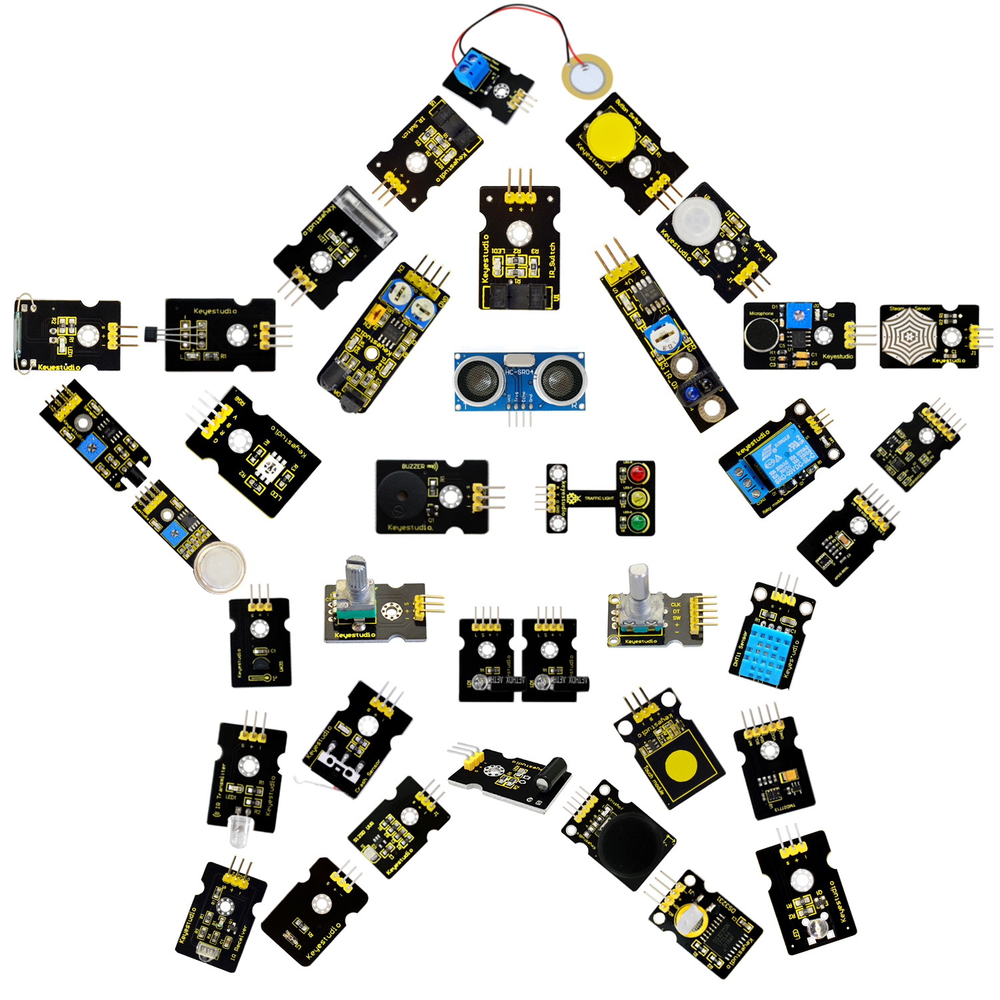For each module, we provide a
clear connection diagram and a sample code. Although you are a beginner, you can
readily pick up how sensors work.

The sample codes for this sensor kit are based on Arduino. In addition, you have
an alternative to apply this kit to other MCU development platform, such as 51,
STM32, Raspberries Pi since the working principle is almost same.

Now, let’s start from the basic lessons.

## 2. Kit List

**(Note: KS0399 kit with no board; KS0400 kit with V4.0 R3; KS0401 with 2560
MEGA R3)**

| **No.** | **Item**                                                            | **Quantity** | **Picture**                                      |
|---------|---------------------------------------------------------------------|--------------|--------------------------------------------------|
|         | White LED module                                                    | 1            | 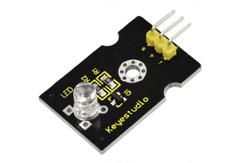  |
|         | RGB LED module                                                      | 1            | 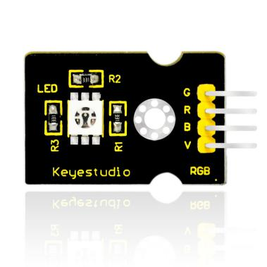 |
|         | Traffic light module                                                | 1            | 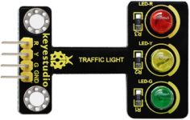  |
|         | Button switch module                                                | 1            |   |
|         | Passive buzzer module                                               | 1            | 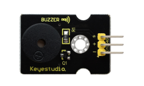  |
|         | Capacitive touch module                                             | 1            | 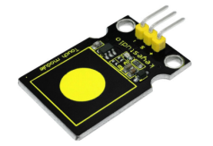  |
|         | Crash sensor                                                        | 1            | 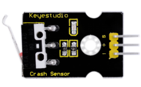  |
|         | Knock sensor                                                        | 1            |   |
|         | Photo interrupter module                                            | 1            | 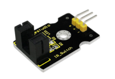  |
|         | Ball Tilt switch sensor                                             | 1            | 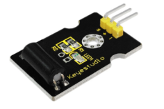  |
|         | PIR motion sensor                                                   | 1            | 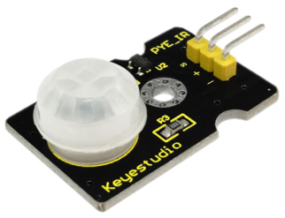  |
|         | Reed switch module                                                  | 1            | 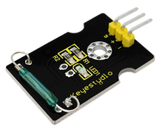  |
|         | Hall magnetic sensor                                                | 1            |   |
|         | Line tracking sensor                                                | 1            |   |
|         | Flame Sensor                                                        | 1            | 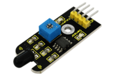  |
|         | Obstacle avoidance sensor                                           | 1            |   |
|         | Photo-resistor sensor                                               | 1            |  |
|         | Microphone sound sensor                                             | 1            | 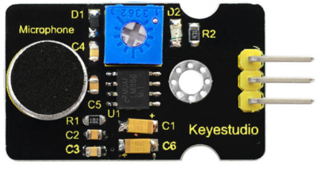  |
|         | Rotary encoder sensor                                               | 1            |   |
|         | MQ2 gas sensor                                                      | 1            |   |
|         | Steam sensor                                                        | 1            | 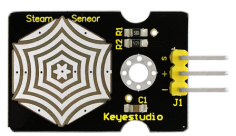  |
|         | TEMT 6000 sensor                                                    | 1            |  |
|         | LM35 temperature sensor                                             | 1            | 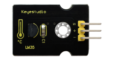  |
|         | DHT11 Temperature and Humidity Sensor                               | 1            | 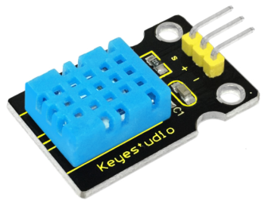  |
|         | Magical light cup module                                            | 2            |   |
|         | IR receiver module                                                  | 1            | 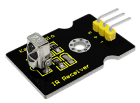  |
|         | IR transmitter module                                               | 1            | 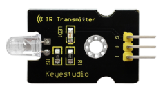  |
|         | Ceramic vibration sensor                                            | 1            | 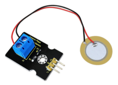  |
|         | GUVA-S12SD 3528 Ultraviolet Sensor                                  | 1            | 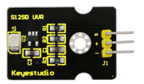  |
|         | MMA8452Q Module Acceleration Tilt Sensor                            | 1            |   |
|         | TMD27713 sensor ALS Infrared LED Optical Proximity Detection Module | 1            |   |
|         | APDS-9930 Attitude Sensor Module                                    | 1            |   |
|         | Potentiometer sensor                                                | 1            |  |
|         | DS3231 Clock module                                                 | 1            | 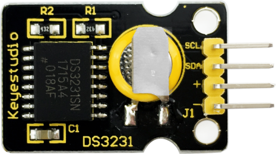  |
|         | Joystick module                                                     | 1            |   |
|         | Single relay module                                                 | 1            | 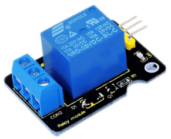  |
|         | HC-SR04 ultrasonic sensor                                           | 1            | 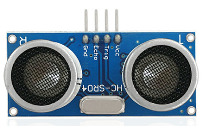  |

**KS0400 kit includes:**

|   | USB Cable                   | 1  |   |
|---|-----------------------------|----|--------------------------------------------------|
|   | keyestudio V4.0 BOARD       | 1  |   |
|   | Dupont Line                 | 40 |   |
|   | Keyestudio Sensor Shield V5 | 1  |  |

**KS0401 kit includes:**

|   | USB Cable                     | 1  |   |
|---|-------------------------------|----|--------------------------------------------------|
|   | Keyestudio Mega 2560 R3       | 1  | 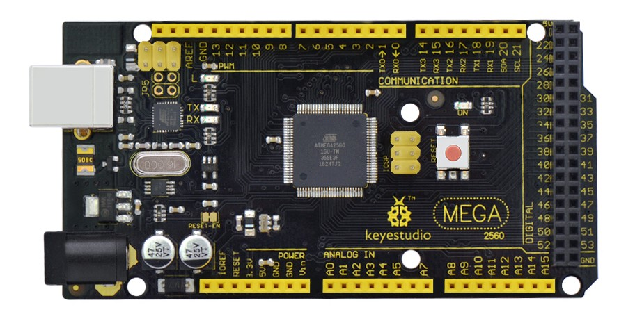 |
|   | Dupont Line                   | 40 |   |
|   | Keyestudio V1.0 Sensor Shield | 1  | 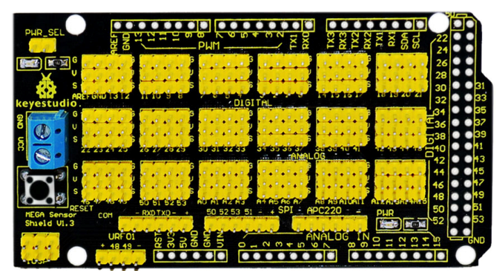  |

## 3. Install Arduino IDE and Driver

**(1) Installing Arduino IDE**

When we get control board, we need to download Arduino IDE and driver firstly.

You could download Arduino IDE from the official website

[https//www.arduino.cc/](https://www.arduino.cc/), click the **SOFTWARE** on the
browse bar, click “DOWNLOADS” to enter download page, as shown below

There are various versions Of IDE for Arduino, just download a version that
compatible with your system, here we will show you how to download and install
the windows version Arduino IDE.

There are two versions of IDE for WINDOWS system, you can choose between the
Installer (.exe) and the Zip packages. We suggest you use the first one that
installs directly everything you need to use the Arduino Software (IDE),
including the drivers. With the Zip package you need to install the drivers
manually. The Zip file is also useful if you want to create a portable
installation.

You just need to click JUST DOWNLOAD.

1.  **Keyestudio V4.0 Development Board**

We need to know keyestudio V4.0 development board, as a core of this sensor kit.

keyestudio V4.0 development board is an Arduino board, which is based on
ATmega328P MCU, and with a cp2102 Chip as a UART-to-USB converter.

It has 14 digital input/output pins (of which 6 can be used as PWM outputs), 6
analog inputs, a 16 MHz quartz crystal, a USB connection, a power jack, 2 ICSP
headers and a reset button.

It contains everything needed to support the microcontroller; simply connect it
to a computer with a USB cable or power it via an external DC power jack (DC
7-12V) or via female headers Vin/ GND(DC 7-12V) to get started.

| Microcontroller             | ATmega328P-PU                                            |
|-----------------------------|----------------------------------------------------------|
| Operating Voltage           | 5V                                                       |
| Input Voltage (recommended) | DC7-12V                                                  |
| Digital I/O Pins            | 14 (D0-D13) (of which 6 provide PWM output)              |
| PWM Digital I/O Pins        | 6 (D3, D5, D6, D9, D10, D11)                             |
| Analog Input Pins           | 6 (A0-A5)                                                |
| DC Current per I/O Pin      | 20 mA                                                    |
| DC Current for 3.3V Pin     | 50 mA                                                    |
| Flash Memory                | 32 KB (ATmega328P-PU) of which 0.5 KB used by bootloader |
| SRAM                        | 2 KB (ATmega328P-PU)                                     |
| EEPROM                      | 1 KB (ATmega328P-PU)                                     |
| Clock Speed                 | 16 MHz                                                   |
| LED_BUILTIN                 | D13                                                      |

1.  **keyestudio MEGA 2560 Board**

Keyestudio Mega 2560 R3 is a microcontroller board based on the ATMEGA2560-16AU
, fully compatible with ARDUINO MEGA 2560 R3.

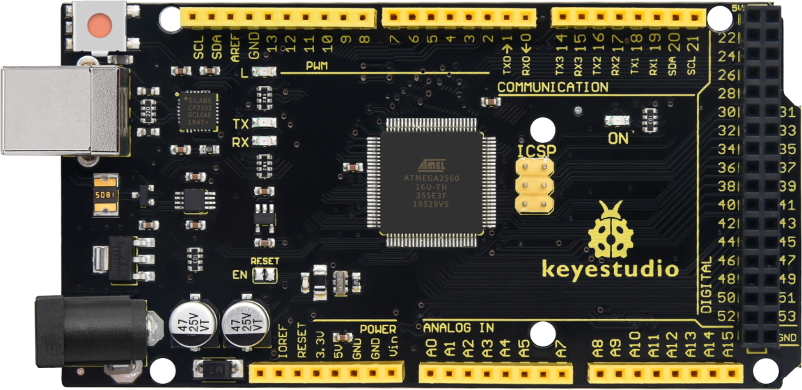

It has 54 digital input/output pins (of which 15 can be used as PWM outputs), 16
analog inputs, 4 UARTs (hardware serial ports), a 16 MHz crystal oscillator, a
USB connection, a power jack, 1 ICSP header, and a reset button. The built-in
ICSP port can burn the firmware for ATMEGA2560-16AU directly. This chip is burnt
the firmware well before leaving the factory, therefore, we hardly use it. We
can power on by USB wire, DC head and Vin GND pins. To facilitate wiring, a 0.5
m USB wire is provided for you.

Specialized Functions of Some Pins:

1\. Serial Communication: D0 (RX0) and D1 (TX1); Serial 1: D19 (RX1) and D18
(TX1); Serial 2: D17 (RX2) and D16 (TX2); Serial 3: D15 (RX3) and D14 (TX3).
Used to receive (RX) and transmit (TX) TTL serial data. Pins 0 and 1 are also
connected to the corresponding pins of the CP2102 USB-to-TTL Serial chip.

2\. PWM Pins (Pulse-Width Modulation): D2 to D13, and D44 to D46. Provide 8-bit
PWM output with the analogWrite() function.

3\. External Interrupts: D2 (interrupt 0), D3 (interrupt 1), D18 (interrupt 5),
D19 (interrupt 4), D20 (interrupt 3), and D21 (interrupt 2). These pins can be
configured to trigger an interrupt on a low level, a rising or falling edge, or
a change in level. See the attachInterrupt() function for details.

4\. SPI communication: D53 (SS), D52 (SCK), D51 (MOSI), D50 (MISO). These pins
support SPI communication using theSPI library. The SPI pins are also broken out
on the ICSP header, which is physically compatible with the Arduino Uno.

5\. IIC communication: D20 (SDA); D21 (SCL). Support TWI communication using the
Wire library.

1.  **Installing V4.0 board Driver**

Let’s install the driver of keyestudio V4.0 board. The USB-TTL chip on V4.0
board adopts CP2102 serial chip. The driver program of this chip is included in
Arduino 1.8 version and above, which is convenient. Plug on USB port of board,
the computer can recognize the hardware and automatically install the driver of
CP2102.

If install unsuccessfully, or you intend to install manually, open the device
manager of computer. Right click Computer----- Properties----- Device Manager

There is a yellow exclamation mark on the page, which implies installing
unsuccessfully. Then we double click the hardware and update the driver.

Click“OK”to enter the following page, click“browse my computer for updated
driver software”, find out the installed or downloaded ARDUINO software. As
shown below

There is a DRIVERS folder in Arduino software installed
package（）, open driver folder
and you can see the driver of CP210X series chips.

We click “Browse”, then find out the driver folder, or you could enter “driver”
to search in rectangular box, then click “next”, the driver will be installed
successfully. (I place Arduino software folder on the desktop, you could follow
my way)

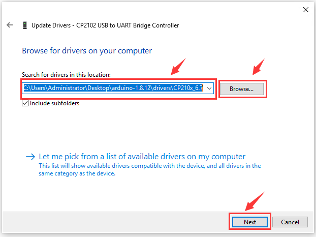

Open device manager, we will find the yellow exclamation mark disappear. The
driver of CP2102 is installed successfully.

**The installation method of keyestudio MEGA 2560 board and V4.0 board is same**

1.  **Arduino IDE Setting**

Clickicon，open Arduino IDE.

To avoid the errors when uploading the program to the board, you need to select
the correct Arduino board that matches the board connected to your computer.

Then come back to the Arduino software, you should click Tools→Board, select the
board. (as shown below)

Then select the correct COM port (you can see the corresponding COM port after
the driver is successfully installed)

Before uploading the program to the board, let’s demonstrate the function of
each symbol in the Arduino IDE toolbar.

A- Used to verify whether there is any compiling mistakes or not.

B- Used to upload the sketch to your Arduino board.

C- Used to create shortcut window of a new sketch.

D- Used to directly open an example sketch.

E- Used to save the sketch.

F- Used to send the serial data received from board to the serial monitor.

1.  **Start First Program**

Open the file to select Example, choose BLINK from BASIC, as shown below

Set board and COM port, the corresponding board and COM port are shown on the
lower right of IDE.

Clickto start compiling the
program, check errors.

Clickto upload the program,
upload successfully.

Upload the program successfully, the onboard LED lights on for 1s, lights off
for 1s. Congratulation, you finish the first program.

**If it is keyestudio MEGA 2560 board, please select Arduino MEGA or MEGA 2560
board**

## 4. How to Add a Library?

What are Libraries ?

[Libraries](https://www.arduino.cc/en/Reference/Libraries) are a collection of
code that makes it easy for you to connect to a sensor,display, module, etc.

For example, the built-in LiquidCrystal library helps talk to LCD displays.
There are hundreds of additional libraries available on the Internet for
download.

The built-in libraries and some of these additional libraries are listed in the
reference.

How to Install a Library ?

Here we will introduce the most simple way for you to add libraries .

Step 1After downloading well the Arduino IDE, you can right-click the icon of
Arduino IDE.

Find the option "Open file location" shown as below

Step 2 Enter it to find out libraries folder, this folder is the library file of
Arduino.

Step 3 Next to find out the “libraries” folder of this kit(seen in the link
https://fs.keyestudio.com/KS0399-0401)

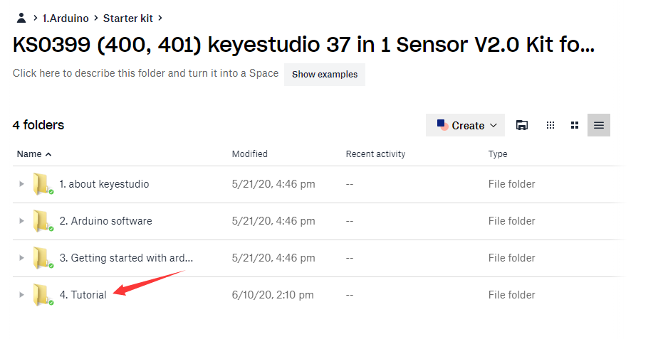

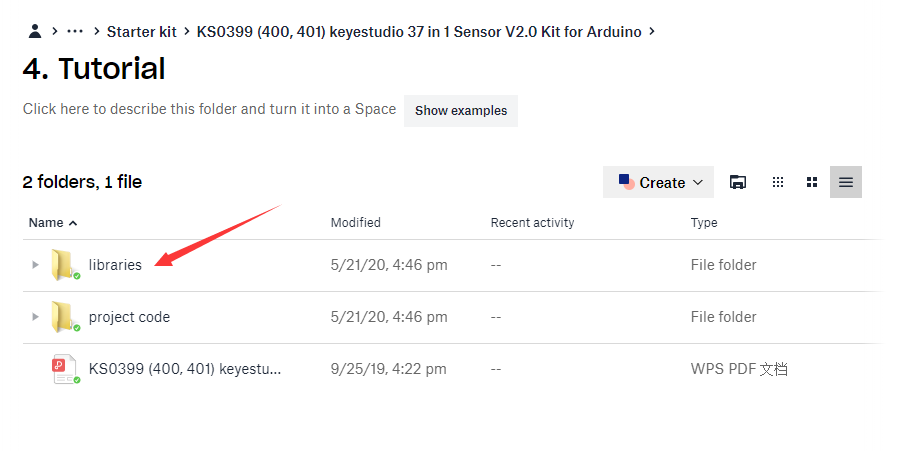

You just need to replicate and paste above libraries into the libraries folder
of Arduino IDE.

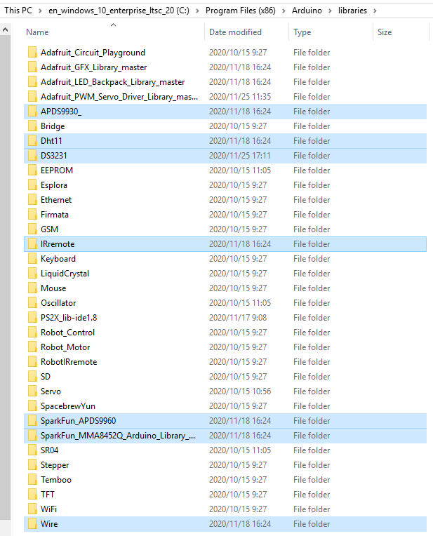

**Note the Arduino software download and the driver installation of keyetudio
Mega 2560 R3 board is similar to arduino V4.0
board****.**

## 5. Project Details

### Project 1: LED Flash

**Introduction:**

LED has wide applications. Most signal lights we saw in our daily life use LED
as its major light source. In today’s experiment, we are going to use Arduino to
make LED module flashing.

**Components list:**

-   Control board \* 1

-   keyestudio Sensor Shield V5\* 1

-   USB Cable\* 1

-   LED module \* 1

-   Dupont Line \*3

**Components Introduction:**

This is a special LED module. When you connect it to ARDUINO development board,
after program, it can emit beautiful light. Of course, you can also control it
using PWM. It will be like fireflies at night. Isn’t cool? We can also combine
it with other sensors to do interesting interactive experiments.

**Specifications:**

-   Control interface: Digital

-   Operating voltage: DC 3.3-5V

-   Pin pitch:2.54mm

-   Emitting color: white

**Hardware
Connection**

Connect the negative pin of LED module to GND, positive pin to VCC (3.3-5V),
Signal pin to digital pin 7.

**For V4.0 connection:**

Stack the Sensor Shield V5 onto the V4.0 board, then connect the LED module.

**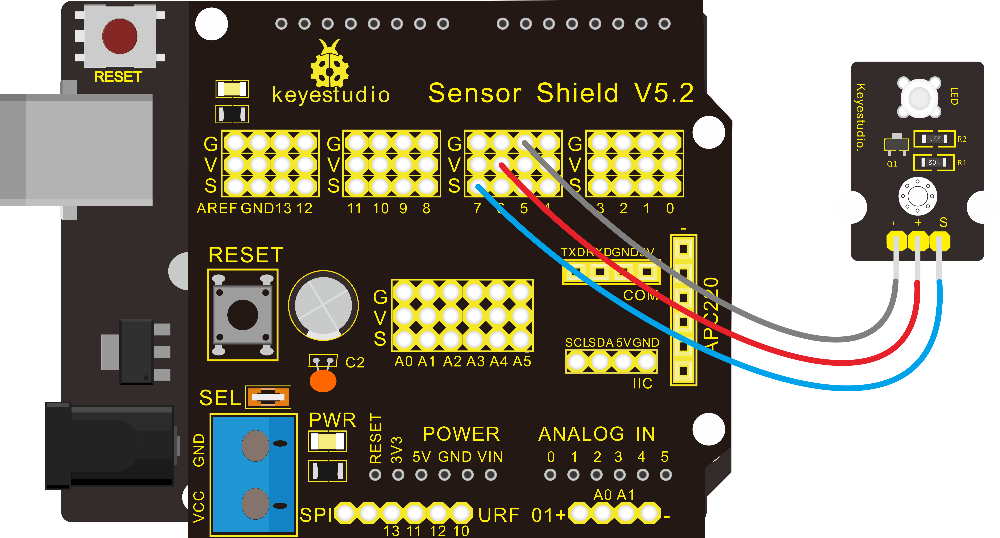**

**For Mega 2560 connection:**

Stack the Sensor Shield V1.0 onto the Mega 2560 board, then connect the LED
module.

**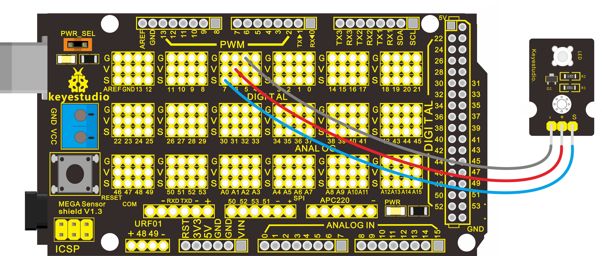**

**Sample Code:**

\*\*\*\*\*\*\*\*\*\*\*\*\*\*\*\*\*\*\*\*\*\*\*\*\*\*\*\*\*\*\*\*\*\*\*\*\*\*\*\*\*\*\*\*\*\*\*\*\*\*\*\*\*\*\*\*\*

int led = 7;

void setup()

{

pinMode(led, OUTPUT); //Set Pin7 as output

}

void loop()

{ digitalWrite(led, HIGH); //Turn off led

delay(1000);

digitalWrite(led, LOW); //Turn on led

delay(1000);

}

\*\*\*\*\*\*\*\*\*\*\*\*\*\*\*\*\*\*\*\*\*\*\*\*\*\*\*\*\*\*\*\*\*\*\*\*\*\*\*\*\*\*\*\*\*\*\*\*\*\*\*\*\*\*\*\*\***Experiment
Result:**

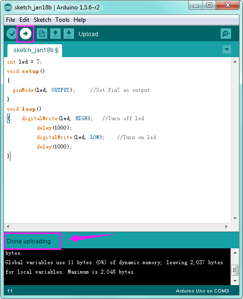

Done uploading the code, you can see the LED on the module flashing for one
second then off for one second, repeatedly.

If it is not, go back and check your operations.

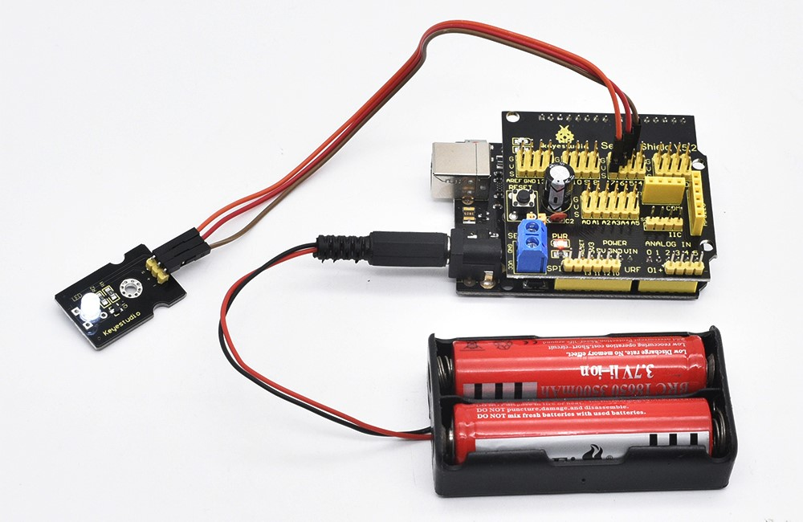

### Project 2: RGB LED

**Introduction:**

This is a full-color LED module, which contains 3 basic colors－red, green and
blue. They can be seen as separate LED lights.

After program, we can turn them on and off by sequence. We can also use PWM
analog output to mix the three colors to generate different colors.

**Specification:**

-   Color: red, green and blue

-   Brightness: High

-   Voltage: 5V

-   Input: digital level

**Hardware
Connection**

To begin with, you need to prepare the following parts before connection:

-   Control board \* 1

-   keyestudio Sensor Shield V5\* 1

-   USB Cable\* 1

-   RGB LED module \* 1

-   Dupont Line \*4

Connect the R pin of RGB module to Digital 10 of V4.0 board, connect the B pin
to Digital 9, G pin to Digital 11, GND pin to ground port.

**For V4.0 connection:**

Stack the Sensor Shield V5 onto the V4.0 board.

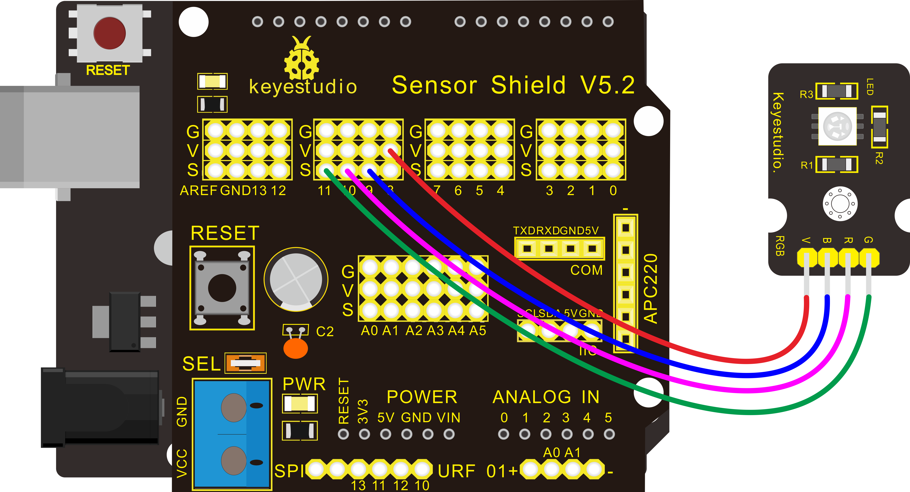

**For 2560 R3 connection:**

Stack the Sensor Shield V1.0 onto the 2560 R3 board

**Sample Code:**

\*\*\*\*\*\*\*\*\*\*\*\*\*\*\*\*\*\*\*\*\*\*\*\*\*\*\*\*\*\*\*\*\*\*\*\*\*\*\*\*\*\*\*\*\*\*\*\*\*\*\*\*\*\*\*\*\*

int redpin = 10; //select the pin for the red LED

int bluepin =9; // select the pin for the blue LED

int greenpin =11;// select the pin for the green LED

int val;

void setup() {

pinMode(redpin, OUTPUT);

pinMode(bluepin, OUTPUT);

pinMode(greenpin, OUTPUT);

}

void loop()

{for(val=255; val\>0; val--)

{analogWrite(11, val);

analogWrite(10, 255-val);

analogWrite(9, 128-val);

delay(1);

}

for(val=0; val\<255; val++)

{analogWrite(11, val);

analogWrite(10, 255-val);

analogWrite(9, 128-val);

delay(1);

}

}

\*\*\*\*\*\*\*\*\*\*\*\*\*\*\*\*\*\*\*\*\*\*\*\*\*\*\*\*\*\*\*\*\*\*\*\*\*\*\*\*\*\*\*\*\*\*\*\*\*\*\*\*\*\*\*\*\*

**Experiment Result:**

You can see the RGB LED flashing in various colors.

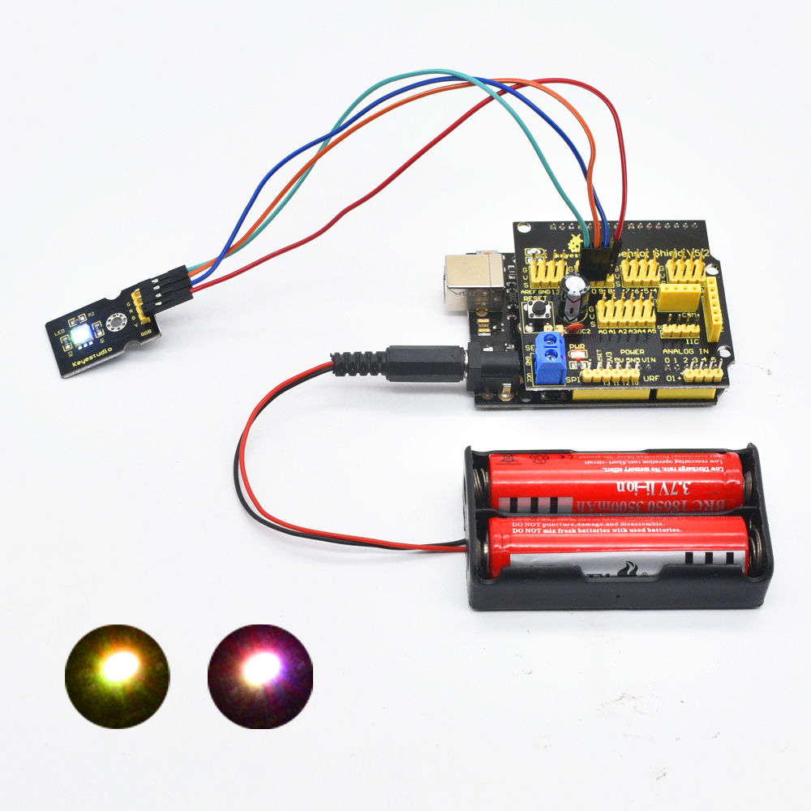

### Project 3: Traffic Light

**Description:**

When learning the microcontroller, you may usually use three LEDs, namely red,
green and yellow lights to simulate the traffic light blinking via external
connection.

This time we specially design this module which is very convenient for wiring,
and on the module you can see the red, yellow and green LED.

This traffic light module is fully compatible with Arduino microcontroller and
Raspberry Pi system.

**Specifications:**

-   Working Voltage: 3.3-5V

-   Interface Type: digital

-   Pin Pitch: 2.54mm

**Hardware Connection**

First, you need to prepare the following parts before connection:

-   Control board \* 1

-   keyestudio Sensor Shield V5\* 1

-   USB Cable\* 1

-   Traffic light module \* 1

-   Dupont Line \*4

Connect the R pin of module to Digital 3 of V4.0 board, connect the Y pin to
Digital 4, G pin to Digital 5, GND pin to ground port.

**For V4.0 connection:**

Stack the Sensor Shield V5 onto the V4.0 board

**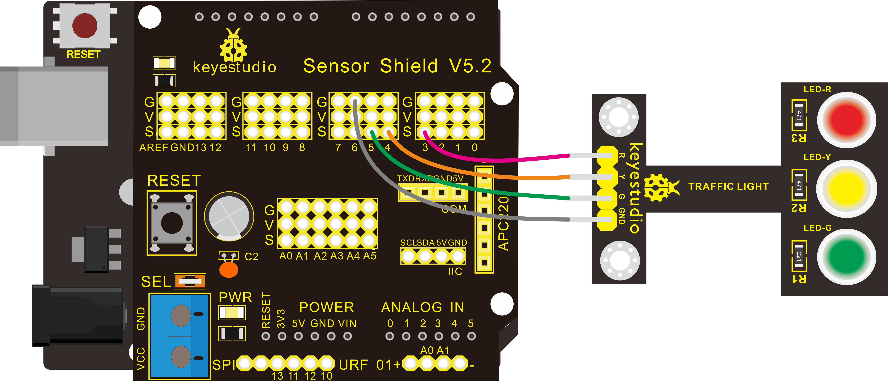**

**For 2560 R3 connection:**

Stack the Sensor Shield V1.0 onto the 2560 R3 board

**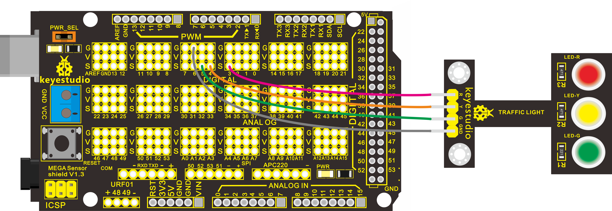**

**Sample Code:**

Copy and paste the below code to Arduino software.

\*\*\*\*\*\*\*\*\*\*\*\*\*\*\*\*\*\*\*\*\*\*\*\*\*\*\*\*\*\*\*\*\*\*\*\*\*\*\*\*\*\*\*\*\*\*\*\*\*\*\*\*\*\*\*\*\*

int redled =3; // initialize digital pin3.

int yellowled =4; // initialize digital pin 4.

int greenled =5; // initialize digital pin 5.

void setup()

{

pinMode(redled, OUTPUT);// set the pin with red LED as “output”

pinMode(yellowled, OUTPUT); // set the pin with yellow LED as “output”

pinMode(greenled, OUTPUT); // set the pin with green LED as “output”

}

void loop()

{

digitalWrite(greenled, HIGH);//// turn on green LED

delay(5000);// wait 5 seconds

digitalWrite(greenled, LOW); // turn off green LED

for(int i=0;i\<3;i++)// blinks for 3 times

{

delay(500);// wait 0.5 seconds

digitalWrite(yellowled, HIGH);// turn on yellow LED

delay(500);// wait 0.5 seconds

digitalWrite(yellowled, LOW);// turn off yellow LED

}

delay(500);// wait 0.5 seconds

digitalWrite(redled, HIGH);// turn on red LED

delay(5000);// wait 5 seconds

digitalWrite(redled, LOW);// turn off red LED

}

\*\*\*\*\*\*\*\*\*\*\*\*\*\*\*\*\*\*\*\*\*\*\*\*\*\*\*\*\*\*\*\*\*\*\*\*\*\*\*\*\*\*\*\*\*\*\*\*\*\*\*\*\*\*\*\*\*

**Experiment Result:**

Done uploading the code, powered up, three LEDs on the module will automatically
simulate the traffic light on and off, alternatively.

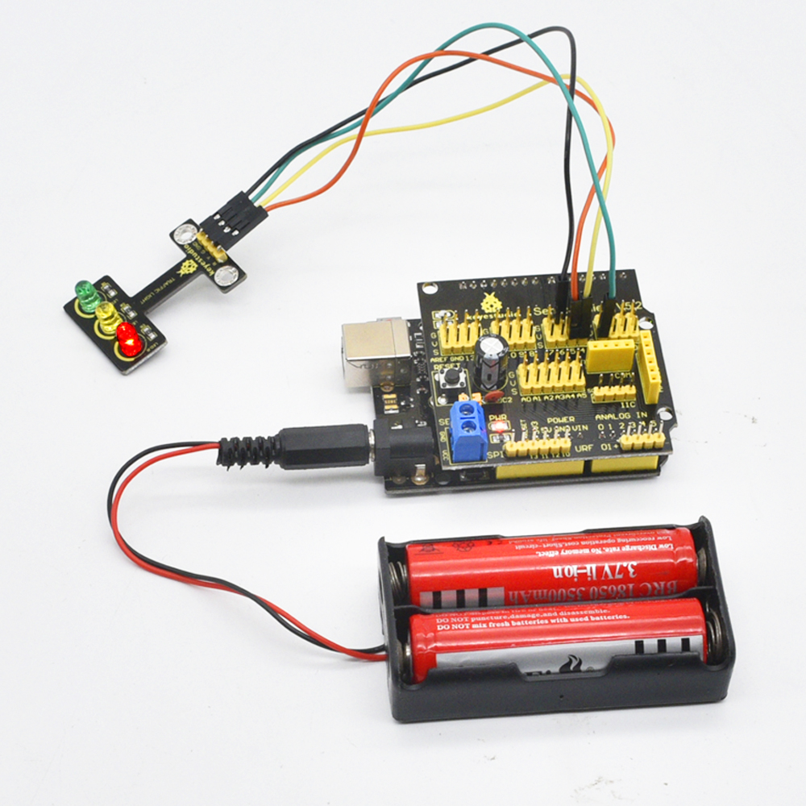

### Project 4: Push Button

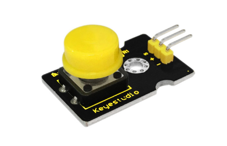

**Introduction:**

This is a basic application module integrated with a push button. You can simply
plug it into an IO shield to have your first taste of Arduino.

**Advantages:**

-   Wide voltage range from 3.3V to 5V

-   Interface: Digital

-   Standard assembling structure

-   Icons illustrate sensor function clearly

-   High quality pin

-   Easy to plug and operate

-   Large button keypad and high-quality button cap

-   Achieve interesting and interactive work

**Components Introduction:**

**Momentary Push button Switch**

This is a common component for controlling electronic devices. It is mostly used
to connect or cut off control circuit so that it can achieve motor or other
electronic equipment control.

Momentary Pushbutton Switch usually stays open. When it is pressed down, circuit
connected; when it is released, it will bounce back to the status of
disconnection.

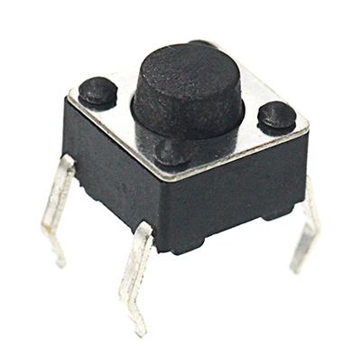

Momentary Pushbutton Switch has 4 footers which can be divided into 2 groups:
footer 1 short connected with footer 2, footer 3 short connected with footer 4.

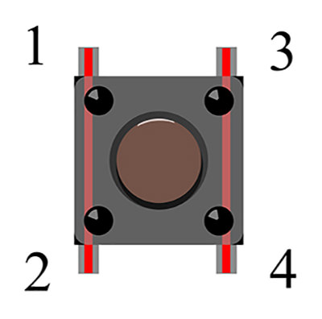

**Hardware
Connection**

To begin with, you need to prepare the following parts:

-   Control board \* 1

-   keyestudio Sensor Shield V5\* 1

-   USB Cable\* 1

-   Button module \* 1

-   Dupont Line \*3

**For V4.0 connection:**

Stack the Sensor Shield V5 onto the V4.0 board

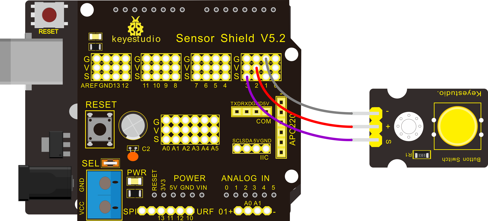

**For 2560 R3 connection:**

Stack the Sensor Shield V1.0 onto the 2560 R3 board

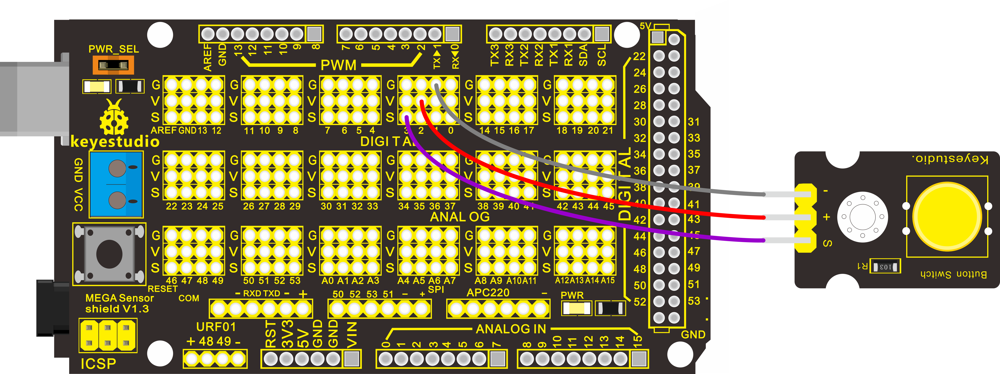

**Sample Code:**

\*\*\*\*\*\*\*\*\*\*\*\*\*\*\*\*\*\*\*\*\*\*\*\*\*\*\*\*\*\*\*\*\*\*\*\*\*\*\*\*\*\*\*\*\*\*\*\*\*\*\*\*\*\*\*\*\*\*\*

/\* \## When you push the digital button, the Led 13 will turn on. Otherwise, the
led turns off.

\*/

int ledPin = 13; // choose the pin for the LED

int inputPin = 3; // Connect sensor to input pin 3

void setup() {

pinMode(ledPin, OUTPUT); // declare LED as output

pinMode(inputPin, INPUT); // declare pushbutton as input

}

void loop(){

int val = digitalRead(inputPin); // read input value

if (val == HIGH) { // check if the input is HIGH

digitalWrite(ledPin, LOW); // turn LED OFF

} else {

digitalWrite(ledPin, HIGH); // turn LED ON

}

}

\*\*\*\*\*\*\*\*\*\*\*\*\*\*\*\*\*\*\*\*\*\*\*\*\*\*\*\*\*\*\*\*\*\*\*\*\*\*\*\*\*\*\*\*\*\*\*\*\*\*\*\*\*\*\*\*\***Experiment
Result:**

Done uploading the code, powered up, when you push the digital button, the Led
13 on V4.0 board will be on. When release the button, the led is off. Shown as
below.

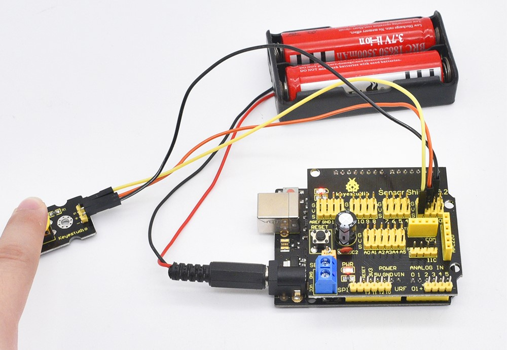

**Think:**

If we want to connect more an LED module, light an LED when press down the
button, and turn off LED when release the button, then how to program? You can
have a try.

### Project 5: Passive Buzzer

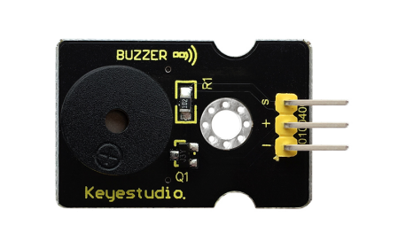

**Introduction:**

We can use Arduino to make many interactive works of which the most commonly
used is acoustic-optic display.

All the previous experiment has something to do with LED. However, the circuit
in this experiment can produce sound. Normally, the experiment is done with a
buzzer or a speaker while buzzer is simpler and easier to use.

The buzzer we introduced here is a passive buzzer. It cannot be actuated by
itself, but by external pulse frequencies. Different frequencies produce
different sounds. We can use Arduino to code the melody of a song, which is
quite fun and simple.

**Specification:**

-   Working voltage: 3.3-5v

-   Interface type: digital

**Hardware Connection**

To begin with, you need to prepare the following parts:

-   Control board \* 1

-   keyestudio Sensor Shield V5\* 1

-   USB Cable\* 1

-   Passive buzzer module \* 1

-   Dupont Line \*3

**For V4.0 connection:**

Stack the Sensor Shield V5 onto the V4.0 board

**For 2560 R3 connection:**

Stack the Sensor Shield V1.0 onto the 2560 R3 board

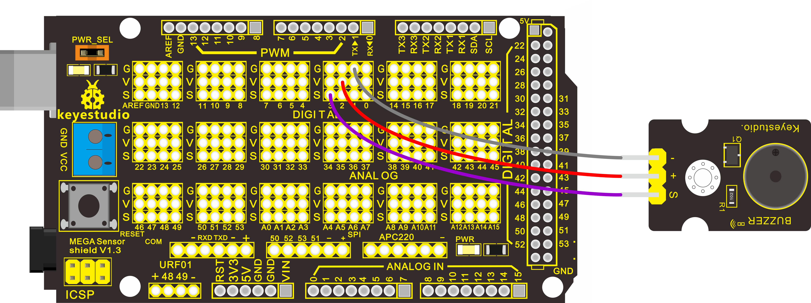

**Sample Code:**

\*\*\*\*\*\*\*\*\*\*\*\*\*\*\*\*\*\*\*\*\*\*\*\*\*\*\*\*\*\*\*\*\*\*\*\*\*\*\*\*\*\*\*\*\*\*\*\*\*\*\*\*\*\*\*\*\*\*\*

int buzzer=3;//set digital IO pin of the buzzer

void setup()

{

pinMode(buzzer,OUTPUT);// set digital IO pin pattern, OUTPUT to be output

}

void loop()

{ unsigned char i,j;//define variable

while(1)

{ for(i=0;i\<80;i++)// output a frequency sound

{ digitalWrite(buzzer,HIGH);// sound

delay(1);//delay1ms

digitalWrite(buzzer,LOW);//not sound

delay(1);//ms delay

}

for(i=0;i\<100;i++)// output a frequency sound

{

digitalWrite(buzzer,HIGH);// sound

digitalWrite(buzzer,LOW);//not sound

delay(2);//2ms delay

}

}

}

\*\*\*\*\*\*\*\*\*\*\*\*\*\*\*\*\*\*\*\*\*\*\*\*\*\*\*\*\*\*\*\*\*\*\*\*\*\*\*\*\*\*\*\*\*\*\*\*\*\*\*\*\*\*\*\*\*\*\*

**Experiment Result:**

After downloading the program, buzzer experiment is complete. You should hear
the buzzer ringing.

### Project 6: Capacitive Touch

****

**Introduction:**

Are you tired of clicking mechanic button? Well, try our capacitive touch
sensor. We can find touch sensors mostly on electronic device. So upgrade your
Arduino Project with our new version touch sensor and make it cool!!

This little sensor can "feel" people and metal touch and feedback a high/low
voltage level. Even isolated by some cloth and paper, it can still feel the
touch. Its sensitivity decrease as isolation layer gets thicker.

**Specification:**

-   Supply Voltage: 3.3V to 5V

-   Interface: Digital

**Hardware
Connection**

To begin with, you need to prepare the following parts:

-   Control board \* 1

-   keyestudio Sensor Shield V5\* 1

-   USB Cable\* 1

-   Capacitive touch sensor module \* 1

-   Dupont Line \*3

**For V4.0 connection:**

Stack the Sensor Shield V5 onto the V4.0 board

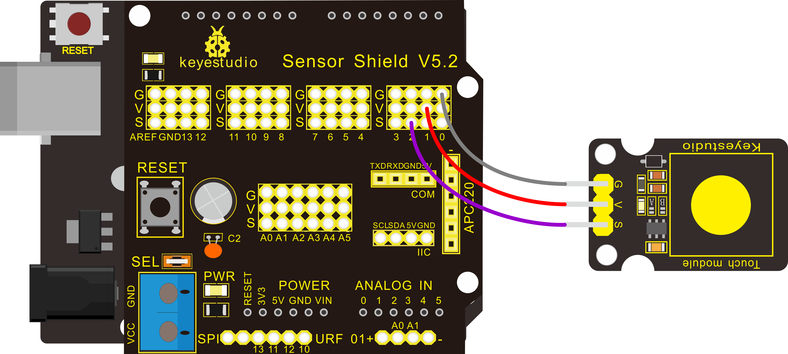

**For 2560 R3 connection:**

Stack the Sensor Shield V1.0 onto the 2560 R3 board

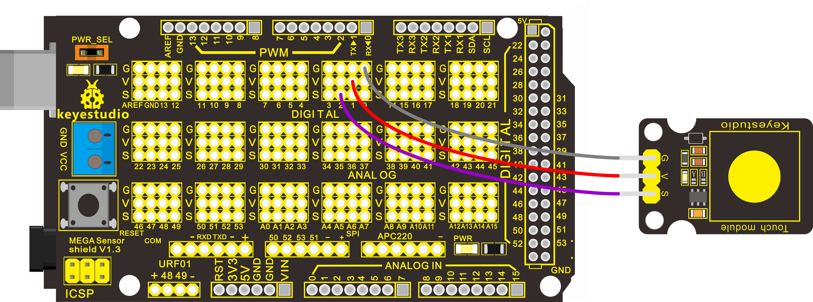

**Sample Code:**

\*\*\*\*\*\*\*\*\*\*\*\*\*\*\*\*\*\*\*\*\*\*\*\*\*\*\*\*\*\*\*\*\*\*\*\*\*\*\*\*\*\*\*\*\*\*\*\*\*\*\*\*\*\*\*\*\*\*\*

int ledPin = 13; // Connect LED on pin 13, or use the onboard one

int KEY = 2; // Connect Touch sensor on Digital Pin 2

void setup(){

pinMode(ledPin, OUTPUT); // Set ledPin to output mode

pinMode(KEY, INPUT); //Set touch sensor pin to input mode

}

void loop(){

if(digitalRead(KEY)==HIGH) { //Read Touch sensor signal

digitalWrite(ledPin, HIGH); // if Touch sensor is HIGH, then turn on

}

else{

digitalWrite(ledPin, LOW); // if Touch sensor is LOW, then turn off the led

}

}

\*\*\*\*\*\*\*\*\*\*\*\*\*\*\*\*\*\*\*\*\*\*\*\*\*\*\*\*\*\*\*\*\*\*\*\*\*\*\*\*\*\*\*\*\*\*\*\*\*\*\*\*\*\*\*\*\*

**Experiment Result:**

Done wiring and powered up, upload well the code, then touch the sensor with
your finger, both D2 led on the sensor and D13 indicator on V4.0 board are on.
Otherwise, those two indicators are turned off.

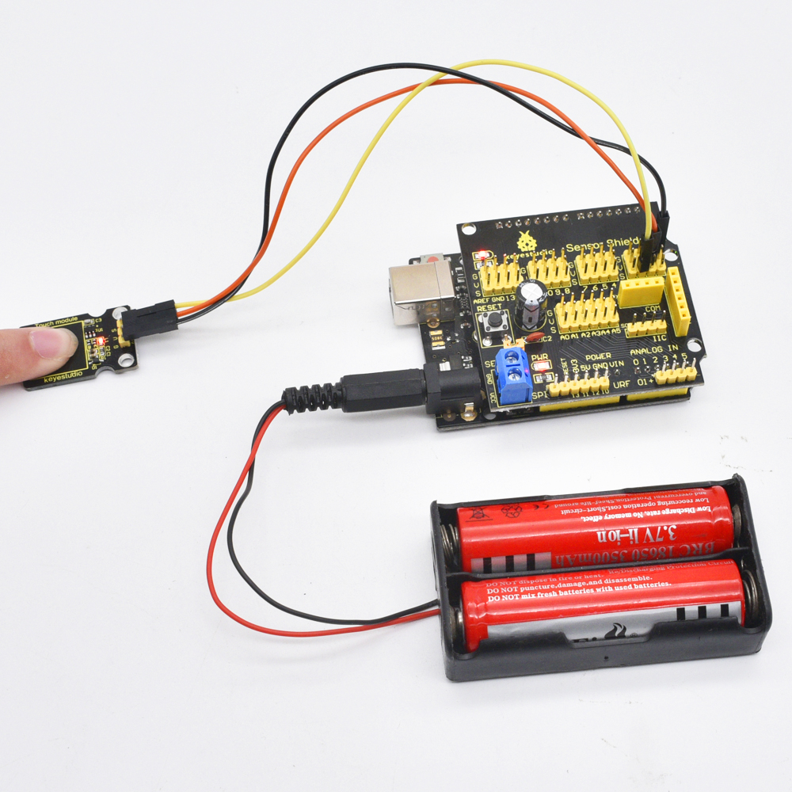

**Think:**

If we want to connect more an LED module, light an LED when touch the sensor,
and turn off LED when not touch the sensor, then how to program?

### Project 7: Collision Flash

**Description:**

Crash sensor, also known as electronic switch, is a digital on-off input module
necessary for elementary electronic learning. By programming, it can realize to
control over light, sound device, key choice function of LCD display, etc.

You can install the sensor to 4WD mobile robot platform to realize crash
detection function. It is indeed convenient and efficient.

**Details:**

1\. If collision happens upfront of where collision module is installed, module
outputs low level signal; no collision, outputs high level signal.

2\. Module reserves M3 mounting hole, convenient for fixation on a car.

4\. With switch indicator light, if there is collision, light is on; no
collision, light is off.

**Pins definition:**

-   **Positive pin (+):** connect to 3v-12v power supply

-   **Negative pin (-):** connect to GND

-   **Signal pin (S):** connect to High-Low level output

**Hardware
Connection**

To begin with, you need to prepare the following parts:

-   Control board \* 1

-   keyestudio Sensor Shield V5\* 1

-   USB Cable\* 1

-   Crash module \* 1

-   Dupont Line \*3

**Note:** You can make a collision flasher using collision module and built-in
LED on interface 13. Connect the collision sensor to Digital pin 3.

When the crash sensor senses a collision signal, the LEDs on both Arduino board
and crash sensor will light up simultaneously.

**For V4.0 connection:**

Stack the Sensor Shield V5 onto the V4.0 board

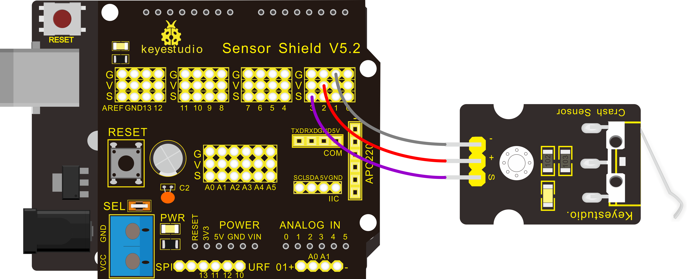

**For 2560 R3 connection:**

Stack the Sensor Shield V1.0 onto the 2560 R3 board

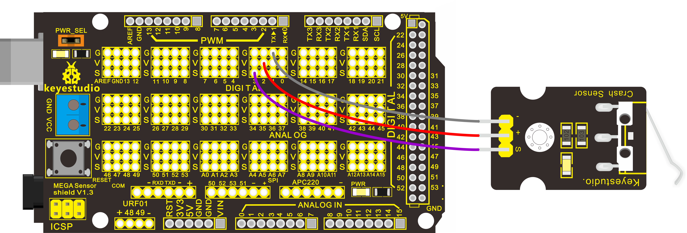

**Sample Code:**

Copy and paste the below code to Arduino software.

\*\*\*\*\*\*\*\*\*\*\*\*\*\*\*\*\*\*\*\*\*\*\*\*\*\*\*\*\*\*\*\*\*\*\*\*\*\*\*\*\*\*\*\*\*\*\*\*\*\*\*\*\*\*\*\*\*\*\*

int Led=13;// set pin for LED

int Shock=3;// set pin for collision sensor

int val;// set digital variable val

void setup()

{

pinMode(Led,OUTPUT);// set pin LED as output

pinMode(Shock,INPUT);// set collision sensor as input

}

void loop()

{

val=digitalRead(Shock);// read value on pin 3 and assign it to val

if(val==HIGH)// when collision sensor detects a signal, LED turns on.

{

digitalWrite(Led,LOW);

} else

{

digitalWrite(Led,HIGH);

}

}

\*\*\*\*\*\*\*\*\*\*\*\*\*\*\*\*\*\*\*\*\*\*\*\*\*\*\*\*\*\*\*\*\*\*\*\*\*\*\*\*\*\*\*\*\*\*\*\*\*\*\*\*\*\*\*\*\*\*\*

**Example Result:**

Upload the code to the board.

When an object crashes the switch of sensor, both the led on the sensor and led
13 on the V4.0 board are turned on.

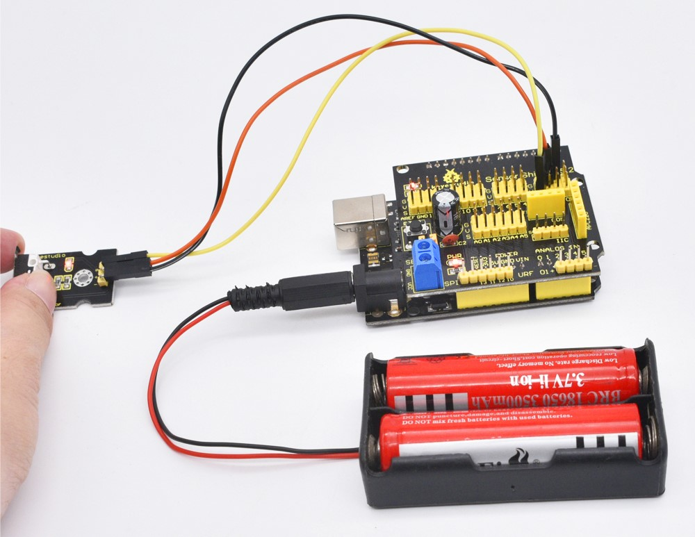

### Project 8: Knock Sensor

**Introduction:**

This is a knock sensor module. When you knock it, it can send a momentary
signal. We can combine it with Arduino to make some interesting experiment, e.g.
electronic drum.

Note: the working voltage of this module is 5V.

**Hardware
Connection**

To begin with, you need to prepare the following parts:

-   Control board \* 1

-   keyestudio Sensor Shield V5\* 1

-   USB Cable\* 1

-   Knock sensor module \* 1

-   Dupont Line \*3

Connect the S pin to digital 3, negative pin to GND port, positive pin to 5V
port.

**For V4.0 connection:**

Stack the Sensor Shield V5 onto the V4.0 board

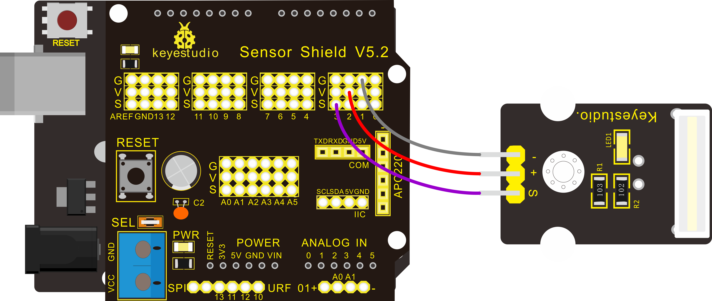

**For 2560 R3 connection:**

Stack the Sensor Shield V1.0 onto the 2560 R3 board

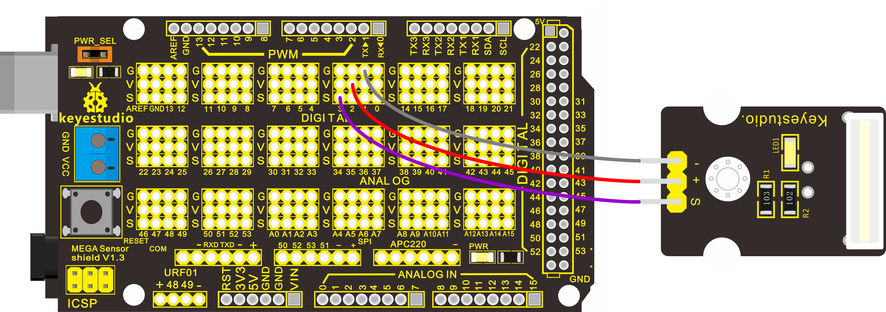

**Sample Code:**

\*\*\*\*\*\*\*\*\*\*\*\*\*\*\*\*\*\*\*\*\*\*\*\*\*\*\*\*\*\*\*\*\*\*\*\*\*\*\*\*\*\*\*\*\*\*\*\*\*\*\*\*\*\*\*\*\*\*\*

\##define SensorLED 13

\##define SensorINPUT 3 //Connect the sensor to digital Pin 3 which is Interrupts
1.

unsigned char state = 0;

void setup()

{

pinMode(SensorLED, OUTPUT);

pinMode(SensorINPUT, INPUT);

attachInterrupt(1, blink, FALLING);// Trigger the blink function when the
falling edge is detected

}

void loop()

{ if(state!=0)

{

state = 0;

digitalWrite(SensorLED,HIGH);

delay(500);

}

else

digitalWrite(SensorLED,LOW);

}

void blink()//Interrupts function

{ state++;

}

\*\*\*\*\*\*\*\*\*\*\*\*\*\*\*\*\*\*\*\*\*\*\*\*\*\*\*\*\*\*\*\*\*\*\*\*\*\*\*\*\*\*\*\*\*\*\*\*\*\*\*\*\*\*\*\*\*\*\*

**Example Result:**

Upload the code to the board.

When the sensor detects a knock signal, both the led on the sensor and led 13 on
the V4.0 board are turned on.

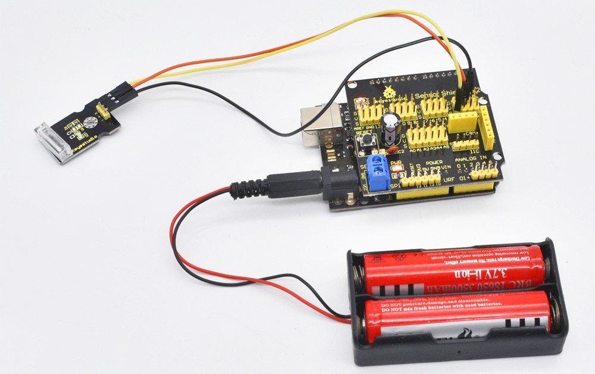

**Think:**

If not easy to see the test result, you can connect an external LED module.
Light an LED when knock the sensor, then how to program? Think about it.

### Project 9: Photo Interrupter

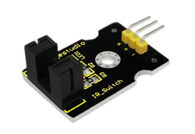

**Introduction:**

Upright part of this sensor is an infrared emitter and on the other side, it’s a
shielded infrared detector. By emitting a beam of infrared light from one end to
other end, the sensor can detect an object when it passes through the beam.

It is used for many applications including optical limit switches, pellet
dispensing, general object detection, etc.

**Specification:**

-   Supply Voltage: 3.3V to 5V

-   Interface: Digital

**Hardware
Connection**

To begin with, you need to prepare the following parts:

-   Control board \* 1

-   keyestudio Sensor Shield V5\* 1

-   USB Cable\* 1

-   Photo Interrupter module \* 1

-   Dupont Line \*3

Connect the S pin to digital 3, negative pin to GND port, positive pin to 5V
port.

**For V4.0 connection:**

Stack the Sensor Shield V5 onto the V4.0 board

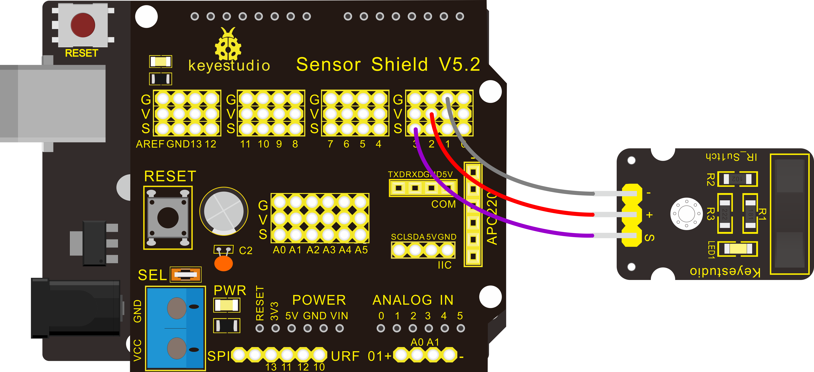

**For 2560 R3 connection:**

Stack the Sensor Shield V1.0 onto the 2560 R3 board

**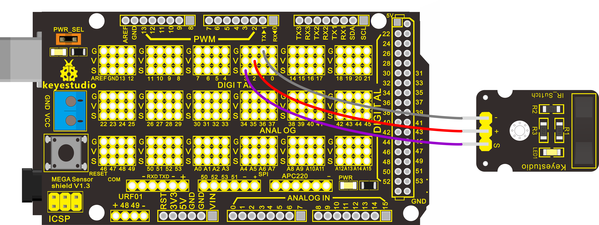**

**Sample Code:**

\*\*\*\*\*\*\*\*\*\*\*\*\*\*\*\*\*\*\*\*\*\*\*\*\*\*\*\*\*\*\*\*\*\*\*\*\*\*\*\*\*\*\*\*\*\*\*\*\*\*\*\*\*\*\*\*\*\*\*

// photo interrupter module

int Led = 13 ;// define LED Interface

int buttonpin = 3; // define the photo interrupter sensor interface

int val ;// define numeric variables val

void setup ()

{

pinMode (Led, OUTPUT) ;// define LED as output interface

pinMode (buttonpin, INPUT) ;// define the photo interrupter sensor output
interface

}

void loop ()

{

val = digitalRead (buttonpin) ;// digital interface will be assigned a value of
3 to read val

if (val == HIGH) // When the light sensor detects a signal is interrupted, LED
flashes

{

digitalWrite (Led, HIGH);

}

else

{

digitalWrite (Led, LOW);

}

}

\*\*\*\*\*\*\*\*\*\*\*\*\*\*\*\*\*\*\*\*\*\*\*\*\*\*\*\*\*\*\*\*\*\*\*\*\*\*\*\*\*\*\*\*\*\*\*\*\*\*\*\*\*\*\*\*\*\*\*

**Example Result:**

Upload the code to the board. When an object passes through the groove joint of
photo interrupter module, the signal is interrupted, led will flash.

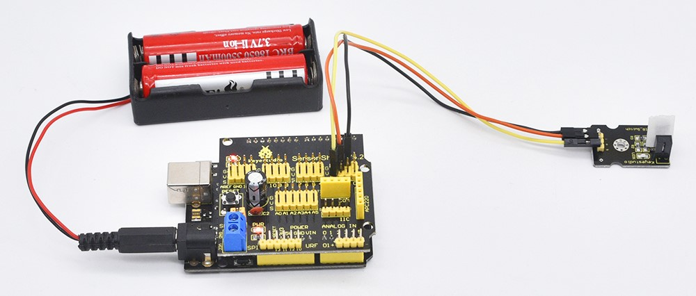

**Think:**

If not easy to see the built-in led status, you can connect an external LED
module, then how to program? Think about it.

### Project 10: Digital Tilt Sensor

**Introduction:**

Tilt Sensor is a simple digital tilt switch.

Simply plug it to our IO/Sensor shield or Arduino board, you can make
interesting and interactive projects.

Tilt sensors (tilt ball switch) allow you to detect orientation or inclination.
They are

small, inexpensive, low-power and easy-to-use.

If used properly, they will not wear out. Their simplicity makes them popular
for toys, gadgets and appliances.

Sometimes, they are referred to as "mercury switches", "tilt switches" or
"rolling

ball sensors" for obvious reasons.

They are usually made up of a cavity of some sort (cylindrical is popular,
although

not always) with a conductive free mass inside, such as a blob of mercury or
rolling

ball.

One end of the cavity has two conductive elements (poles).

When the sensor is oriented so that that end is downwards, the mass rolls onto
the poles and shorts them, acting as a switch throw.

While not as precise or flexible as a full accelerometer, tilt switches can
detect motion or orientation. Another benefit is that the big ones can switch
power on their own. Accelerometer, on the other hand, output digital or analog
voltage that

must then be analyzed using extra circuitry.

**Specification:**

-   Supply Voltage: 3.3V to 5V

-   Interface: Digital

**Hardware
Connection**

To begin with, you need to prepare the following parts:

-   Control board \* 1

-   keyestudio Sensor Shield V5\* 1

-   USB Cable\* 1

-   Tilt ball switch module \* 1

-   Dupont Line \*3

Connect the S pin to digital 3, negative pin to GND port, positive pin to 5V
port.

**For V4.0 connection:**

Stack the Sensor Shield V5 onto the V4.0 board

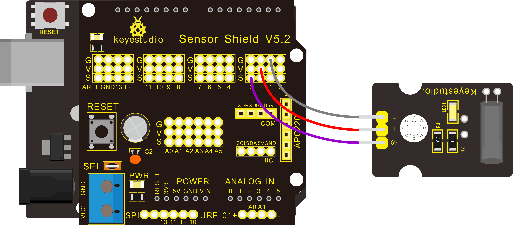

**For 2560 R3 connection:**

Stack the Sensor Shield V1.0 onto the 2560 R3 board

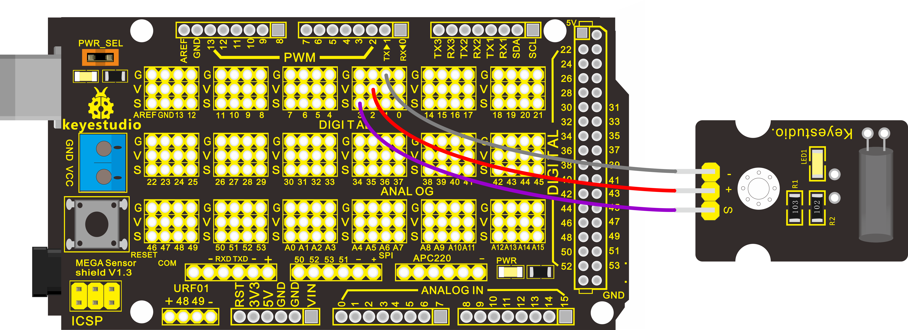

**Sample Code:**

\*\*\*\*\*\*\*\*\*\*\*\*\*\*\*\*\*\*\*\*\*\*\*\*\*\*\*\*\*\*\*\*\*\*\*\*\*\*\*\*\*\*\*\*\*\*\*\*\*\*\*\*\*\*\*\*\*\*\*

int ledPin = 13; // Connect LED to pin 13

int switcher = 3; // Connect Tilt sensor to Pin3

void setup()

{

pinMode(ledPin, OUTPUT); // Set digital pin 13 to output mode

pinMode(switcher, INPUT); // Set digital pin 3 to input mode

}

void loop()

{

if(digitalRead(switcher)==HIGH) //Read sensor value

{

digitalWrite(ledPin, HIGH); // Turn on LED when the sensor is tilted

}

else

{

digitalWrite(ledPin, LOW); // Turn off LED when the sensor is not triggered

}

}

\*\*\*\*\*\*\*\*\*\*\*\*\*\*\*\*\*\*\*\*\*\*\*\*\*\*\*\*\*\*\*\*\*\*\*\*\*\*\*\*\*\*\*\*\*\*\*\*\*\*\*\*\*\*\*\*\*\*\*

**Example Result:**

Upload the code to the board. Then tilt the sensor, you will see the led on the
sensor is turned on. Shown as below.

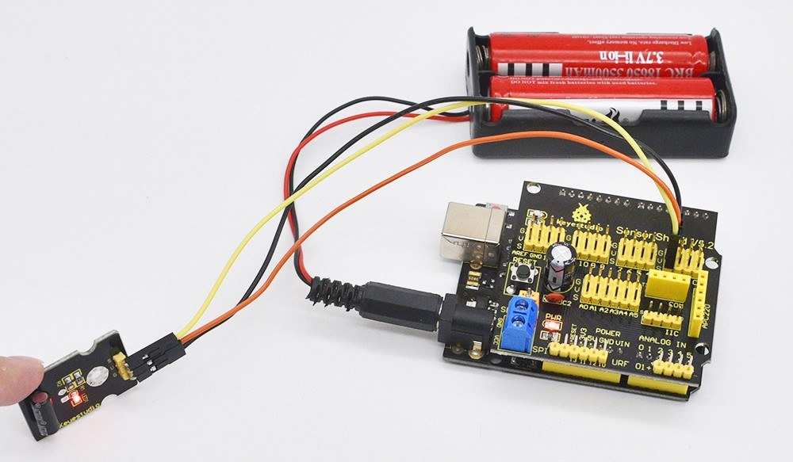

**Think:**

Or you can connect more an external LED module, then how to program? Think about
it. The LED will turn on when tilt the sensor, and the LED will turn off when
the sensor is not tilted.

### Project 11: PIR Motion Sensing

**Introduction:**

Pyroelectric infrared motion sensor can detect infrared signals from a moving
person or moving animal, and output switching signals.

It can be applied to a variety of occasions to detect the movement of human
body.

Conventional pyroelectric infrared sensors require body pyroelectric infrared
detector, professional chip, complex peripheral circuit, so the size is bigger,
with complex circuit, and lower reliability.

\*\*\*\*Now we launch this new
pyroelectric infrared motion sensor, specially designed for Arduino.

It uses an integrated digital body pyroelectric infrared sensor, has smaller
size, higher reliability, lower power consumption and simple peripheral circuit.

**Specification:**

-   Input Voltage: 3.3 \~ 5V, 6V Maximum

-   Working Current: 15uA

-   Working Temperature: -20 \~ 85 ℃

-   Output Voltage: High 3V, low 0V

-   Output Delay Time (High Level): About 2.3 to 3 Seconds

-   Detection angle: 100 °

-   Detection distance: 7 meters

-   Output Indicator LED (When output HIGH, it will be ON)

-   Pin limit current: 100mA

**Hardware
Connection**

To begin with, you need to prepare the following parts:

-   Control board \* 1

-   keyestudio Sensor Shield V5\* 1

-   USB Cable\* 1

-   PIR motion sensor\* 1

-   Dupont Line \*3

Connect the S pin to digital 3, negative pin to GND port, positive pin to 5V
port.

**For V4.0 connection:**

Stack the Sensor Shield V5 onto the V4.0 board.

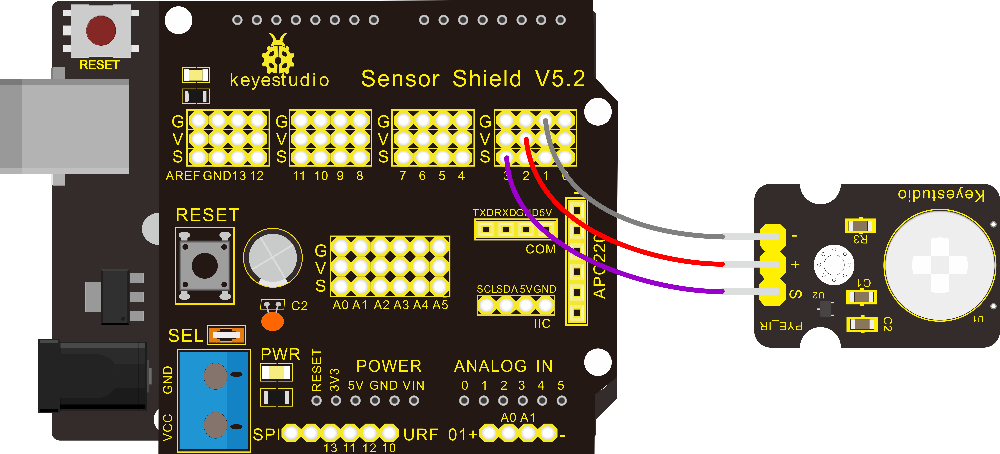

**For 2560 R3 connection:**

Stack the Sensor Shield V1.0 onto the 2560 R3 board

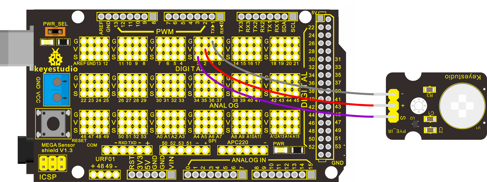

**Sample Code:**

\*\*\*\*\*\*\*\*\*\*\*\*\*\*\*\*\*\*\*\*\*\*\*\*\*\*\*\*\*\*\*\*\*\*\*\*\*\*\*\*\*\*\*\*\*\*\*\*\*\*\*\*\*\*\*\*\*\*\*

byte sensorPin = 3;

byte indicator = 13;

void setup()

{

pinMode(sensorPin,INPUT);

pinMode(indicator,OUTPUT);

Serial.begin(9600);

}

void loop()

{

byte state = digitalRead(sensorPin);

digitalWrite(indicator,state);

if(state == 1)Serial.println("Somebody is in this area!");

else if(state == 0)Serial.println("No one!");

delay(500);

}

\*\*\*\*\*\*\*\*\*\*\*\*\*\*\*\*\*\*\*\*\*\*\*\*\*\*\*\*\*\*\*\*\*\*\*\*\*\*\*\*\*\*\*\*\*\*\*\*\*\*\*\*\*\*\*\*\*\*\*

**Example Result:**

Done wiring and powered up, upload well the code, if the sensor detects someone
moving nearby, D13 indicator on V4.0 board will light up, and "Somebody is in
this area!" is displayed on the serial monitor.

If no detecting the movement, D13 indicator will turn off, and "No one!" is
displayed on the serial monitor.

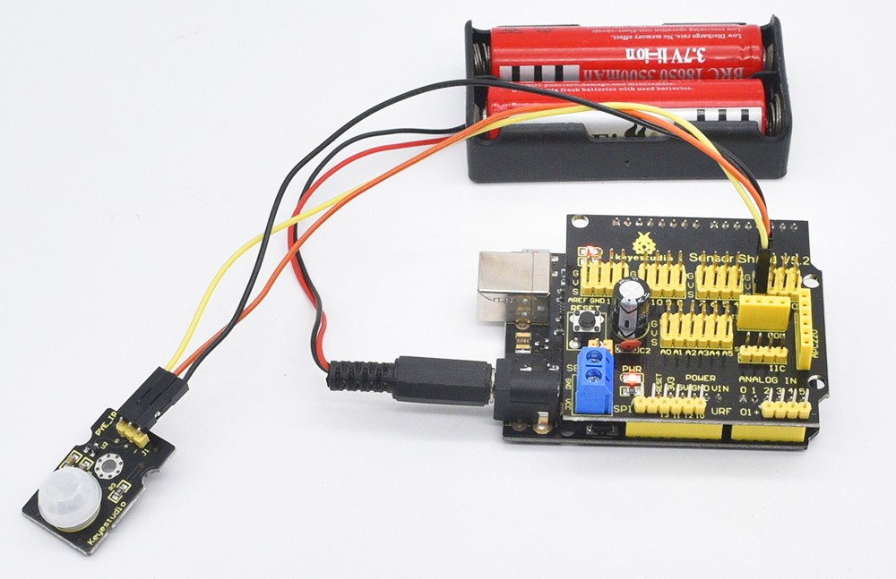

### Project 12: Reed Switch

**Description:**

\*\*\*\*Reed Switch is a special
switch and a main component for reed relay and proximity switch. Reed switch is
usually comprised of two soft magnetic materials and metal reed contacts which
will disconnect itself when there is no magnetic.

In addition, some reed switches are also equipped with another reed acting as
the third normally-closed contact. These reed contacts are encapsulated in a
glass tube fulled of inert gases(such as nitrogen and helium) or in a vacuum
glass tube.

The reeds encapsulated in the glass tube are placed in parallel with ends
overlapped. Certain amount of space or mutual contact will be reserved to
constitute the normally-open or normally-closed contacts of the switch.

Reed switch can be used as for count, limit or other purposes. For instance, a
kind of bike-kilometer is constituted by sticking magnetic to the tire and
mounting reed switch aside. You can also mount reed switch on the door for
alarming purpose or as switches.

Reed switch has been widely applied in household appliances, cars,
communication, industry, healthcare and security areas.

Furthermore, it can also be applied to other sensors and electric devices such
as liquidometer, door magnet, reed relay, oil level sensor and proximity
sensor(magnetic sensor). It can be used under high-risk environment.

**Specification**

-   Working voltage: DC 3.3V-5V

-   Working current: ≥20mA

-   Working temperature: －10℃ to＋50℃

-   Detection distance: ≤10mm

-   IO Interface: 3Pin (-/+/S)

**Hardware
Connection**

To begin with, you need to prepare the following parts:

-   Control board \* 1

-   keyestudio Sensor Shield V5\* 1

-   USB Cable\* 1

-   Reed switch sensor\* 1

-   Dupont Line \*3

Connect the S pin to digital 3, negative pin to GND port, positive pin to 5V
port.

**For V4.0 connection:**

Stack the Sensor Shield V5 onto the V4.0 board.

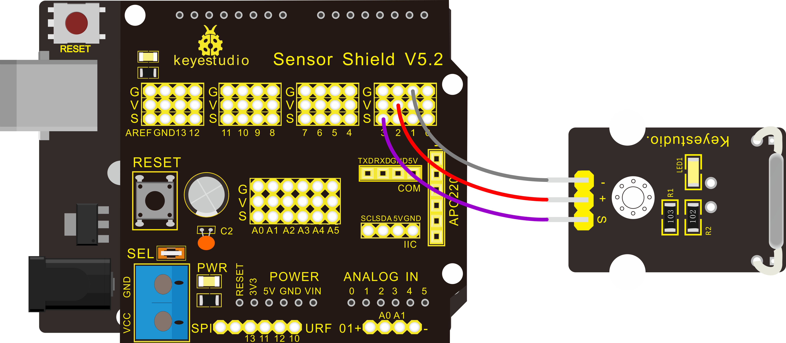

**For 2560 R3 connection:**

Stack the Sensor Shield V1.0 onto the 2560 R3 board

**Sample Code**

Copy and paste the below code to Arduino software.

\*\*\*\*\*\*\*\*\*\*\*\*\*\*\*\*\*\*\*\*\*\*\*\*\*\*\*\*\*\*\*\*\*\*\*\*\*\*\*\*\*\*\*\*\*\*\*\*\*\*\*\*\*\*\*\*\*\*\*

int Led=13;//define LED interface

int buttonpin=3; //define magnetic ring sensor interface

int val;//define digital variable val

void setup()

{

pinMode(Led,OUTPUT);//define LED as output interface

pinMode(buttonpin,INPUT);//define magnetic ring sensor as output interface

}

void loop()

{

val=digitalRead(buttonpin);// read and assign the value of digital interface 3
to val

if(val==HIGH)//When a signal is detected by magnetic ring sensor, LED will flash

{

digitalWrite(Led,HIGH);

}

else

{

digitalWrite(Led,LOW);

}

}

\*\*\*\*\*\*\*\*\*\*\*\*\*\*\*\*\*\*\*\*\*\*\*\*\*\*\*\*\*\*\*\*\*\*\*\*\*\*\*\*\*\*\*\*\*\*\*\*\*\*\*\*\*\*\*\*\*\*\*

**Example Result**

Done wiring and powered up, upload well the code to the board. You can see the
D13 led on V4.0 board is on.

Then we put some magnetic balls close to the sensor. When the sensor detects the
magnetic field signal, the led on the sensor will be turned on but D13 led will
be turned off.

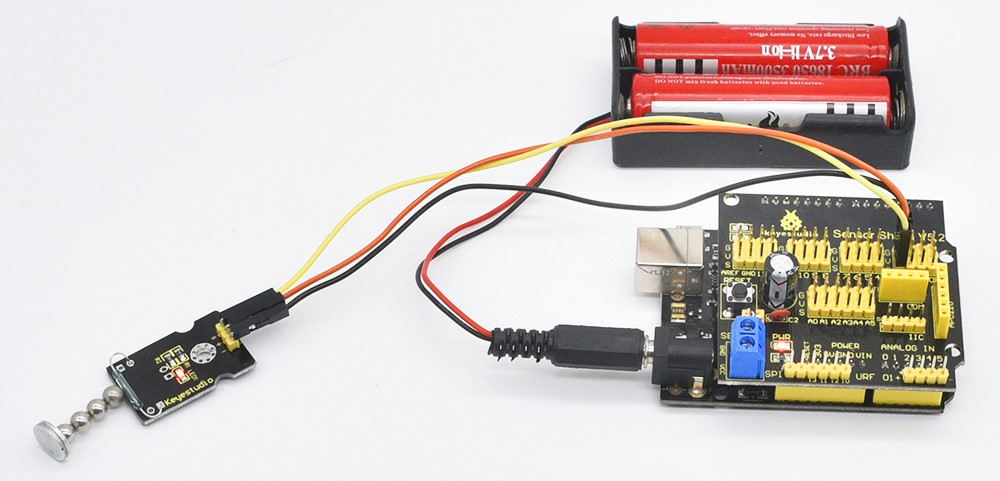

### Project 13: Hall Magnetic Sensor

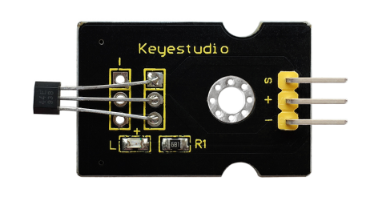

**Introduction:**

This is a Magnetic Induction Sensor. It senses the magnetic materials within a
detection range up to 3cm.

The detection range and the strength of the magnetic field are proportional.

The output is digital on/off. This sensor uses the SFE Reed Switch - Magnetic
Field Sensor.

**Specification:**

-   Sensing magnetic materials

-   Detection range: up to 3cm

-   Output: digital on/off

-   Detection range and magnetic field strength are proportional

**Hardware
Connection**

To begin with, you need to prepare the following parts:

-   Control board \* 1

-   keyestudio Sensor Shield V5\* 1

-   USB Cable\* 1

-   Hall Magnetic sensor\* 1

-   Dupont Line \*3

Connect the S pin to digital 3, negative pin to GND port, positive pin to 5V
port.

**For V4.0 connection:**

Stack the Sensor Shield V5 onto the V4.0 board.

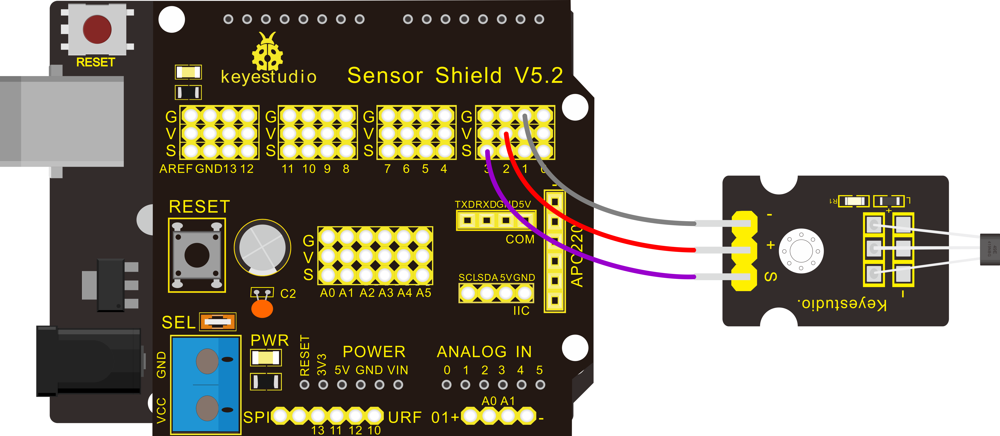

**For 2560 R3 connection:**

Stack the Sensor Shield V1.0 onto the 2560 R3 board

**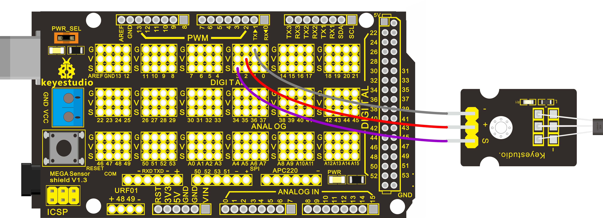**

**Sample Code:**

\*\*\*\*\*\*\*\*\*\*\*\*\*\*\*\*\*\*\*\*\*\*\*\*\*\*\*\*\*\*\*\*\*\*\*\*\*\*\*\*\*\*\*\*\*\*\*\*\*\*\*\*\*\*\*\*\*\*\*

int ledPin = 13; // choose the pin for the LED

int inputPin = 3; // Connect sensor to input pin 3

int val = 0; // variable for reading the pin status

void setup() {

pinMode(ledPin, OUTPUT); // declare LED as output

pinMode(inputPin, INPUT); // declare pushbutton as input

}

void loop(){

val = digitalRead(inputPin); // read input value

if (val == HIGH) { // check if the input is HIGH

digitalWrite(ledPin, LOW); // turn LED OFF

} else {

digitalWrite(ledPin, HIGH); // turn LED ON

}

}

\*\*\*\*\*\*\*\*\*\*\*\*\*\*\*\*\*\*\*\*\*\*\*\*\*\*\*\*\*\*\*\*\*\*\*\*\*\*\*\*\*\*\*\*\*\*\*\*\*\*\*\*\*\*\*\*\*\*\*

**Example Result**

Wire it up and upload well the code to board, you will see that D13 indicator on
V4.0 board is off, and led on the module is also off.

But if put a magnetic ball close to the hall module, you will see the D13
indicator on V4.0 board is turned on, and led on the module is also turned on.

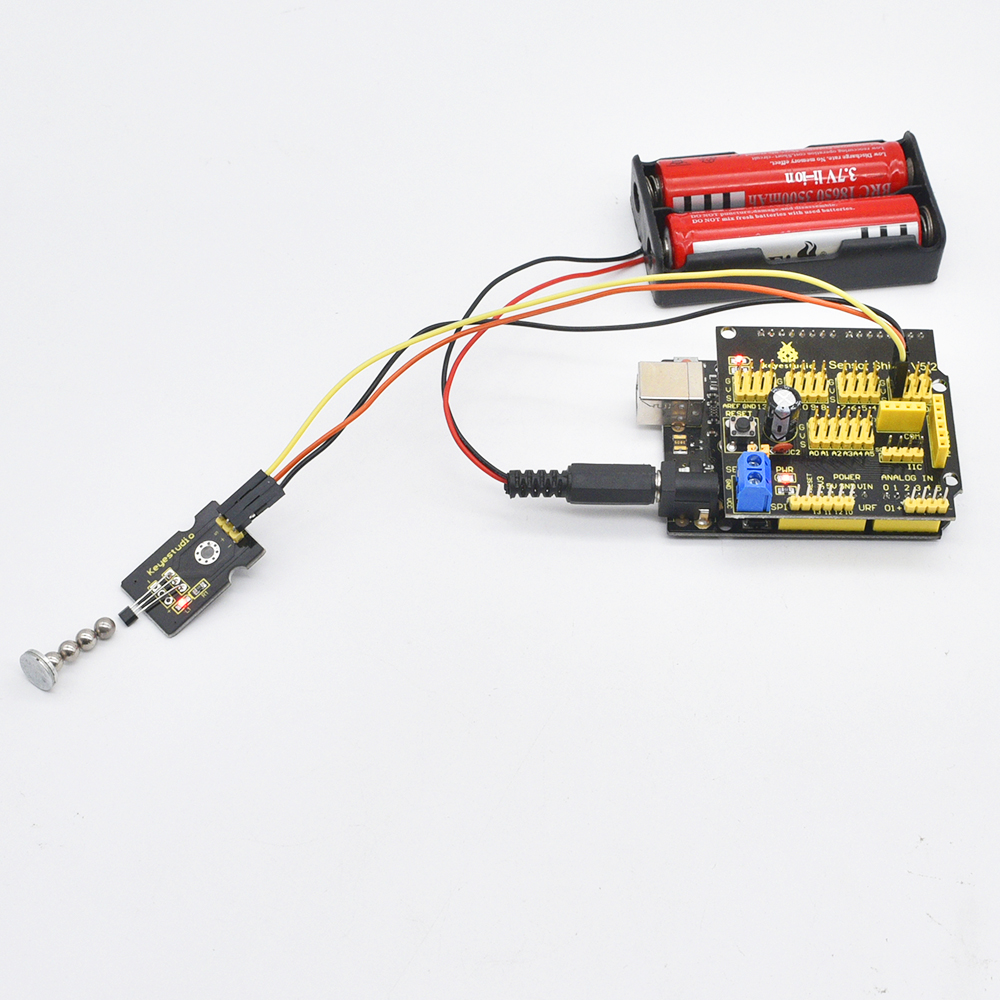

### Project 14: Line Tracking

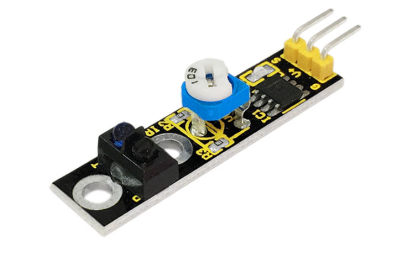

**Introduction:**

This Line Tracking Sensor can detect white line in black and black line in
white. The single line-tracking signal provides a stable output signal TTL for a
more accurate and more stable line. Multi-channel option can be easily achieved
by installing required line-tracking robot sensors.

**Specification:**

-   Power supply: +5V

-   Operating current: \<10mA

-   Operating temperature range: 0°C \~ + 50°C

-   Output interface: 3Pin interface (1 - signal, 2 - power, 3 - power supply
    negative)

-   Output Level: TTL level

**Hardware
Connection**

To begin with, you need to prepare the following parts:

-   Control board \* 1

-   keyestudio Sensor Shield V5\* 1

-   USB Cable\* 1

-   Line tracking sensor\*1

-   Dupont Line \*3

Connect the S pin to digital 3, negative pin to GND port, positive pin to 5V
port.

**For V4.0 connection:**

Stack the Sensor Shield V5 onto the V4.0 board.

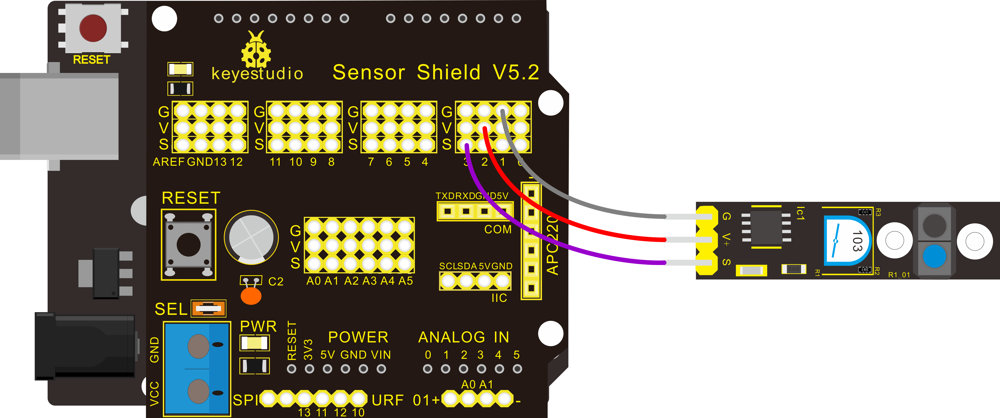

**For 2560 R3 connection:**

Stack the Sensor Shield V1.0 onto the 2560 R3 board

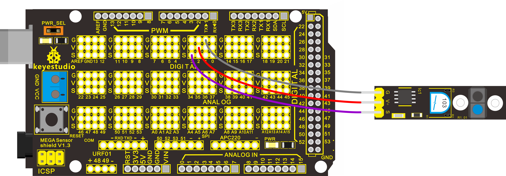

**Sample Code:**

\*\*\*\*\*\*\*\*\*\*\*\*\*\*\*\*\*\*\*\*\*\*\*\*\*\*\*\*\*\*\*\*\*\*\*\*\*\*\*\*\*\*\*\*\*\*\*\*\*\*\*\*\*\*\*\*\*\*\*

///Arduino Sample Code

void setup()

{

Serial.begin(9600);

}

void loop()

{

Serial.println(digitalRead(3)); // print the data from the sensor

delay(500);

}

\*\*\*\*\*\*\*\*\*\*\*\*\*\*\*\*\*\*\*\*\*\*\*\*\*\*\*\*\*\*\*\*\*\*\*\*\*\*\*\*\*\*\*\*\*\*\*\*\*\*\*\*\*\*\*\*\*\*\*

**Example Result**

Done uploading the code to board, open the serial monitor and set the baud rate
to 9600, then you can see the data from the sensor. Shown below.

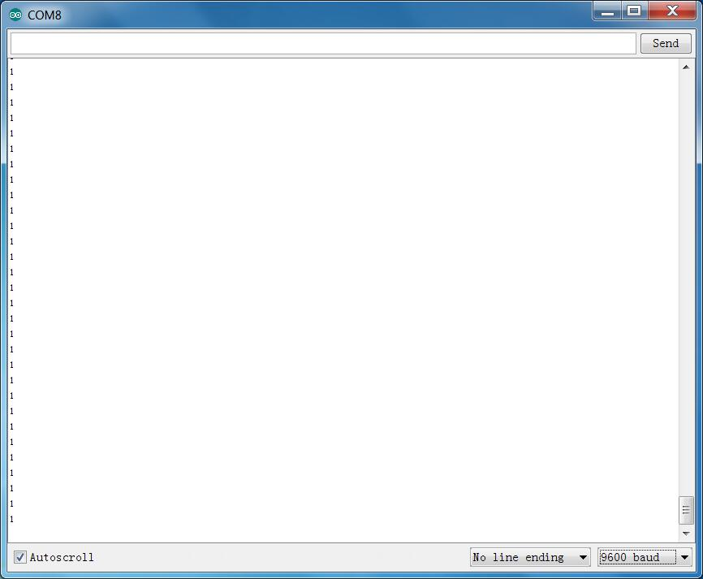

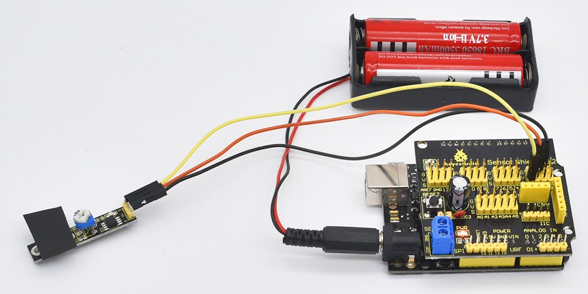

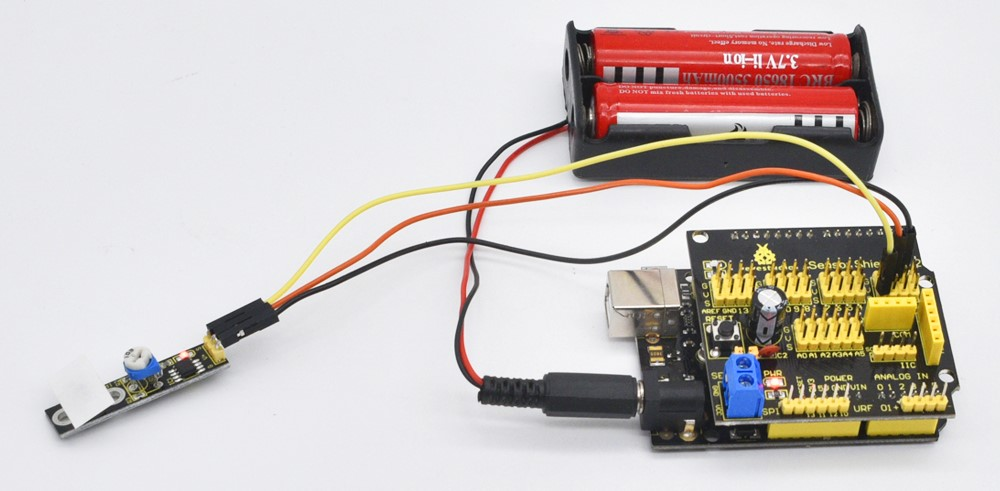

### Project 15: Flame Sensor

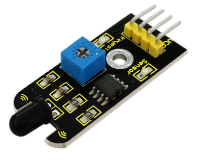

**Introduction:**

This flame sensor can be used to detect fire or other lights whose wavelength
stands at 760nm \~ 1100nm. In the fire-fighting robot game, the flame plays an
important role in the probe, which can be used as the robot's eyes to find fire
source.

**Specification:**

-   Supply Voltage: 3.3V to 5V

-   Detection range: 20cm (4.8V) \~ 100cm (1V)

-   Rang of Spectral Bandwidth: 760nm to 1100nm

-   Operating temperature: -25℃ to 85℃

-   Interface: digital

**Hardware
Connection**

To begin with, you need to prepare the following parts:

-   Control board \* 1

-   keyestudio Sensor Shield V5\* 1

-   USB Cable\* 1

-   Flame sensor\*1

-   Dupont Line \*3

Connect the S pin to digital 2, negative pin to GND port, positive pin to 5V
port.

**For V4.0 connection:**

Stack the Sensor Shield V5 onto the V4.0 board.

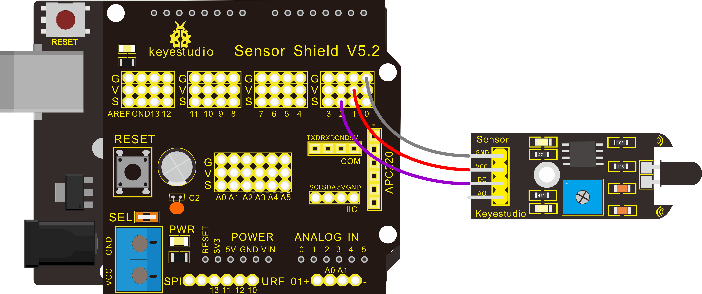

**For 2560 R3 connection:**

Stack the Sensor Shield V1.0 onto the 2560 R3 board

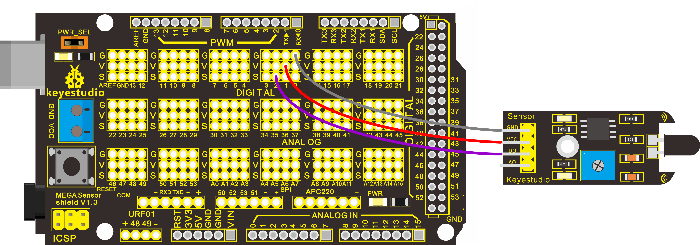

**Sample Code:**

\*\*\*\*\*\*\*\*\*\*\*\*\*\*\*\*\*\*\*\*\*\*\*\*\*\*\*\*\*\*\*\*\*\*\*\*\*\*\*\*\*\*\*\*\*\*\*\*\*\*\*\*\*\*\*\*\*\*\*

const int flamePin = 2; // the number of the flame pin

const int ledPin = 13; // the number of the LED pin

// variables will change:

int State = 0; // variable for reading status

void setup() {

// initialize the LED pin as an output:

pinMode(ledPin, OUTPUT);

// initialize the pushbutton pin as an input:

pinMode(flamePin, INPUT);

}

void loop(){

// read the state of the value:

State = digitalRead(flamePin);

if (State == HIGH) {

// turn LED on:

digitalWrite(ledPin, HIGH);

}

else {

// turn LED off:

digitalWrite(ledPin, LOW);

}

}

\*\*\*\*\*\*\*\*\*\*\*\*\*\*\*\*\*\*\*\*\*\*\*\*\*\*\*\*\*\*\*\*\*\*\*\*\*\*\*\*\*\*\*\*\*\*\*\*\*\*\*\*\*\*\*\*\*\*\*

**Example Result**

Done wiring and powered up, upload well the code to the board.

Then if you put a lighter close to the sensor, when the sensor detects the
flame, another led on the sensor is turned on.

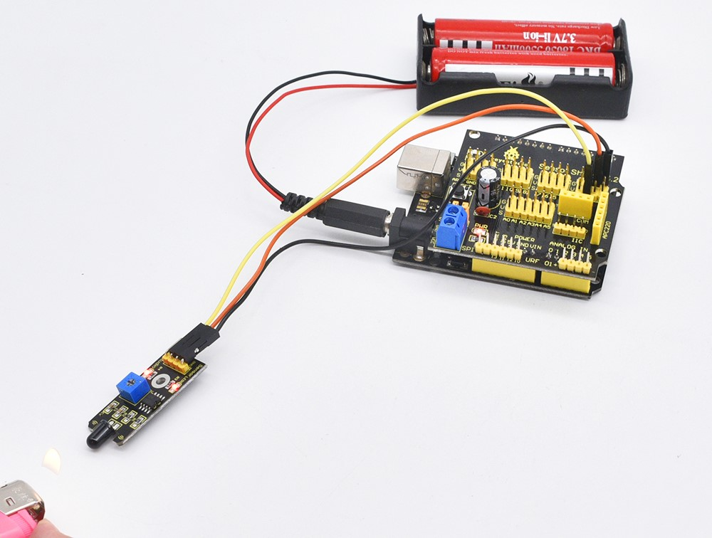

### Project 16: Infrared Obstacle Avoidance

**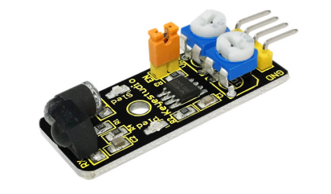**

**Introduction:**

Infrared obstacle avoidance sensor is equipped with distance adjustment function
and is especially designed for wheeled robots.

This sensor has strong adaptability to ambient light and is of high precision.
It has a pair of infrared transmitting and receiving tube.

When infrared ray launched by the transmitting tube encounters an obstacle (its
reflector), the infrared ray is reflected to the receiving tube, and the
indicator will light up; the signal output interface outputs digital signal.

We can adjust the detection distance through the potentiometer knob (effective
distance: 2～40cm, working Voltage: 3.3V-5V ).

Thanks to a wide voltage range, this sensor can work steadily even under
fluctuating power supply voltage and is suitable for the use of various
micro-controllers, Arduino controllers and BS2 controllers.

A robot mounted with the sensor can sense changes in the environment.

**Specification：**

-   Working voltage: DC 3.3V-5V

-   Working current: ≥20mA

-   Working temperature: －10℃—＋50℃

-   Detection distance: 2-40cm

-   IO Interface: 4 wire interface (-/+/S/EN)

-   Output signal: TTL voltage

-   Accommodation mode: Multi-circle resistance regulation

-   Effective Angle: 35°

**Hardware
Connection**

To begin with, you need to prepare the following parts:

-   Control board \* 1

-   keyestudio Sensor Shield V5\* 1

-   USB Cable\* 1

-   Infrared obstacle avoidance sensor\*1

-   Dupont Line \*3

Connect the S pin to digital 2, negative pin to GND port, positive pin to 5V
port.

**For V4.0 connection:**

Stack the Sensor Shield V5 onto the V4.0 board.

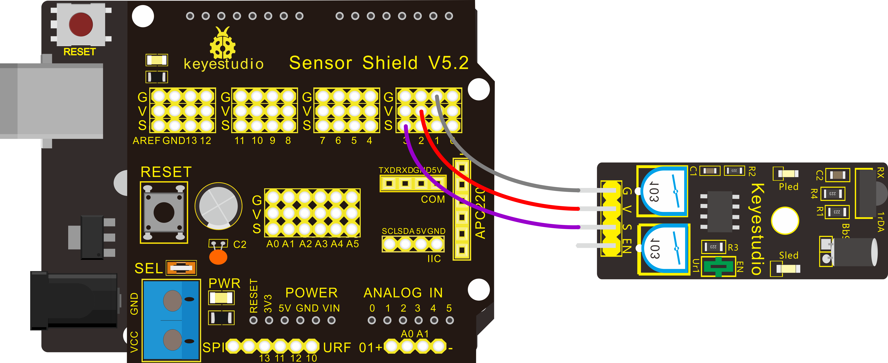

**For 2560 R3 connection:**

Stack the Sensor Shield V1.0 onto the 2560 R3 board

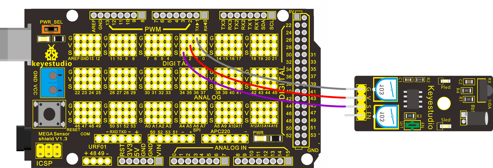

**Sample Code:**

\*\*\*\*\*\*\*\*\*\*\*\*\*\*\*\*\*\*\*\*\*\*\*\*\*\*\*\*\*\*\*\*\*\*\*\*\*\*\*\*\*\*\*\*\*\*\*\*\*\*\*\*\*\*\*\*\*\*\*

const int sensorPin = 3; // the number of the sensor pin

const int ledPin = 13; // the number of the LED pin

int sensorState = 0; // variable for reading the sensor status

void setup() {

pinMode(ledPin, OUTPUT);

pinMode(sensorPin, INPUT); }

void loop(){

// read the state of the sensor value:

sensorState = digitalRead(sensorPin);

// if it is, the sensorState is HIGH:

if (sensorState == HIGH) {

digitalWrite(ledPin, HIGH);

}

else {

digitalWrite(ledPin, LOW);

}

}

\*\*\*\*\*\*\*\*\*\*\*\*\*\*\*\*\*\*\*\*\*\*\*\*\*\*\*\*\*\*\*\*\*\*\*\*\*\*\*\*\*\*\*\*\*\*\*\*\*\*\*\*\*\*\*\*\*\*\*

**Example Result**

Done uploading the code to board, if we put a foam block in front of the sensor,
this time when sensor detects the obstacle, sled on the sensor will be turned
on.

### Project 17 : Photocell sensor

**Introduction:**

Photocell is commonly seen in our daily life and is mainly used in intelligent
switch, also in common electronic design. To make it easier and more effective,
we supply corresponding modules.

Photocell is a semiconductor. It has features of high sensitivity, quick
response, spectral characteristic, and R-value consistence, maintaining high
stability and reliability in environment extremes such as high temperature, high
humidity.

It’s widely used in automatic control switch fields like cameras, garden solar
lights, lawn lamps, money detectors, quartz clocks, music cups, gift boxes, mini
night lights, sound and light control switches, etc.

**Specification:**

-   Interface type: analog

-   Working voltage: 5V

**Hardware
Connection**

To begin with, you need to prepare the following parts:

-   Control board \* 1

-   keyestudio Sensor Shield V5\* 1

-   USB Cable\* 1

-   Photocell sensor\*1

-   Dupont Line \*3

Connect the S pin to analog A0, negative pin to GND port, positive pin to 5V
port.

**For V4.0 connection:**

Stack the Sensor Shield V5 onto the V4.0 board.

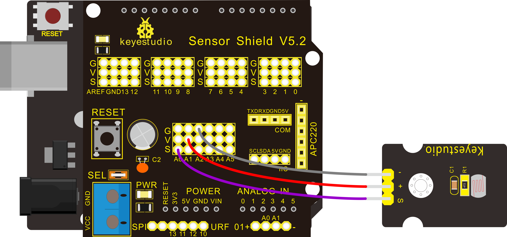

**For 2560 R3 connection:**

Stack the Sensor Shield V1.0 onto the 2560 R3 board.

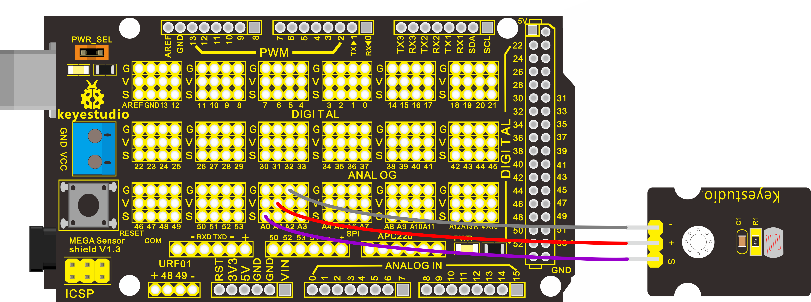

**Sample Code:**

\*\*\*\*\*\*\*\*\*\*\*\*\*\*\*\*\*\*\*\*\*\*\*\*\*\*\*\*\*\*\*\*\*\*\*\*\*\*\*\*\*\*\*\*\*\*\*\*\*\*\*\*\*\*\*\*\*\*\*

int sensorPin =A0 ;

int value = 0;

void setup()

{

Serial.begin(9600); }

void loop()

{

value = analogRead(sensorPin);

Serial.println(value, DEC);

delay(50); }

\*\*\*\*\*\*\*\*\*\*\*\*\*\*\*\*\*\*\*\*\*\*\*\*\*\*\*\*\*\*\*\*\*\*\*\*\*\*\*\*\*\*\*\*\*\*\*\*\*\*\*\*\*\*\*\*\*\*\*

**Example Result**

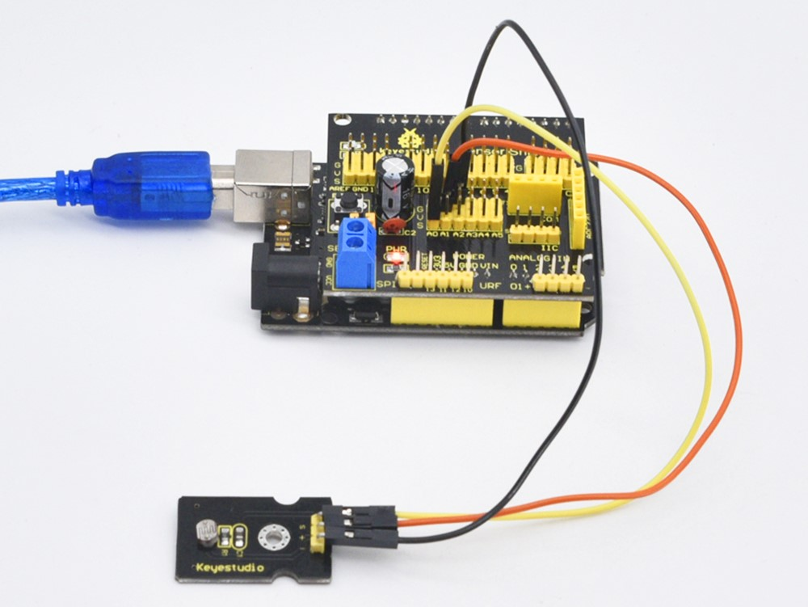

Done wiring and powered up, upload well the code, then open the serial monitor;
if cover the photocell on the sensor with your hand, you will see the analog
value decrease.

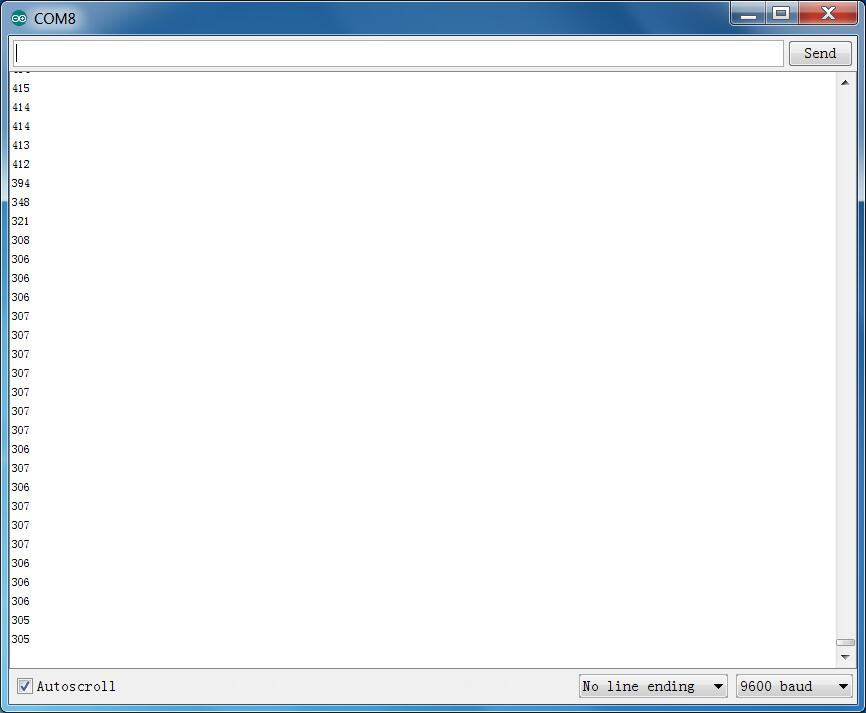

### Project 18: Analog Sound Sensor

**Introduction:**

Analog Sound Sensor is typically used in detecting the loudness in ambient
environment. The Arduino can collect its output signal by imitating the input
interface. The sensor comes with a potentiometer, so that you can adjust the
sensitivity. You can use it to make some interesting interactive works, such as
a voice operated switch.

**Specification:**

-   Supply Voltage: 3.3V to 5V

-   Interface: Analog

-   Detecting sound intensity

**Hardware
Connection**

To begin with, you need to prepare the following parts:

-   Control board \* 1

-   keyestudio Sensor Shield V5\* 1

-   USB Cable\* 1

-   Sound sensor\*1

-   Dupont Line \*3

Connect the S pin to analog A0, negative pin to GND port, positive pin to 5V
port.

**For V4.0 connection:**

Stack the Sensor Shield V5 onto the V4.0 board.

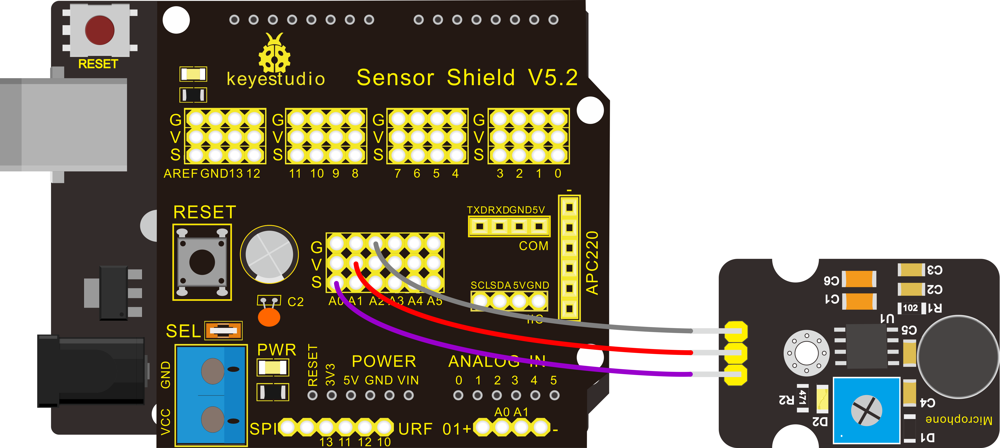

**For 2560 R3 connection:**

Stack the Sensor Shield V1.0 onto the 2560 R3 board.

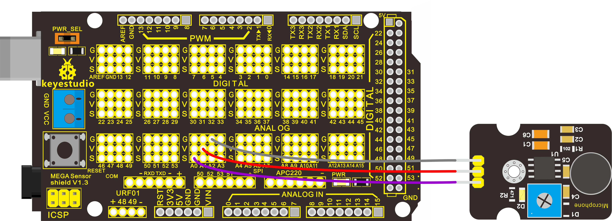

**Sample Code:**

\*\*\*\*\*\*\*\*\*\*\*\*\*\*\*\*\*\*\*\*\*\*\*\*\*\*\*\*\*\*\*\*\*\*\*\*\*\*\*\*\*\*\*\*\*\*\*\*\*\*\*\*\*\*\*\*\*\*\*

void setup()

{

Serial.begin(9600); // open serial port, set the baud rate to 9600 bps

}

void loop()

{

int val;

val=analogRead(0); //connect mic sensor to Analog 0

Serial.println(val,DEC);//print the sound value to serial

delay(100);

}

\*\*\*\*\*\*\*\*\*\*\*\*\*\*\*\*\*\*\*\*\*\*\*\*\*\*\*\*\*\*\*\*\*\*\*\*\*\*\*\*\*\*\*\*\*\*\*\*\*\*\*\*\*\*\*\*\*\*\*

**Example Result**

Done wiring and powered up, upload well the code, then open the serial monitor
and set the baud rate to 9600, you will see the analog value.

When talking toward the micro head, the value will increase. Shown below.

You can the potentiometer to adjust the sensitivity.

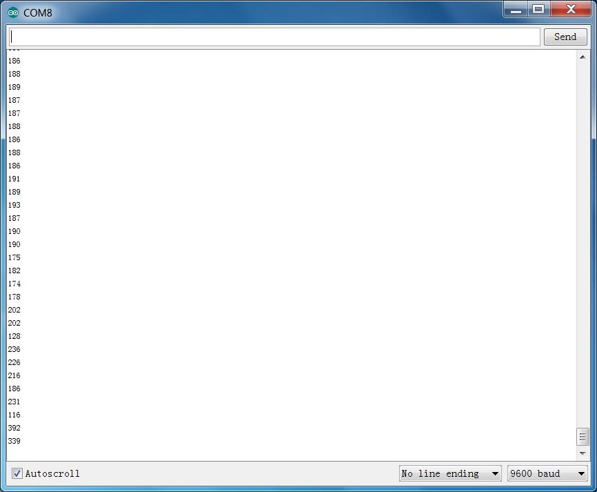

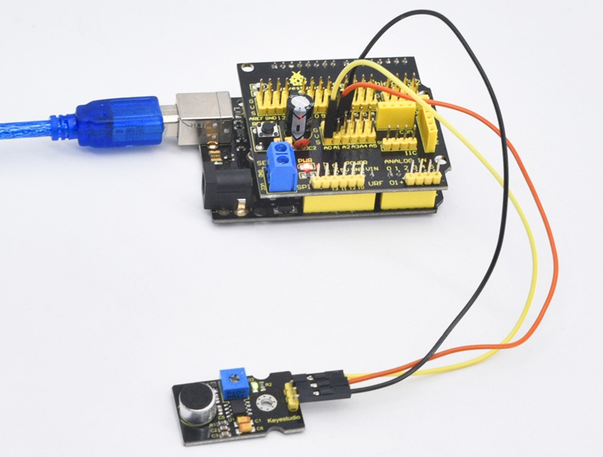

### Project 19: Rotary Encoder

****

**Introduction:**

The rotary encoder can count the pulse outputting times during the process of
its rotation in positive and reverse direction by rotating. This rotating
counting is unlimited, not like potential counting. It can be restored to
initial state to count from 0 with the button on rotary encoder.

Combined with other sensors, we can make interesting projects by reading the
analog value from the IO port.

**Specification:**

-   Supply Voltage: 3.3V to 5V

-   Interface: Analog

**Hardware
Connection**

To begin with, you need to prepare the following parts:

-   Control board \* 1

-   keyestudio Sensor Shield V5\* 1

-   USB Cable\* 1

-   Rotary encoder sensor\*1

-   Traffic light module\*1

-   Dupont Line \*8

**For V4.0 connection:**

Stack the Sensor Shield V5 onto the V4.0 board.

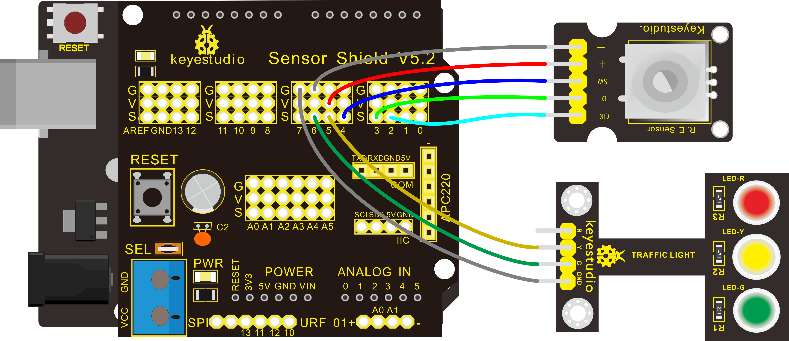

**For 2560 R3 connection:**

Stack the Sensor Shield V1.0 onto the 2560 R3 board.

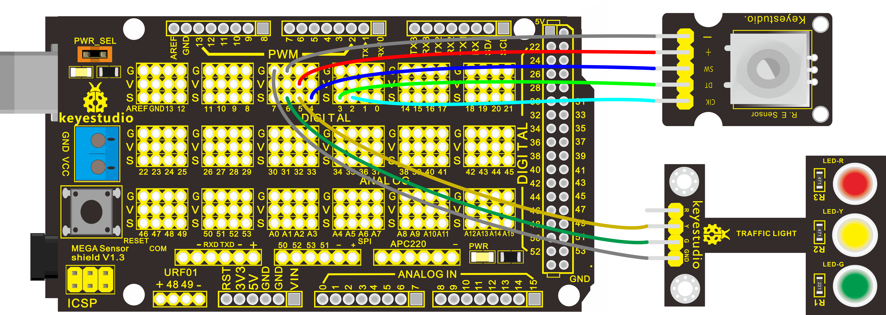

**Sample Code:**

\*\*\*\*\*\*\*\*\*\*\*\*\*\*\*\*\*\*\*\*\*\*\*\*\*\*\*\*\*\*\*\*\*\*\*\*\*\*\*\*\*\*\*\*\*\*\*\*\*\*\*\*\*\*\*\*\*\*\*

const int interruptA = 0;

const int interruptB = 1;

int CLK = 2; // PIN2

int DAT = 3; // PIN3

int BUTTON = 4; // PIN4

int LED1 = 5; // PIN5

int LED2 = 6; // PIN6

int COUNT = 0;

void setup()

{

attachInterrupt(interruptA, RoteStateChanged, FALLING);

// attachInterrupt(interruptB, buttonState, FALLING);

pinMode(CLK, INPUT);

digitalWrite(2, HIGH); // Pull High Restance

pinMode(DAT, INPUT);

digitalWrite(3, HIGH); // Pull High Restance

pinMode(BUTTON, INPUT);

digitalWrite(4, HIGH); // Pull High Restance

pinMode(LED1, OUTPUT);

pinMode(LED2, OUTPUT);

Serial.begin(9600);

}

void loop()

{

if (!(digitalRead(BUTTON)))

{

COUNT = 0;

Serial.println("STOP COUNT = 0");

digitalWrite(LED1, LOW);

digitalWrite(LED2, LOW);

delay (2000);

}

Serial.println(COUNT);

}

//-------------------------------------------

void RoteStateChanged() //When CLK FALLING READ DAT

{

if (digitalRead(DAT)) // When DAT = HIGH IS FORWARD

{

COUNT++;

digitalWrite(LED1, HIGH);

digitalWrite(LED2, LOW);

delay(20);

}

else // When DAT = LOW IS BackRote

{

COUNT--;

digitalWrite(LED2, HIGH);

digitalWrite(LED1, LOW);

delay(20);

}

}

\*\*\*\*\*\*\*\*\*\*\*\*\*\*\*\*\*\*\*\*\*\*\*\*\*\*\*\*\*\*\*\*\*\*\*\*\*\*\*\*\*\*\*\*\*\*\*\*\*\*\*\*\*\*\*\*\*\*\*

**Example Result**

Wiring well and uploading the above code, you can rotate the encoder module to
turn two LEDs on the traffic light module on and off.

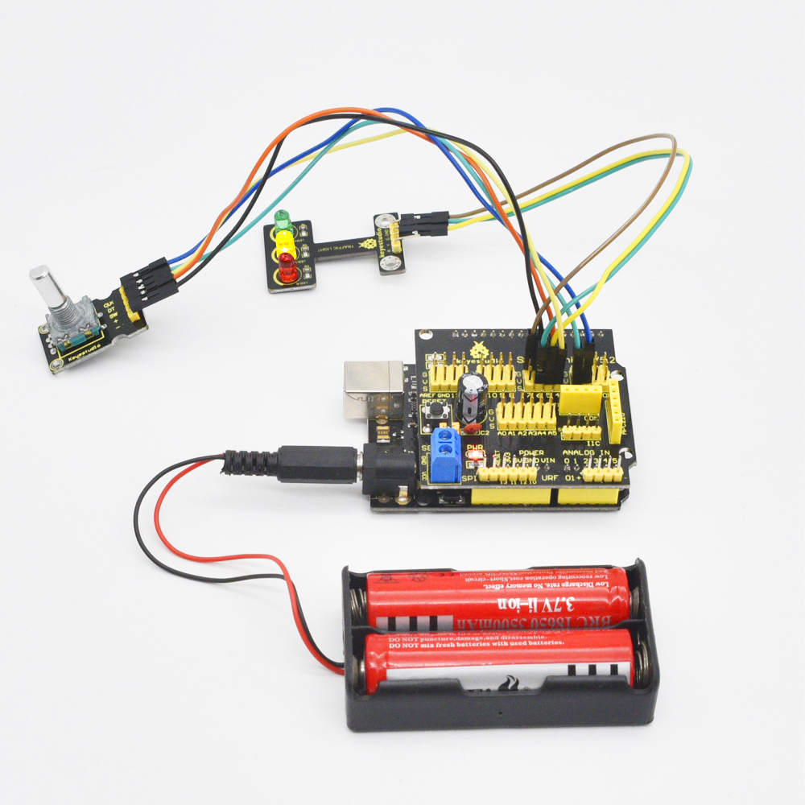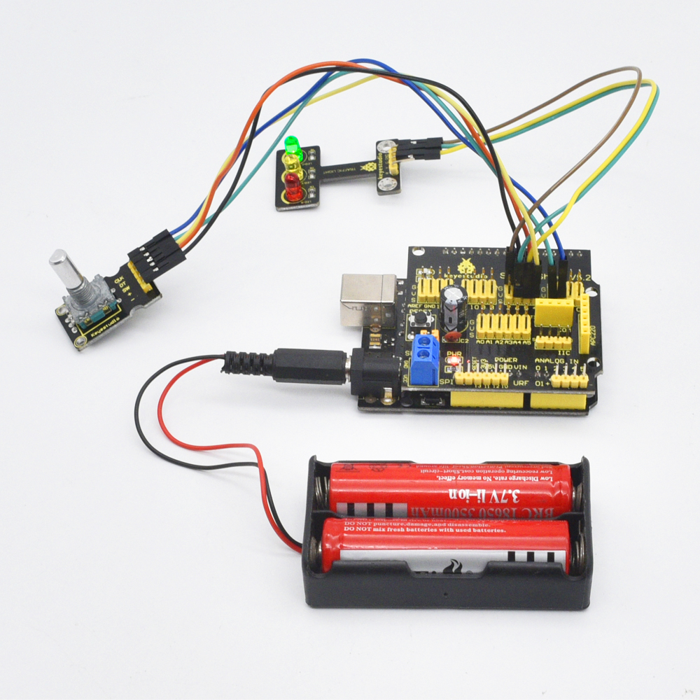

### Project 20: Analog Gas Sensor

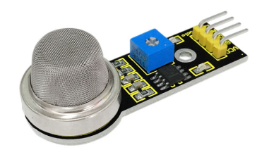

**Introduction:**

This analog gas sensor - MQ2 is used in gas leakage detecting equipment in
consumer electronics and industrial markets.

This sensor is suitable for detecting LPG, I-butane, propane, methane, alcohol,
Hydrogen and smoke. It has high sensitivity and quick response.

In addition, the sensitivity can be adjusted by the potentiometer.

**Specification:**

-   Power supply: 5V

-   Interface type: Analog

-   Wide detecting scope

-   Quick response and High sensitivity

-   Simple drive circuit

-   Stable and long lifespan

**Hardware
Connection**

To begin with, you need to prepare the following parts:

-   Control board \* 1

-   keyestudio Sensor Shield V5\* 1

-   USB Cable\* 1

-   Analog gas sensor\*1

-   Dupont Line \*3

Connect the S pin to analog A0, negative pin to GND port, positive pin to 5V
port.

**For V4.0 connection:**

Stack the Sensor Shield V5 onto the V4.0 board.

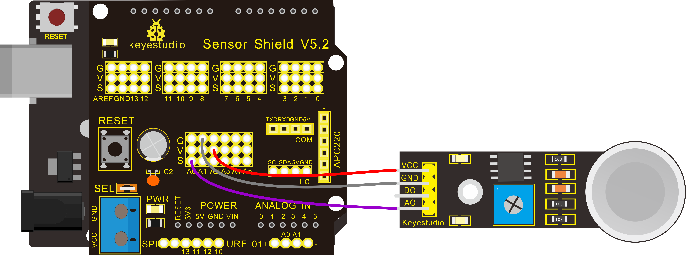

**For 2560 R3 connection:**

Stack the Sensor Shield V1.0 onto the 2560 R3 board.

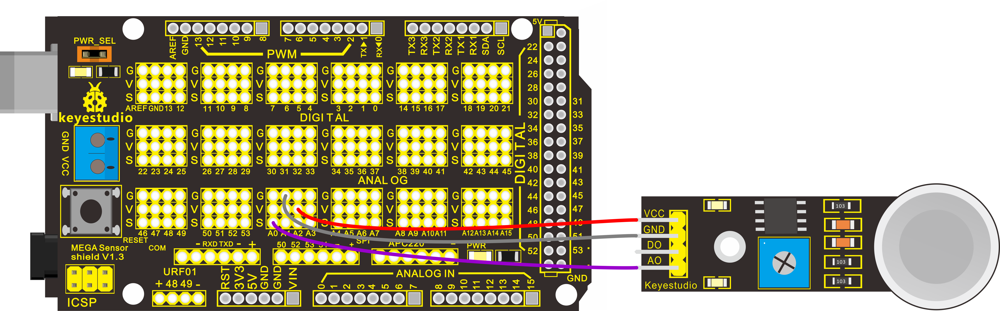

**Sample Code:**

\*\*\*\*\*\*\*\*\*\*\*\*\*\*\*\*\*\*\*\*\*\*\*\*\*\*\*\*\*\*\*\*\*\*\*\*\*\*\*\*\*\*\*\*\*\*\*\*\*\*\*\*\*\*\*\*\*\*\*

///Arduino Sample Code

void setup()

{

Serial.begin(9600); //Set serial baud rate to 9600 bps

}

void loop()

{

int val;

val=analogRead(0);//Read Gas value from analog 0

Serial.println(val,DEC);//Print the value to serial port

delay(100);

}

\*\*\*\*\*\*\*\*\*\*\*\*\*\*\*\*\*\*\*\*\*\*\*\*\*\*\*\*\*\*\*\*\*\*\*\*\*\*\*\*\*\*\*\*\*\*\*\*\*\*\*\*\*\*\*\*\*\*\*

**Example Result**

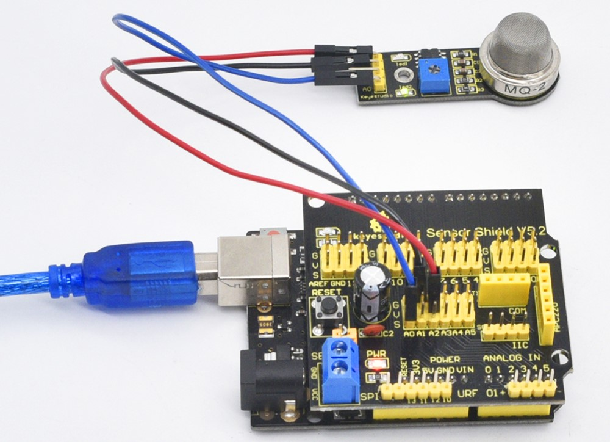

Done wiring and powered up, upload well the code, then open the serial monitor
and set the baud rate as 9600, you will see the analog value.

When detecting the gas, the value will make a change.

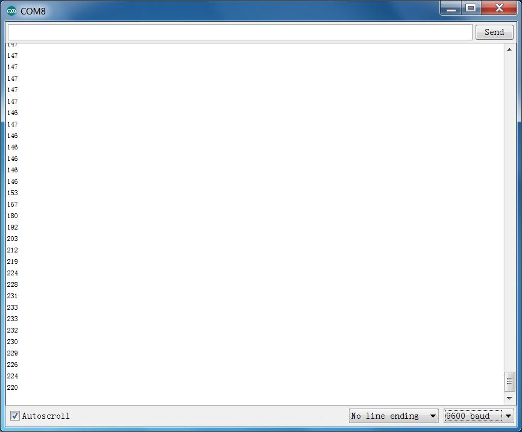

### Project 21: Steam Moisture

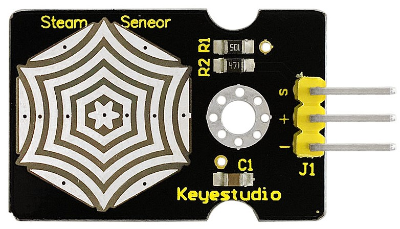

**Introduction:**

Vapor Sensor is an analog sensor and can make a simple rainwater detector and
liquid level switch. When humidity on the face of this sensor rises, output
voltage will increase.

Caution: connection parts is non-waterproof, so please don’t put them into
water.

**Specification:**

-   Working Voltage: 3.3V or 5V

-   Working Current: \<20mA

-   Range of Working Temperature: －10℃～＋70℃

-   Interface Type: Analog Signal Output

**Pins Definition:**

-   **S pin:** for Signal Output

-   **Positive pin (+):** for Power Supply (VCC)

-   **Negative pin (-):** for Ground (GND)

**Hardware
Connection**

To begin with, you need to prepare the following parts:

-   Control board \* 1

-   keyestudio Sensor Shield V5\* 1

-   USB Cable\* 1

-   Steam sensor\*1

-   Dupont Line \*3

Connect the S pin to analog A0, negative pin to GND port, positive pin to 5V
port.

**For V4.0 connection:**

Stack the Sensor Shield V5 onto the V4.0 board.

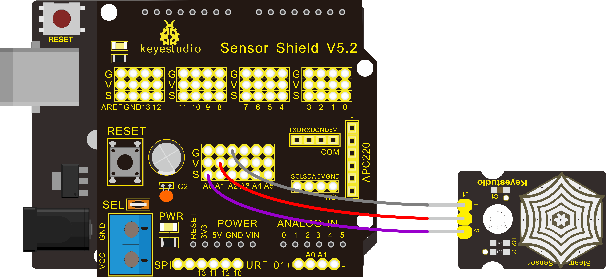

**For 2560 R3 connection:**

Stack the Sensor Shield V1.0 onto the 2560 R3 board.

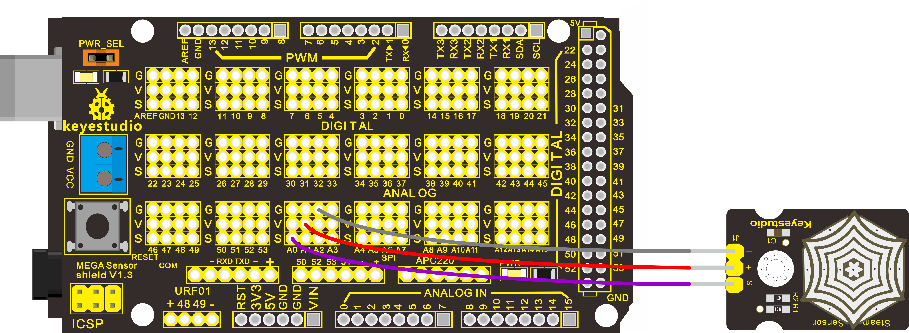

**Sample Code:**

\*\*\*\*\*\*\*\*\*\*\*\*\*\*\*\*\*\*\*\*\*\*\*\*\*\*\*\*\*\*\*\*\*\*\*\*\*\*\*\*\*\*\*\*\*\*\*\*\*\*\*\*\*\*\*\*\*

void setup()

{

Serial.begin(9600); //open serial port, and set baud rate at 9600bps

}

void loop()

{

int val;

val=analogRead(0); //plug vapor sensor into analog port 0

Serial.print("Moisture is ");

Serial.println(val,DEC); //read analog value through serial port printed

delay(100);

}

\*\*\*\*\*\*\*\*\*\*\*\*\*\*\*\*\*\*\*\*\*\*\*\*\*\*\*\*\*\*\*\*\*\*\*\*\*\*\*\*\*\*\*\*\*\*\*\*\*\*\*\*\*\*\*\*\*

**Example Result**

When detecting different degrees of humidity, the sensor will get the feedback
of different current value. Shown as the following picture.

Due to the limited condition, you can put a drop of water on the sensor, the
moisture value will be changed on serial monitor of Arduino software.

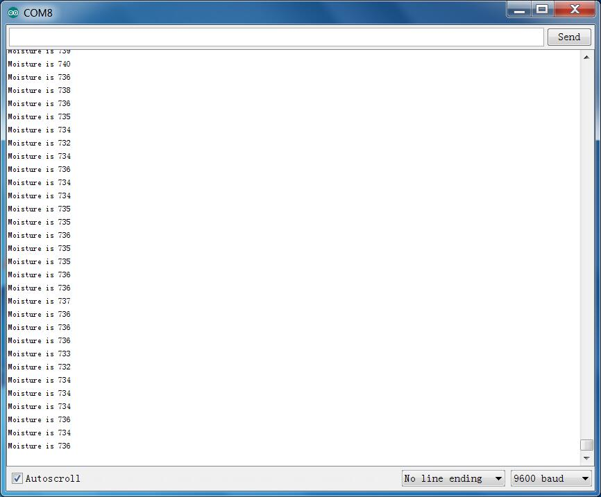

### Project 22: TEMT6000 Ambient Light

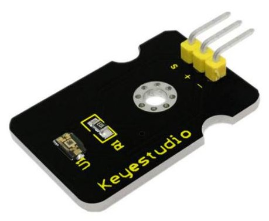

**Introduction:**

c

**Hooking It Up**

This is an incredibly simple part, just connect power and ground, and the signal
pin to your favorite analog input and you are done, the sensor will output
analog voltage, that ramps up when it gets brighter. You can power this off of
3.3v if you would like, the output value will just be lower.

Firstly you need to prepare the following parts before connection.

-   Control board \* 1

-   keyestudio Sensor Shield V5\* 1

-   USB Cable\* 1

-   TEMT6000 ambient light sensor\*1

-   Dupont Line \*3

Connect the S pin to analog A0, negative pin to GND port, positive pin to 5V
port.

**For V4.0 connection:**

Stack the Sensor Shield V5 onto the V4.0 board.

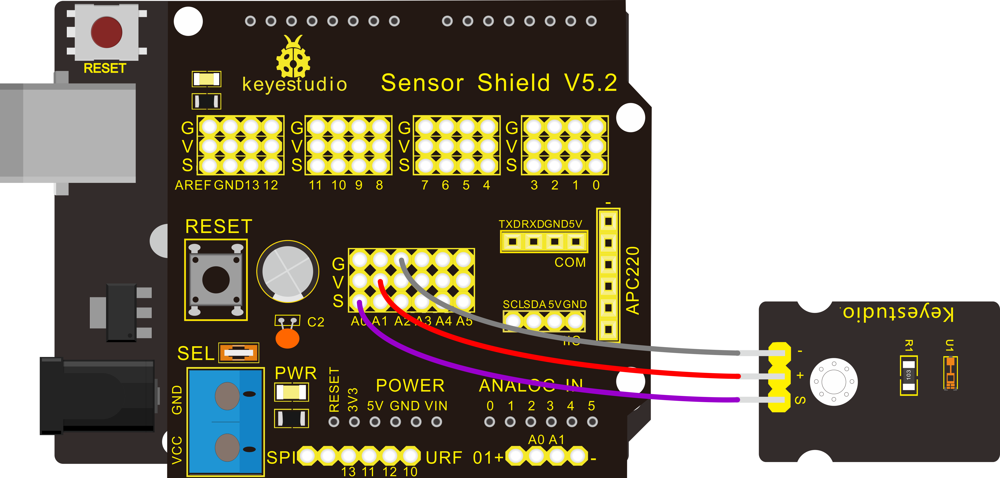

**For 2560 R3 connection:**

Stack the Sensor Shield V1.0 onto the 2560 R3 board.

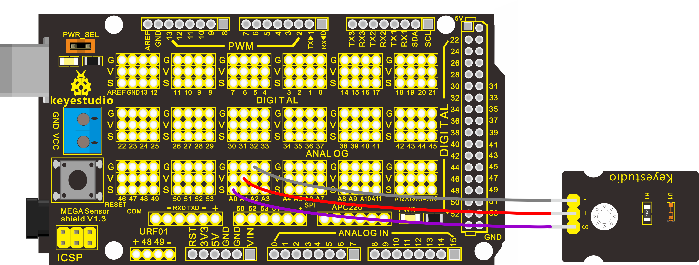

**Code**

You can not get more simple than this – This just reports the reading from the
sensor to the serial terminal: 0-1023 with 1023 being very bright, and 0 being
very dark.

\*\*\*\*\*\*\*\*\*\*\*\*\*\*\*\*\*\*\*\*\*\*\*\*\*\*\*\*\*\*\*\*\*\*\*\*\*\*\*\*\*\*\*\*\*\*\*\*\*\*\*\*\*\*\*\*\*

int temt6000Pin = 0;

void setup() {

Serial.begin(9600);

}

void loop() {

int value = analogRead(temt6000Pin);

Serial.println(value);

delay(100); //only here to slow down the output so it is easier to read

}

\*\*\*\*\*\*\*\*\*\*\*\*\*\*\*\*\*\*\*\*\*\*\*\*\*\*\*\*\*\*\*\*\*\*\*\*\*\*\*\*\*\*\*\*\*\*\*\*\*\*\*\*\*\*\*\*\*\*\*

**Example Result**

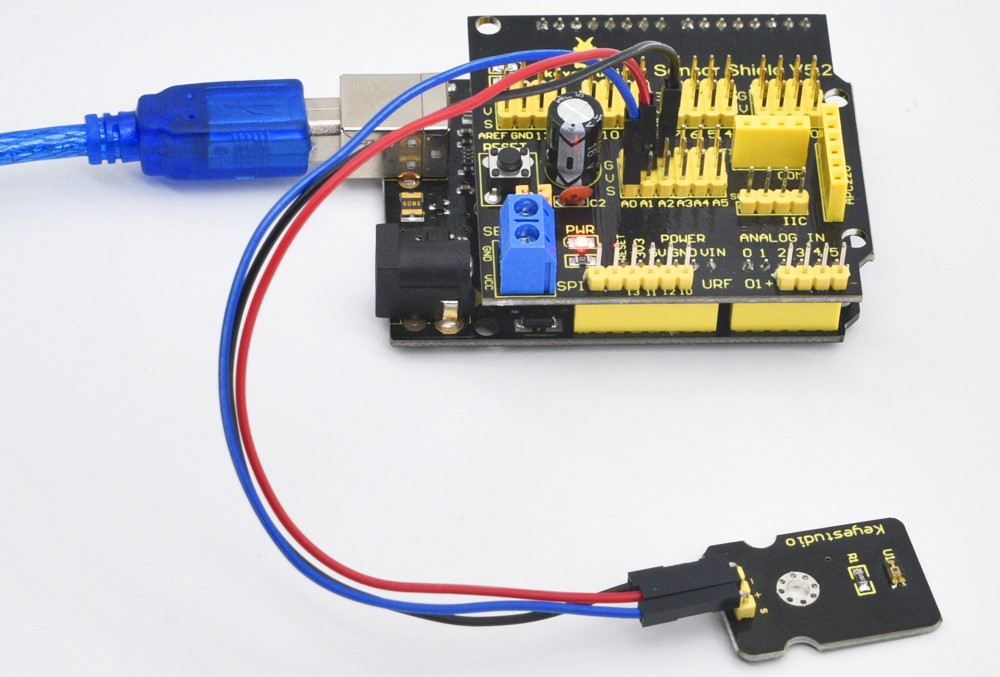

Wiring well and uploading the code above, open the serial monitor.

Then cover the sensor with your hand or a paper, the light becomes weak, finally
you will see the value showed on monitor decrease.

### Project 23: LM35 Linear Temperature

****

**Introduction:**

LM35 Linear Temperature Sensor is based on semiconductor LM35 temperature
sensor. It can be used to detect ambient air temperature. This sensor offers a
functional range among 0 degree Celsius to 100 degree Celsius. Sensitivity is
10mV per degree Celsius. The output voltage is proportional to the temperature.

This sensor is commonly used as a temperature measurement sensor. It includes
thermocouples, platinum resistance, thermal resistance and temperature
semiconductor chips. The chip is commonly used in high temperature measurement
thermocouples. Platinum resistance temperature sensor is used in the measurement
of 800 degrees Celsius, while the thermal resistance and semiconductor
temperature sensor is suitable for measuring the temperature of 100-200 degrees
or below, in which the application of a simple semiconductor temperature sensor
is good in linearity and high in sensitivity.

The LM35 linear temperature sensor is easily connected to Arduino shield.

**Specification:**

-   Based on the semiconductor LM35 temperature sensor

-   Can be used to detect ambient air temperature

-   Sensitivity: 10mV per degree Celcius

-   Functional range: 0 degree Celsius to 100 degree Celsius

**Hardware
Connection**

To begin with, you need to prepare the following parts:

-   Control board \* 1

-   keyestudio Sensor Shield V5\* 1

-   USB Cable\* 1

-   LM35 temperature sensor\*1

-   Dupont Line \*3

Connect the S pin to analog A0, negative pin to GND port, positive pin to 5V
port.

**For V4.0 connection:**

Stack the Sensor Shield V5 onto the V4.0 board.

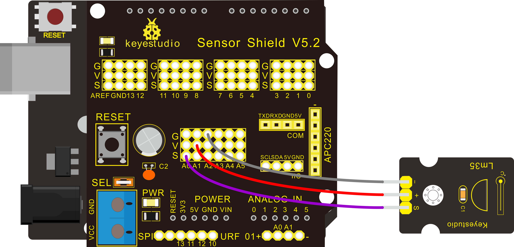

**For 2560 R3 connection:**

Stack the Sensor Shield V1.0 onto the 2560 R3 board.

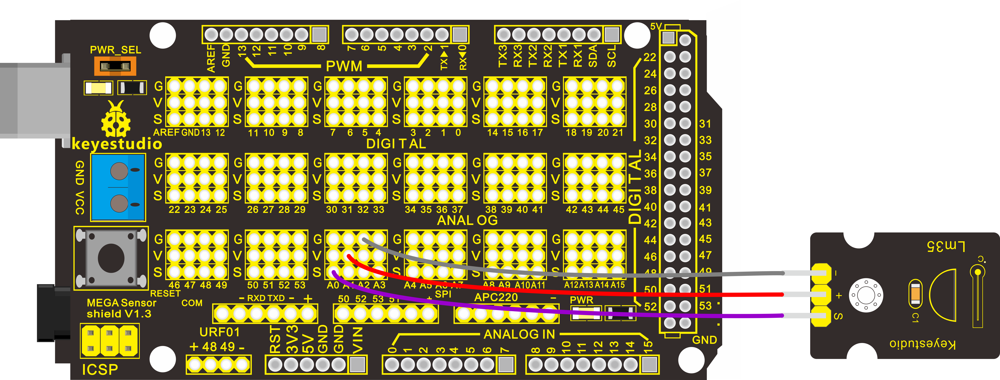

**Sample Code:**

\*\*\*\*\*\*\*\*\*\*\*\*\*\*\*\*\*\*\*\*\*\*\*\*\*\*\*\*\*\*\*\*\*\*\*\*\*\*\*\*\*\*\*\*\*\*\*\*\*\*\*\*\*\*\*\*\*\*\*

void setup()

{

Serial.begin(9600);//Set Baud Rate to 9600 bps

}

void loop()

{ int val;

int dat;

val=analogRead(0);//Connect LM35 on Analog 0

dat=(500 \* val) /1024;;

Serial.print("Temp:"); //Display the temperature on Serial monitor

Serial.print(dat);

Serial.println("C");

delay(500);

}

\*\*\*\*\*\*\*\*\*\*\*\*\*\*\*\*\*\*\*\*\*\*\*\*\*\*\*\*\*\*\*\*\*\*\*\*\*\*\*\*\*\*\*\*\*\*\*\*\*\*\*\*\*\*\*\*\*\*\*

**Example Result**

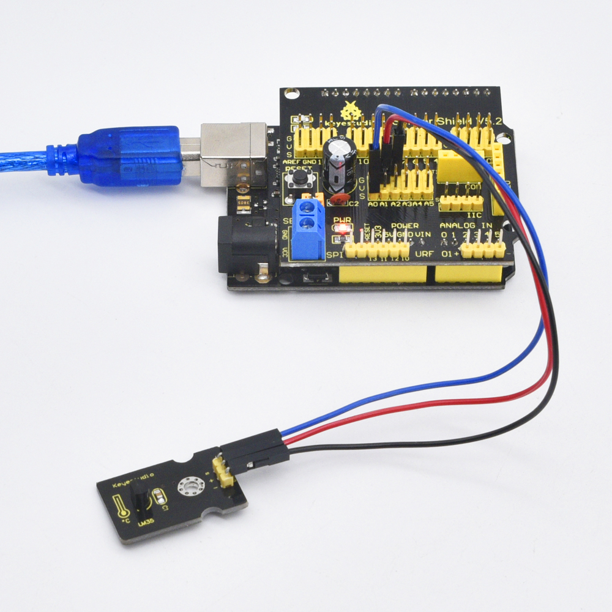

Upload well the code to the board, then open the serial monitor and set the baud
rate to 9600, finally you will see the current temperature value shown below.
The value may be slight difference due to different places and weather.

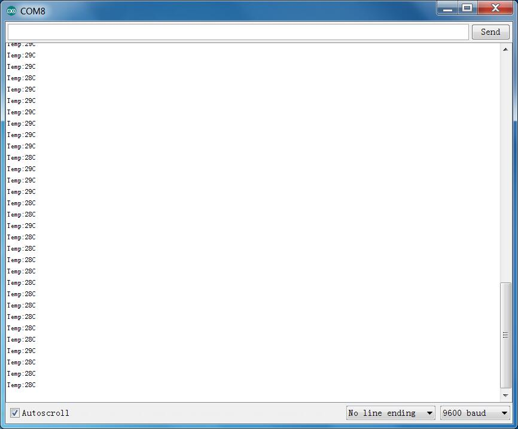

### Project 24: DHT11 Temperature and Humidity

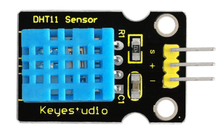

**Introduction:**

This DHT11 sensor features calibrated digital signal output with the temperature
and humidity sensor complex. Its technology ensures high reliability and
excellent long-term stability. A high-performance 8-bit microcontroller is
connected.

This sensor includes a resistive element and a sense of wet NTC temperature
measuring devices. It has excellent quality, fast response, anti-interference
ability and high cost performance advantages.

Each DHT11 sensor features extremely accurate calibration data of humidity
calibration chamber. The calibration coefficients stored in the OTP program
memory, internal sensors detect signals in the process, and we should call these
calibration coefficients.

The single-wire serial interface system is integrated to make it quick and easy.
Qualities of small size, low power, and 20-meter signal transmission distance
make it a wide applied application and even the most demanding one. Convenient
connection, special packages can be provided according to users need.

**Specification:**

-   Supply Voltage: +5 V

-   Temperature range: 0-50 °C error of ± 2 °C

-   Humidity: 20-90% RH ± 5% RH error

-   Interface: Digital

**Hardware
Connection**

To begin with, you need to prepare the following parts:

-   Control board \* 1

-   keyestudio Sensor Shield V5\* 1

-   USB Cable\* 1

-   DHT11 Temperature and Humidity Sensor\*1

-   Dupont Line \*3

Connect the S pin to digital D4, negative pin to GND port, positive pin to 5V
port.

**For V4.0 connection:**

Stack the Sensor Shield V5 onto the V4.0 board.

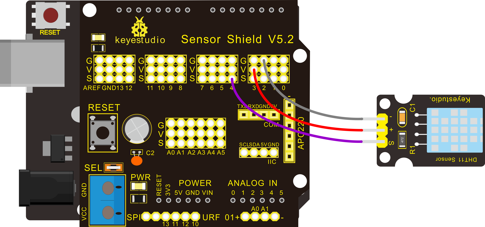

**For 2560 R3 connection:**

Stack the Sensor Shield V1.0 onto the 2560 R3 board.

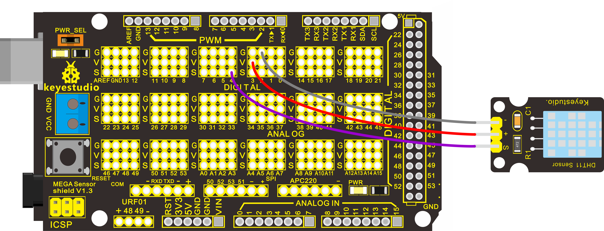

**Sample Code:**

Please download the
[DHT11Lib](https://github.com/RobTillaart/Arduino/tree/master/libraries/DHTlib)
firstly.Or,[see the website](http://playground.arduino.cc/Main/DHTLib)

\*\*\*\*\*\*\*\*\*\*\*\*\*\*\*\*\*\*\*\*\*\*\*\*\*\*\*\*\*\*\*\*\*\*\*\*\*\*\*\*\*\*\*\*\*\*\*\*\*\*\*\*\*\*\*\*\*\*\*

\##include \<dht11.h\>

dht11 DHT;

\##define DHT11_PIN 4

void setup(){

Serial.begin(9600);

Serial.println("DHT TEST PROGRAM ");

Serial.print("LIBRARY VERSION: ");

Serial.println(DHT11LIB_VERSION);

Serial.println();

Serial.println("Type,\\tstatus,\\tHumidity (%),\\tTemperature (C)");

}

void loop(){

int chk;

Serial.print("DHT11, \\t");

chk = DHT.read(DHT11_PIN); // READ DATA

switch (chk){

case DHTLIB_OK:

Serial.print("OK,\\t");

break;

case DHTLIB_ERROR_CHECKSUM:

Serial.print("Checksum error,\\t");

break;

case DHTLIB_ERROR_TIMEOUT:

Serial.print("Time out error,\\t");

break;

default:

Serial.print("Unknown error,\\t");

break;

}

// DISPLAT DATA

Serial.print(DHT.humidity,1);

Serial.print(",\\t");

Serial.println(DHT.temperature,1);

delay(1000);

}

\*\*\*\*\*\*\*\*\*\*\*\*\*\*\*\*\*\*\*\*\*\*\*\*\*\*\*\*\*\*\*\*\*\*\*\*\*\*\*\*\*\*\*\*\*\*\*\*\*\*\*\*\*\*\*\*\*\*\*

**Example Result**

Wire it up well and upload the above code to V4.0 board. Then open the serial
monitor and set the baud rate to 9600, you will see the current temperature and
humidity value.

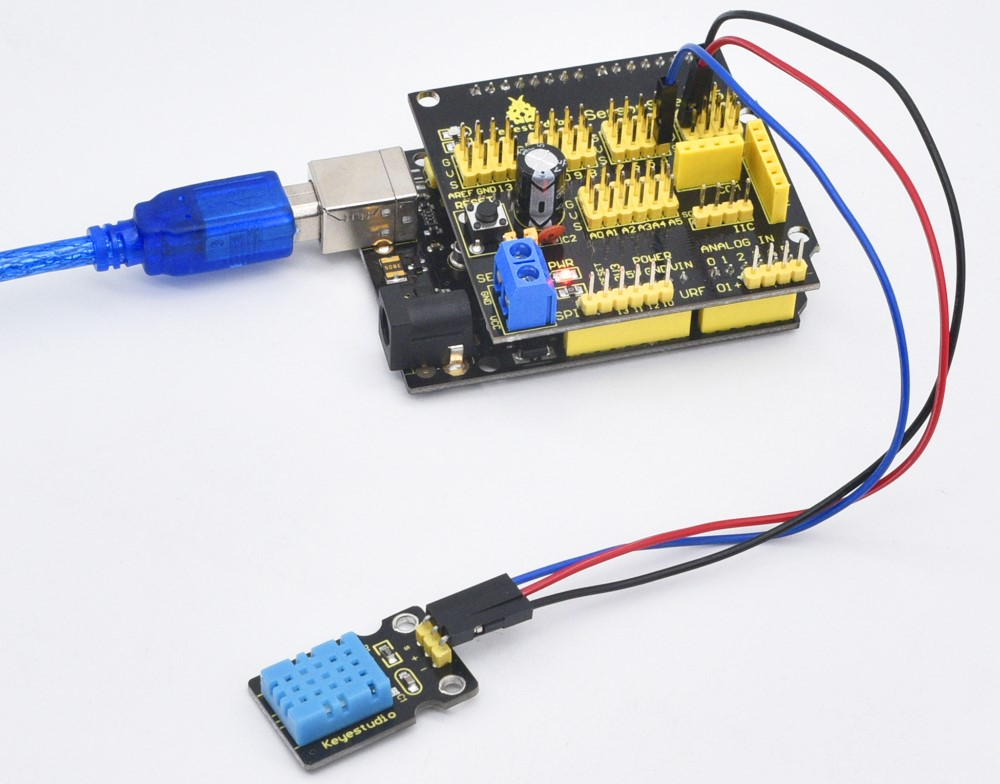

### Project 25: Magical Light Cup

****

**Introduction**

Magic light cup module is able to interact with ARDUINO. The principle is based
on PWM dimming. The mercury switch on the module can provide a digital signal
and trigger PWM regulation. The brightness of two modules will be changed
together through the program design, finally you can see the changing effect
that two set of cups are pouring the light.

**Specification**

Supply Voltage: 3.3V to 5V

Interface: Digital

**Connection Diagram**

Firstly you need to prepare the following parts.

-   Control board \* 1

-   keyestudio Sensor Shield V5\* 1

-   USB Cable\* 1

-   Light cap module\*2

-   Dupont Line \*8

For one light cap module, connect its Signal pin to Digital header 2, L pin to
Digital pin 3. For another one, connect its Signal pin to Digital port 8, L pin
to Digital 9.

Connect the positive pin to anode row of breadboard, lead off the row to 5V port
of V4.0 board; connect the negative pin to cathode row, lead off the row to
ground port.

**For V4.0 connection:**

Stack the Sensor Shield V5 onto the V4.0 board.

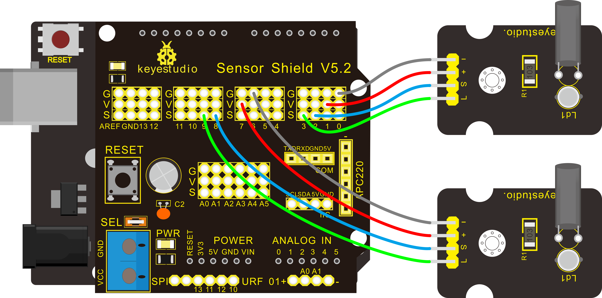

**For 2560 R3 connection:**

Stack the Sensor Shield V1.0 onto the 2560 R3 board.

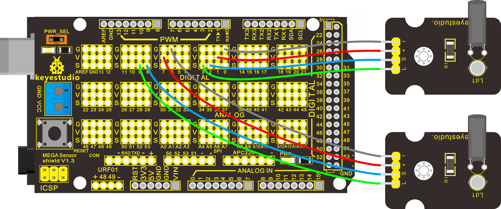

**Sample Code**

Copy and paste the code below to Arduino software.

\*\*\*\*\*\*\*\*\*\*\*\*\*\*\*\*\*\*\*\*\*\*\*\*\*\*\*\*\*\*\*\*\*\*\*\*\*\*\*\*\*\*\*\*\*\*\*\*\*\*\*\*\*\*\*\*\*\*\*

int LedPinA = 3;

int LedPinB = 9;

int ButtonPinA = 2;

int ButtonPinB = 8;

int buttonStateA = 0;

int buttonStateB = 0;

int brightnessA = 0;

int brightnessB= 255;

void setup()

{

Serial.begin(9600);

pinMode(LedPinA, OUTPUT);

pinMode(LedPinB, OUTPUT);

pinMode(ButtonPinA, INPUT);

pinMode(ButtonPinB, INPUT);

}

void loop()

{

buttonStateA = digitalRead(ButtonPinA);

if (buttonStateA == HIGH && brightnessA != 255)

{

brightnessA ++;

}

if (buttonStateA == LOW && brightnessA != 0)

{

brightnessA --;

}

analogWrite(LedPinB, brightnessA);

Serial.print(brightnessA);

Serial.print(" ");

buttonStateB = digitalRead(ButtonPinB);

if (buttonStateB == HIGH && brightnessB != 0)

{

brightnessB --;

}

if (buttonStateB == LOW && brightnessB != 255)

{

brightnessB++;

}

analogWrite(LedPinA, brightnessB);

Serial.println(brightnessB);

delay(5);

}

\*\*\*\*\*\*\*\*\*\*\*\*\*\*\*\*\*\*\*\*\*\*\*\*\*\*\*\*\*\*\*\*\*\*\*\*\*\*\*\*\*\*\*\*\*\*\*\*\*\*\*\*\*\*\*\*\*\*\*

**Example Result**

Wire it up as the above diagram and upload well the code to the board, then you
can see one cap lights up while the other one is off.

When tilt these two caps towards the same side, one cap is gradually become
bright, another bright cap is gradually off.

**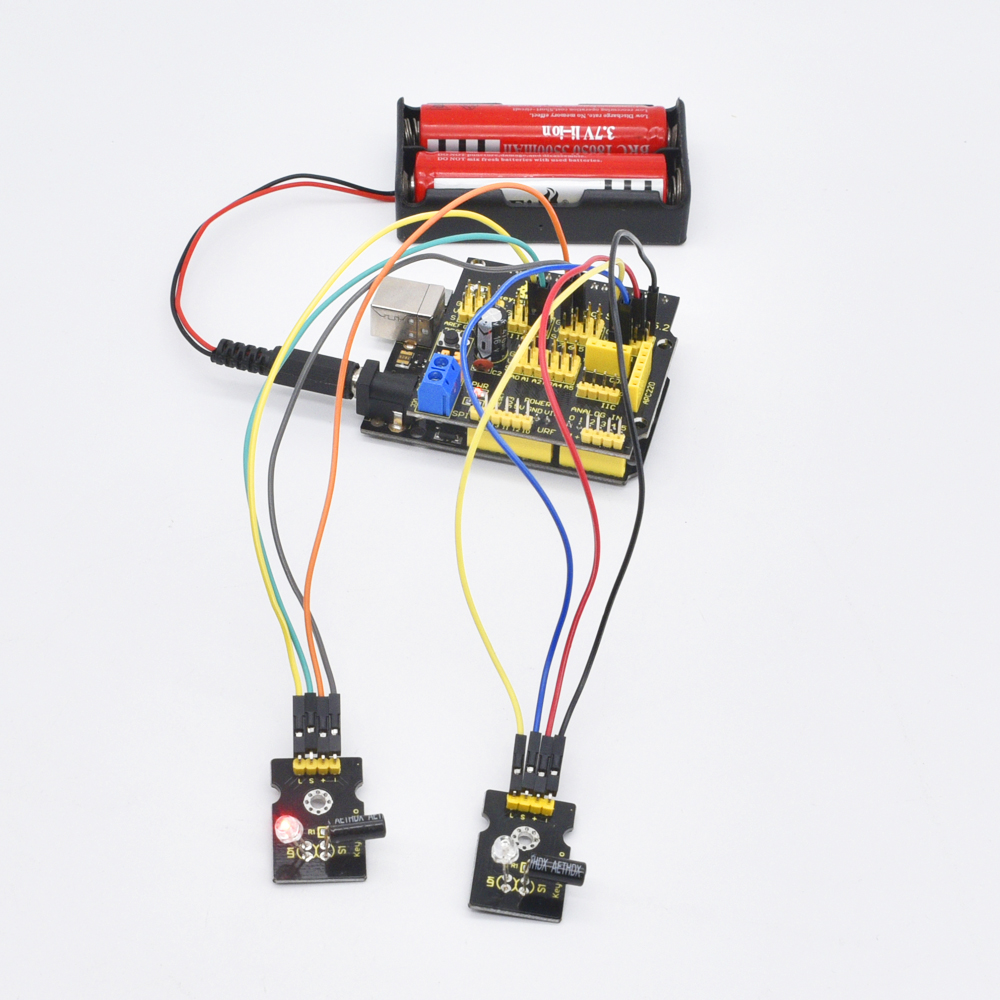**

### Project 26: Digital IR Transmitter

**Introduction:**

IR Transmitter module is designed for IR communication which is widely used for
operating the television device from a short line-of-sight distance. The remote
control is usually contracted to remote.

Since infrared (IR) remote controls use light, they require line of sight to
operate the destination device. The signal can, however, be reflected by
mirrors, just like any other light source.

If operation is required where no line of sight is possible, for instance, when
controlling equipment in another room or installed in a cabinet, many brands of
IR extenders are available for this on the market. Most of these have an IR
receiver, picking up the IR signal and relaying it via radio waves to the remote
part, which has an IR transmitter mimicking the original IR control.

Infrared receivers also tend to have a more or less limited operating angle,
which mainly depends on the optical characteristics of the phototransistor.
However, it’s easy to increase the operating angle using a matte transparent
object in front of the receiver.

**Specification:**

-   Power Supply: 3-5V

-   Infrared center frequency: 850nm-940nm

-   Infrared emission angle: about 20 degrees

-   Infrared emission distance: about 1.3m (5V 38Khz)

-   Interface: 3PIN

-   Mounting hole: inner diameter is 3.2mm, spacing is 15mm

**Hardware
Connection**

To begin with, you need to prepare the following parts:

-   Control board \* 1

-   keyestudio Sensor Shield V5\* 1

-   USB Cable\* 1

-   IR transmitter module\*1

-   Dupont Line \*3

Connect the S pin to digital 3, negative pin to GND port, positive pin to 5V
port.

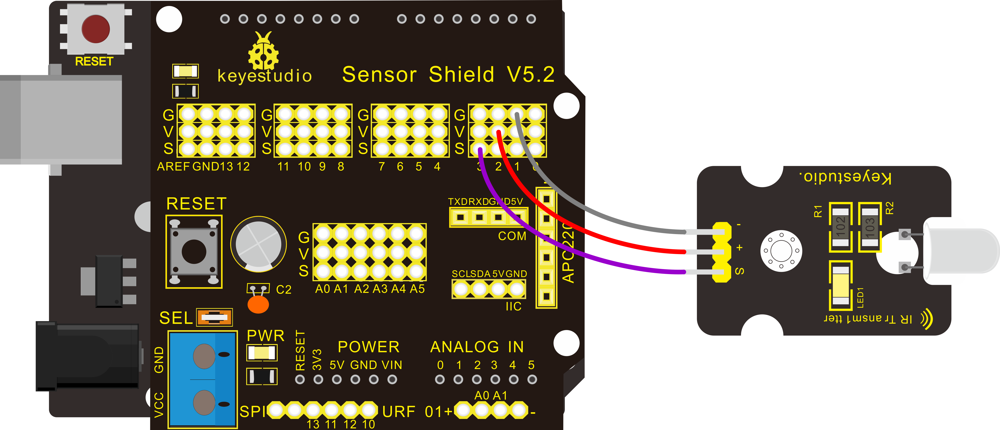

**Note:** This IR transmitter module is not compatible with Mega2560 main board
because **IRremoteInt.h** has no PWM port for \_AVR_ATmega2560_device; but V4.0
is default using pin3

**Sample Code:**

\*\*\*\*\*\*\*\*\*\*\*\*\*\*\*\*\*\*\*\*\*\*\*\*\*\*\*\*\*\*\*\*\*\*\*\*\*\*\*\*\*\*\*\*\*\*\*\*\*\*\*\*\*\*\*\*\*\*\*

int led = 3;

void setup() {

pinMode(led, OUTPUT);

}

void loop() {

digitalWrite(led, HIGH);

delay(1000);

digitalWrite(led, LOW);

delay(1000); }

\*\*\*\*\*\*\*\*\*\*\*\*\*\*\*\*\*\*\*\*\*\*\*\*\*\*\*\*\*\*\*\*\*\*\*\*\*\*\*\*\*\*\*\*\*\*\*\*\*\*\*\*\*\*\*\*\*\*\*

In the darkness of the environment, you are going to see blinking blue light on
phone's screen when using camera to shoot the infrared LED.

Upload well the above code to the board, the led on the sensor will blink red
light.

In the following, let’s move on to an interactive example between IR receiver
and IR transmitter module.

**Infrared Remote/Communication:**

**Hardware Required**

-   Arduino R3 x2

-   Digital IR Receiver x1

-   IR Transmitter Module x1

**Note:** here if you have no two main boards, you can replace it with the
breadboard for connection, may be more easier and convenient.

-   Get Arduino library
    [Arduino-IRremote](https://github.com/shirriff/Arduino-IRremote) and install
    it

**Connection Diagram:**

**For IR Transmitter:**

Notice: Arduino-IRremote only supports D3 as transmitter.

**For IR Receiver:** connect the signal pin to D11 port.

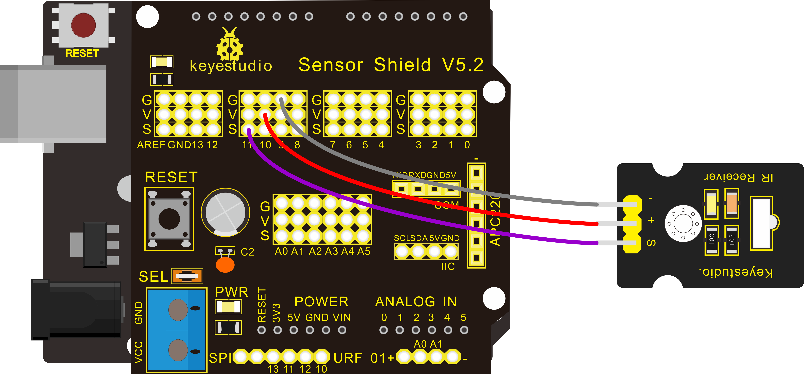

**Upload code to the V4.0 connected with IR Transmitter:**

\*\*\*\*\*\*\*\*\*\*\*\*\*\*\*\*\*\*\*\*\*\*\*\*\*\*\*\*\*\*\*\*\*\*\*\*\*\*\*\*\*\*\*\*\*\*\*\*\*\*\*\*\*\*\*\*\*\*\*

\##include \<IRremote.h\>

IRsend irsend;

void setup()

{}

void loop() {

irsend.sendRC5(0x0, 8); //send 0x0 code (8 bits)

delay(200);

irsend.sendRC5(0x1, 8);

delay(200); }

\*\*\*\*\*\*\*\*\*\*\*\*\*\*\*\*\*\*\*\*\*\*\*\*\*\*\*\*\*\*\*\*\*\*\*\*\*\*\*\*\*\*\*\*\*\*\*\*\*\*\*\*\*\*\*\*\*\*\*

**Upload code to the V4.0 connected with IR Receiver:**

\*\*\*\*\*\*\*\*\*\*\*\*\*\*\*\*\*\*\*\*\*\*\*\*\*\*\*\*\*\*\*\*\*\*\*\*\*\*\*\*\*\*\*\*\*\*\*\*\*\*\*\*\*\*\*\*\*\*\*

\##include \<IRremote.h\>

const int RECV_PIN = 11;

const int LED_PIN = 13;

IRrecv irrecv(RECV_PIN);

decode_results results;

void setup()

{Serial.begin(9600);

irrecv.enableIRIn(); // Start the receiver

}

void loop()

{if (irrecv.decode(&results))

{ if ( results.bits \> 0 )

{

int state;

if ( 0x1 == results.value )

{

state = HIGH;

}

else

{

state = LOW;

}

digitalWrite( LED_PIN, state );

}

irrecv.resume(); // prepare to receive the next value

}}

\*\*\*\*\*\*\*\*\*\*\*\*\*\*\*\*\*\*\*\*\*\*\*\*\*\*\*\*\*\*\*\*\*\*\*\*\*\*\*\*\*\*\*\*\*\*\*\*\*\*\*\*\*\*\*\*\*\*\*

**Result:**

When IR Receiver module receives the infrared signal from IR Transmitter, D1 led
on the IR Receiver module will blink. Shown as below figure.

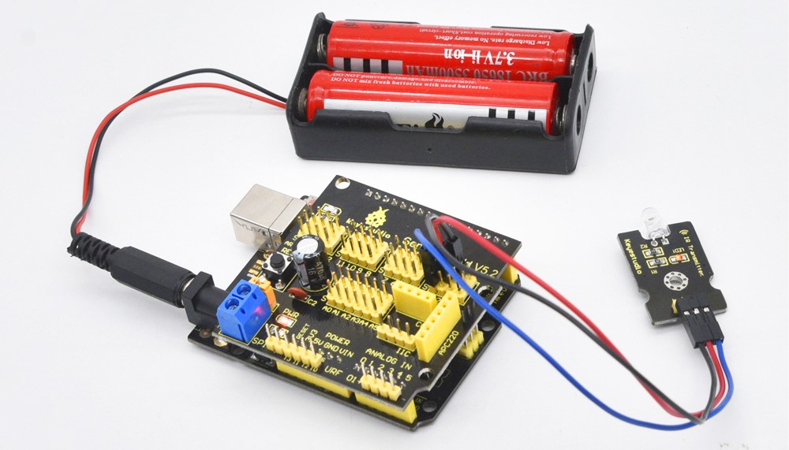

### Project 27: Digital IR Receiver

****

**Introduction:**

IR is widely used in remote control. With this IR receiver, Arduino Project is
able to receive command from any IR remoter controller if you have the right
decoder. Well, it will be also easy to make your own IR controller using IR
transmitter.

**Specification:**

-   Power Supply: 5V

-   Interface type: Digital

-   Modulate Frequency: 38Khz

-   Interface: 3PIN

**Wiring Diagram**

To begin with, you need to prepare the following parts:

-   Control board \* 1

-   keyestudio Sensor Shield V5\* 1

-   USB Cable\* 1

-   IR receiver module\*1

-   Dupont Line \*3

Connect the S pin to digital 11, negative pin to GND port, positive pin to 5V
port.

**For 2560 R3 connection:**

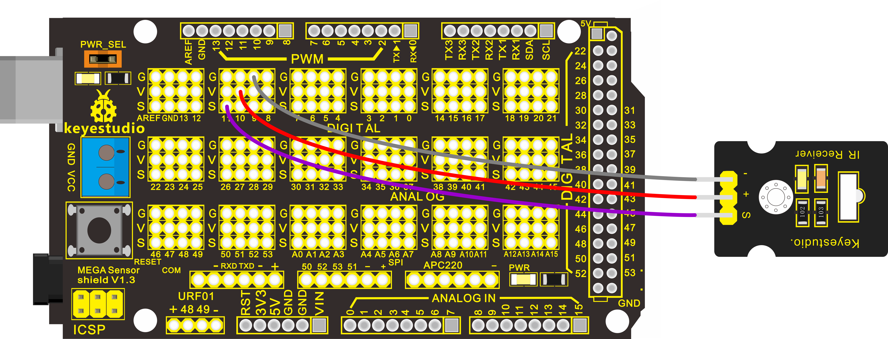

NOTE: In the sample code below Digital pin 11 is in use, you may either change
your wiring or change the sample code to match.

**Sample Code:**

\*\*\*\*\*\*\*\*\*\*\*\*\*\*\*\*\*\*\*\*\*\*\*\*\*\*\*\*\*\*\*\*\*\*\*\*\*\*\*\*\*\*\*\*\*\*\*\*\*\*\*\*\*\*\*\*\*\*\*

\##include \<IRremote.h\>

int RECV_PIN = 11;

IRrecv irrecv(RECV_PIN);

decode_results results;

void setup()

{

Serial.begin(9600);

irrecv.enableIRIn(); // Start the receiver

}

void loop() {

if (irrecv.decode(&results)) {

Serial.println(results.value, HEX);

irrecv.resume(); // Receive the next value

}

}

\*\*\*\*\*\*\*\*\*\*\*\*\*\*\*\*\*\*\*\*\*\*\*\*\*\*\*\*\*\*\*\*\*\*\*\*\*\*\*\*\*\*\*\*\*\*\*\*\*\*\*\*\*\*\*\*\*\*\*

**Note:** before compiling the code, do remember to place the library into
libraries directory of Arduino IDE. Otherwise, compiling will fail.

IR Remote Library includes some sample codes for sending and receiving.

<https://github.com/shirriff/Arduino-IRremote>

**Result:**

Done wiring and uploading the code, then control the IR receiver module by an
infrared remote control, D1 led will flash. Shown as below.

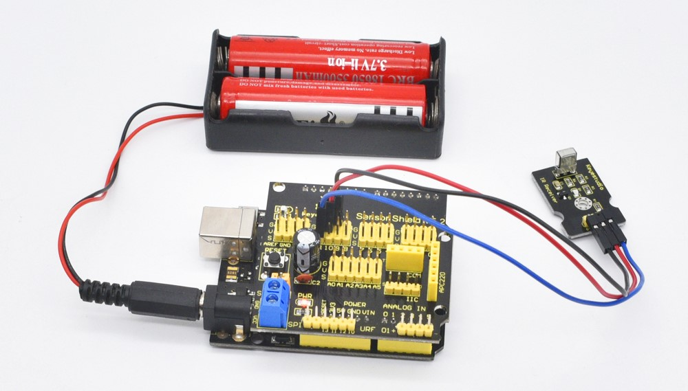

### Project 28: Analog Ceramic Vibration

**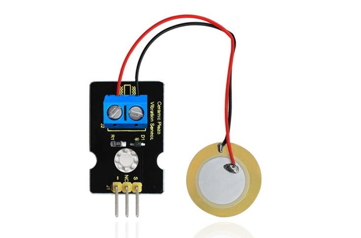**

**Description**

This vibration sensor is based on piezoelectric ceramic chip analog vibration.
It makes use of the anti-conversion process that piezoelectric ceramic vibration
will generate the electric signals. When vibrating the piezoelectric ceramic
chip, the sensor’s signal terminal will generate electrical signals.

The sensor can be used with Arduino dedicated sensor shield, and Arduino analog
port can perceive weak vibration signals, so that it can make interactive works
related to vibration, such as electronic drum.

Connect the vibration sensor to the analog port A0 of Control board. When
vibrating the sensor in different degrees, you will see the different output
value is displaying on serial monitor of Arduino software.

**Specification**

-   Supply Voltage: 3.3V to 5V

-   Working Current：\<1mA

-   Working Temperature Range：－10℃～＋70℃

-   Output Signal：analog signal

**Connection Diagram**

First, you need to prepare the following parts before connection:

-   Control board \* 1

-   keyestudio Sensor Shield V5\* 1

-   USB Cable\* 1

-   vibration sensor\*1

-   Dupont Line \*3

Connect the S pin to Analog A0, connect the negative pin to GND port, NC pin to
5V port.

**For V4.0 connection:**

Stack the Sensor Shield V5 onto the V4.0 board.

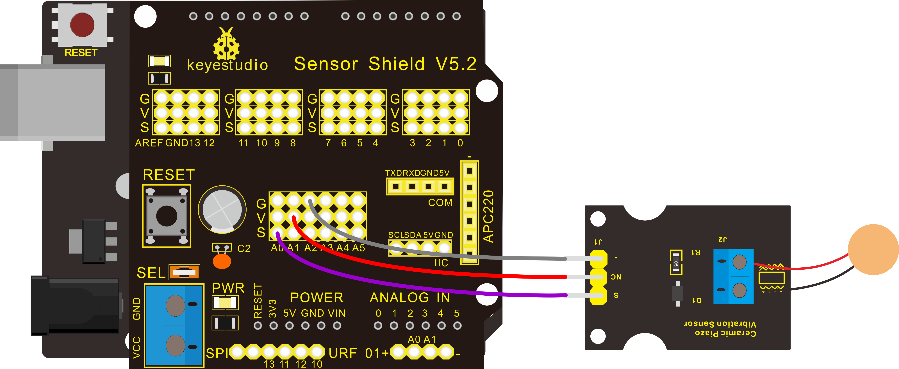

**For 2560 R3 connection:**

Stack the Sensor Shield V1.0 onto the 2560 R3 board.

**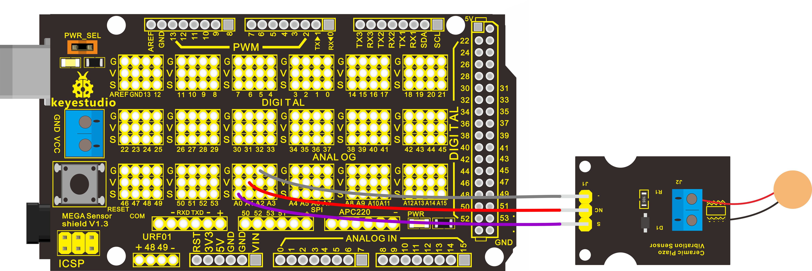**

**Sample Code**

Copy and paste the below code to Arduino software.

\*\*\*\*\*\*\*\*\*\*\*\*\*\*\*\*\*\*\*\*\*\*\*\*\*\*\*\*\*\*\*\*\*\*\*\*\*\*\*\*\*\*\*\*\*\*\*\*\*\*\*\*\*\*\*\*\*\*\*

void setup()

{

Serial.begin(9600); //Open the serial to set the baud rate as 9600bps

}

void loop()

{

int val;

val=analogRead(0); //Connect the sensor to analog interface A0

Serial.print("Vibration is ");

Serial.println(val,DEC);//Print the analog value read on serial port

delay(100);

}

\*\*\*\*\*\*\*\*\*\*\*\*\*\*\*\*\*\*\*\*\*\*\*\*\*\*\*\*\*\*\*\*\*\*\*\*\*\*\*\*\*\*\*\*\*\*\*\*\*\*\*\*\*\*\*\*\*\*\*

**Example Result**

Wiring as the above diagram and upload well the code, then open the serial
monitor and set the baud rate to 9600.

When vibrating the ceramic chip, you will see the data change as the figure
shown below.

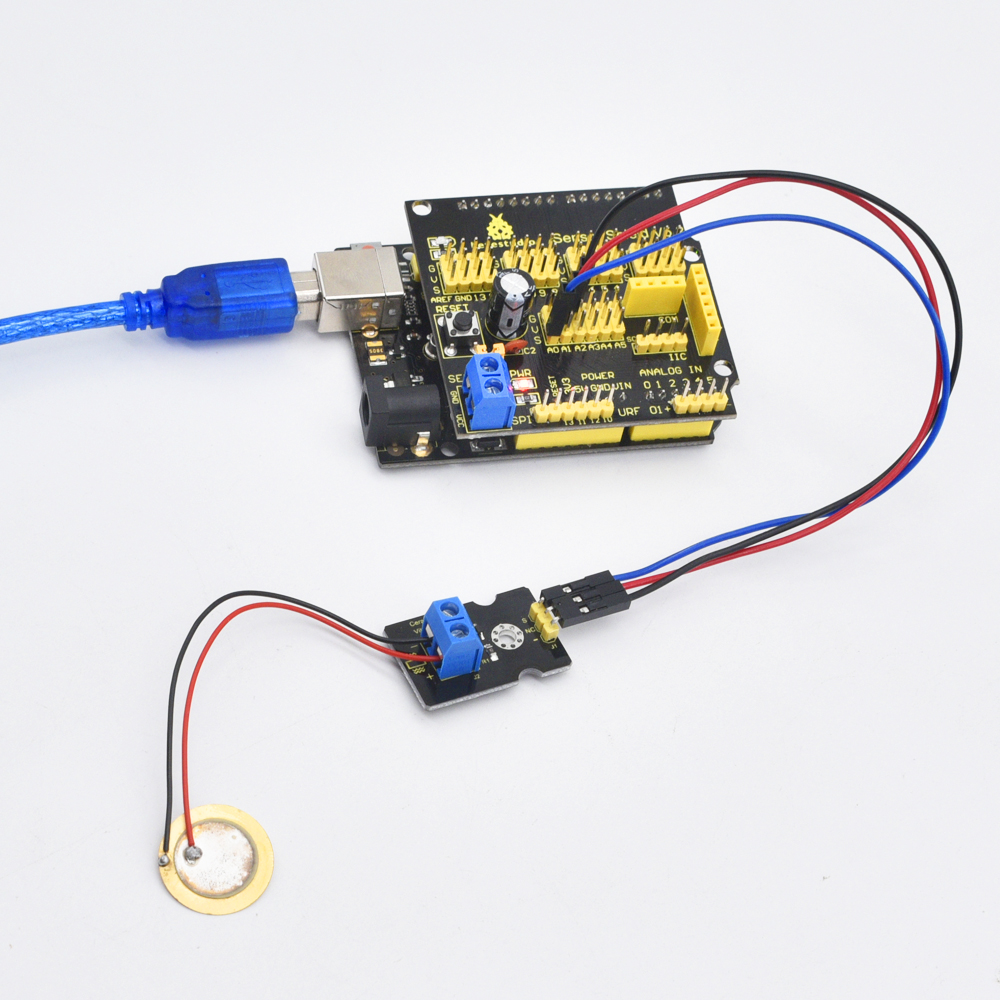

### Project 29: Ultraviolet Light

**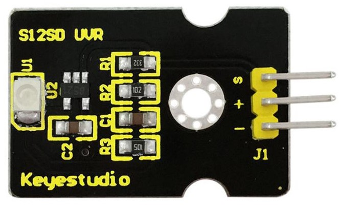**

**Description**

keyestudio GUVA-S12SD ultraviolet sensor is used to detect ultraviolet light.

It includes GUVA-S12SD applied to measure ultraviolet index of intelligent
wearable device, such as watches, smart phone and outdoor device with UV index
detecting.

It can be also used to monitor the intensity of ultraviolet light or used as a
UV flame detector when disinfecting things by ultraviolet light.

**Parameters**

-   Supply Voltage: 2.5V～5V

-   Output Signal: Analog Signal

-   Detecting Range of Spectrum: 240-370nm

-   Active Region: 0.076mm2

-   Responsivity: 0.14A/W

-   Dark Current: 1nA

-   Light Current: 101\~125nA UVA Light, 1mW/cm2

**Connection Diagram**

Firstly you need to prepare the following parts before connection.

-   Control board \* 1

-   keyestudio Sensor Shield V5\* 1

-   USB Cable\* 1

-   Ultraviolet Sensor \*1

-   Dupont Line \*3

Connect the S pin to Analog A0, connect the negative pin to GND port, positive
pin to V pin.

**For V4.0 connection:**

Stack the Sensor Shield V5 onto the V4.0 board.

**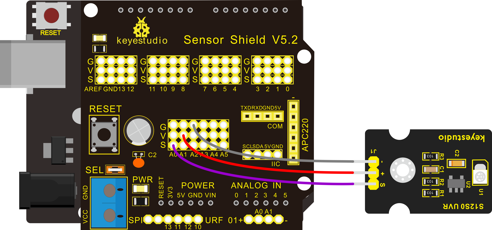**

**For 2560 R3 connection:**

Stack the Sensor Shield V1.0 onto the 2560 R3 board.

**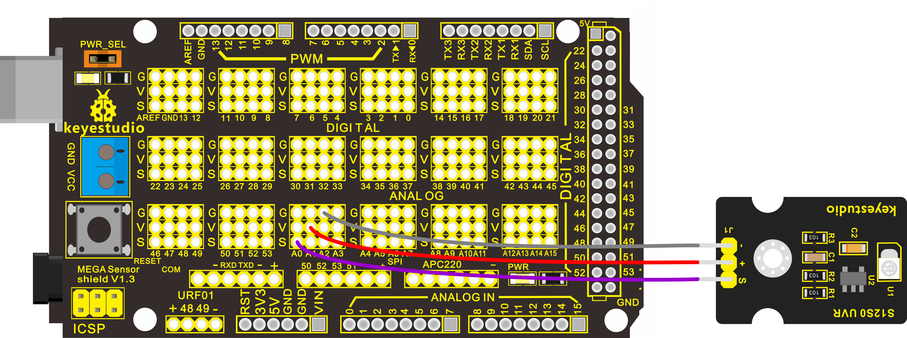**

**Sample Code**

Copy and paste the code below to Arduino software.

\*\*\*\*\*\*\*\*\*\*\*\*\*\*\*\*\*\*\*\*\*\*\*\*\*\*\*\*\*\*\*\*\*\*\*\*\*\*\*\*\*\*\*\*\*\*\*\*\*\*\*\*\*\*\*\*\*

/\*

AnalogReadSerial

Reads an analog input on pin 0, prints the result to the serial monitor.

Attach the center pin of a potentiometer to pin A0, and the outside pins to +5V
and ground.

This example code is in the public domain.

\*/

// the setup routine runs once when you press reset:

void setup() {

// initialize serial communication at 9600 bits per second:

Serial.begin(9600);

}

// the loop routine runs over and over again forever:

void loop() {

// read the input on analog pin 0:

int sensorValue = analogRead(A0);

// print out the value you read:

Serial.println(sensorValue);

delay(1); // delay in between reads for stability

}

\*\*\*\*\*\*\*\*\*\*\*\*\*\*\*\*\*\*\*\*\*\*\*\*\*\*\*\*\*\*\*\*\*\*\*\*\*\*\*\*\*\*\*\*\*\*\*\*\*\*\*\*\*\*\*\*\*\*\*

**Example Result**

Upload the program code, then open serial monitor, it will display the data.

If shine UV light to the sensor, the data on serial monitor is changing.

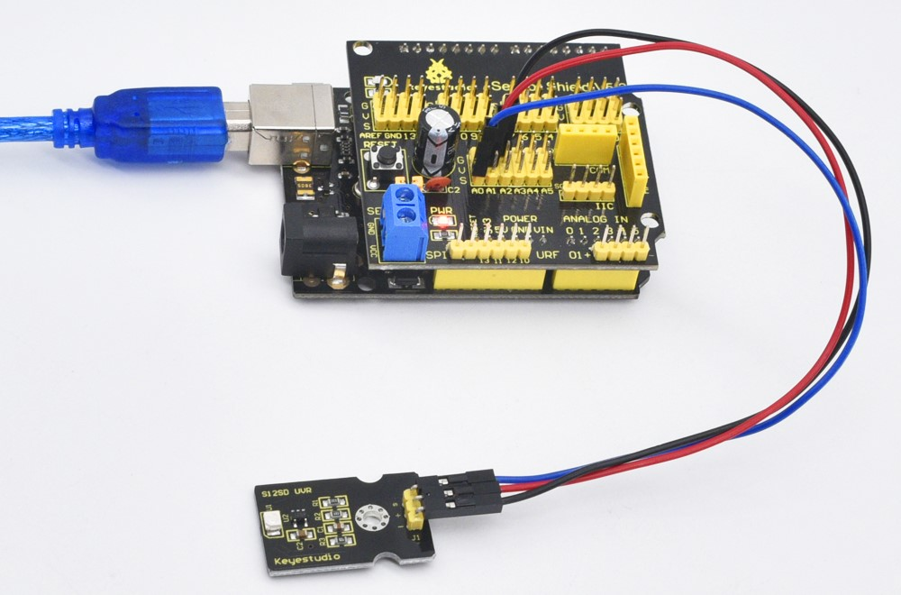

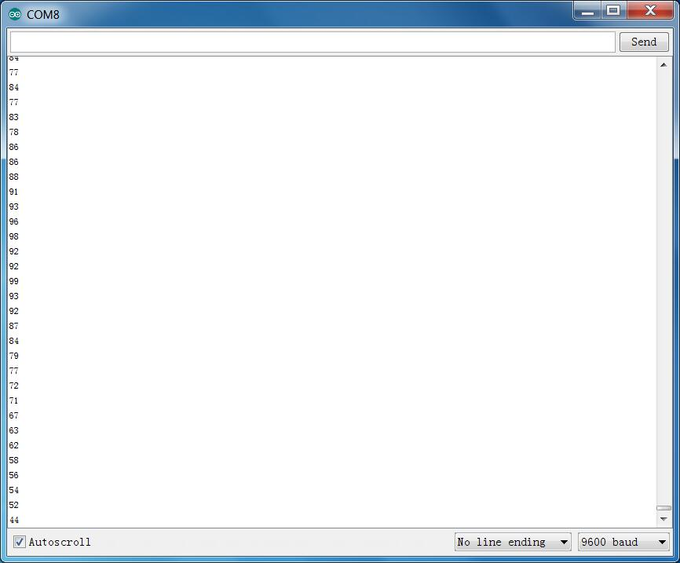

### Project 30: Triaxial Digital Acceleration Detection

**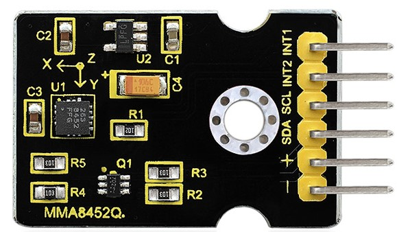**

**Introduction**

MMA8452Q is a smart low-power, three-axis, capacitive micromachine acceleration
sensor with 12-bit resolution.

This acceleration sensor has a rich embedded performance, featured with flexible
user programmable options and two interruption pins configuration. The embedded
interruption function can save the overall power consumption and remove the
burden of constantly polling the data in the main processor.

Besides, MMA8452Q has a user optional range of ±2g / ±4g/ ±8g, which can output
high-pass filtering data and non-filtered data in real time.

This device can configure an embedded function to generate an inertial wake-up
interrupt signal, which enables MMA8452Q to maintain a low-power mode in the
static state while monitoring the event.

**Performance Parameters**

-   Power Supply Voltage：DC 3.3 V to 5 V

-   ±2g/±4g/±8g Optional dynamic range

-   Output data rate (ODR) range: 1.56 Hz to 800 Hz

-   Noise：99μg/√Hz

-   12 bits and 8 bits digital outputs;

-   I2C digital output interface (up to 2.25 MHz when the pull-up resistor is
    4.7 kΩ);

-   Two programmable interruption pins applied to six interruption sources;

-   Three motion detection embedded channels: free fall detection, pulse
    detection, shaking detection;

-   Direction (transverse/longitudinal) detection with setting lag compensation;

-   Automatic arousal and auto-dormant ODR can be automatically altered;

-   High-pass filtering data can be exported in real time;

-   Power consumption: 6 μA – 165 μA

**Connection Diagram**

Firstly you need to prepare the following parts by yourself before testing.

-   Control board \* 1

-   keyestudio Sensor Shield V5\* 1

-   USB Cable\* 1

-   MMA8452Q sensor\*1

-   Dupont Line \*4

**For V4.0 connection:**

Stack the Sensor Shield V5 onto the V4.0 board. Connect the SCL pin of MMA8452Q
sensor to Analog A5, SDA pin to Analog A4; Connect positive pin (+)to V pin,
negative pin(-) to GND.

**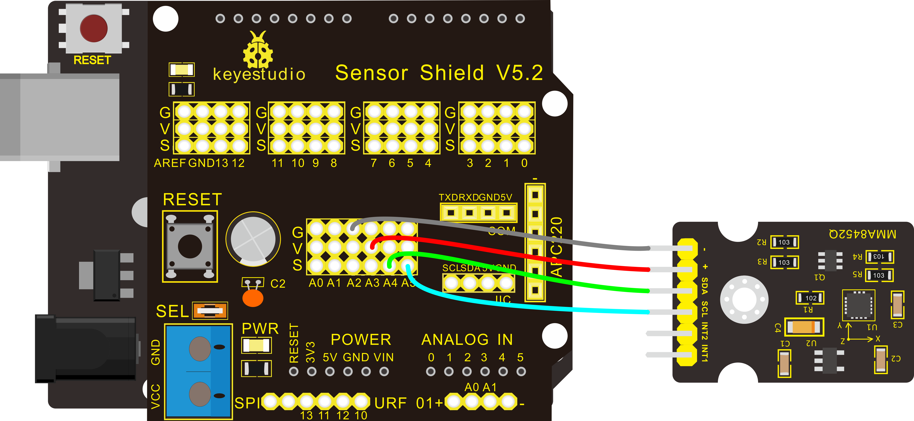**

**For 2560 R3 connection:**

Stack the Sensor Shield V1.0 onto the 2560 R3 board. Connect the SCL pin of
MMA8452Q sensor to pin D21, SDA pin to pin D20; Connect positive pin (+)to V
pin, negative pin(-) to GND.

**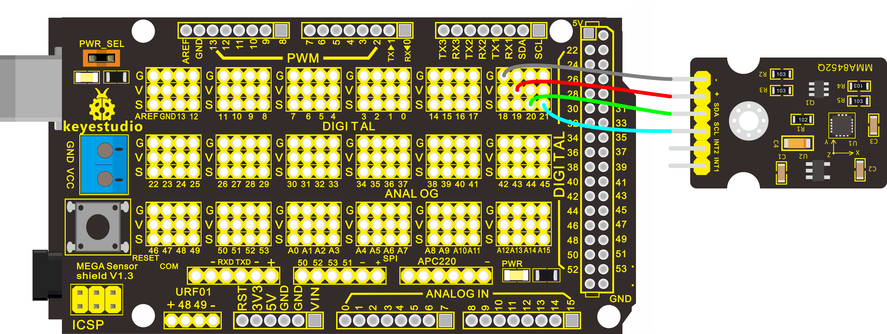**

**Sample Code**

Copy and paste the code below to Arduino software.

\*\*\*\*\*\*\*\*\*\*\*\*\*\*\*\*\*\*\*\*\*\*\*\*\*\*\*\*\*\*\*\*\*\*\*\*\*\*\*\*\*\*\*\*\*\*\*\*\*\*\*\*\*\*\*\*\*\*\*

\##include \<Wire.h\> // Must include Wire library for I2C

\##include \<SparkFun_MMA8452Q.h\> // Includes the SFE_MMA8452Q library

// Begin using the library by creating an instance of the MMA8452Q

// class. We'll call it "accel". That's what we'll reference from

// here on out.

MMA8452Q accel;

// The setup function simply starts serial and initializes the

// accelerometer.

void setup()

{

Serial.begin(9600);

Serial.println("MMA8452Q Test Code!");

// Choose your adventure! There are a few options when it comes

// to initializing the MMA8452Q:

// 1. Default init. This will set the accelerometer up

// with a full-scale range of +/-2g, and an output data rate

// of 800 Hz (fastest).

accel.init();

// 2. Initialize with FULL-SCALE setting. You can set the scale

// using either SCALE_2G, SCALE_4G, or SCALE_8G as the value.

// That'll set the scale to +/-2g, 4g, or 8g respectively.

//accel.init(SCALE_4G); // Uncomment this out if you'd like

// 3. Initialize with FULL-SCALE and DATA RATE setting. If you

// want control over how fast your accelerometer produces

// data use one of the following options in the second param:

// ODR_800, ODR_400, ODR_200, ODR_100, ODR_50, ODR_12,

// ODR_6, or ODR_1.

// Sets to 800, 400, 200, 100, 50, 12.5, 6.25, or 1.56 Hz.

//accel.init(SCALE_8G, ODR_6);

}

// The loop function will simply check for new data from the

// accelerometer and print it out if it's available.

void loop()

{

// Use the accel.available() function to wait for new data

// from the accelerometer.

if (accel.available())

{

// First, use accel.read() to read the new variables:

accel.read();

// accel.read() will update two sets of variables.

// \* int's x, y, and z will store the signed 12-bit values

// read out of the accelerometer.

// \* floats cx, cy, and cz will store the calculated

// acceleration from those 12-bit values. These variables

// are in units of g's.

// Check the two function declarations below for an example

// of how to use these variables.

printCalculatedAccels();

//printAccels(); // Uncomment to print digital readings

// The library also supports the portrait/landscape detection

// of the MMA8452Q. Check out this function declaration for

// an example of how to use that.

printOrientation();

Serial.println(); // Print new line every time.

}

}

// The function demonstrates how to use the accel.x, accel.y and

// accel.z variables.

// Before using these variables you must call the accel.read()

// function!

void printAccels()

{

Serial.print(accel.x, 3);

Serial.print("\\t");

Serial.print(accel.y, 3);

Serial.print("\\t");

Serial.print(accel.z, 3);

Serial.print("\\t");

}

// This function demonstrates how to use the accel.cx, accel.cy,

// and accel.cz variables.

// Before using these variables you must call the accel.read()

// function!

void printCalculatedAccels()

{

Serial.print(accel.cx, 3);

Serial.print("\\t");

Serial.print(accel.cy, 3);

Serial.print("\\t");

Serial.print(accel.cz, 3);

Serial.print("\\t");

}

// This function demonstrates how to use the accel.readPL()

// function, which reads the portrait/landscape status of the

// sensor.

void printOrientation()

{

// accel.readPL() will return a byte containing information

// about the orientation of the sensor. It will be either

// PORTRAIT_U, PORTRAIT_D, LANDSCAPE_R, LANDSCAPE_L, or

// LOCKOUT.

byte pl = accel.readPL();

switch (pl)

{

case PORTRAIT_U:

Serial.print("Portrait Up");

break;

case PORTRAIT_D:

Serial.print("Portrait Down");

break;

case LANDSCAPE_R:

Serial.print("Landscape Right");

break;

case LANDSCAPE_L:

Serial.print("Landscape Left");

break;

case LOCKOUT:

Serial.print("Flat");

break;

}

}

\*\*\*\*\*\*\*\*\*\*\*\*\*\*\*\*\*\*\*\*\*\*\*\*\*\*\*\*\*\*\*\*\*\*\*\*\*\*\*\*\*\*\*\*\*\*\*\*\*\*\*\*\*\*\*\*\*\*\*

**Note:** before compiling the code, do remember to place the library into
libraries directory of Arduino IDE. Otherwise, compiling will fail.

**Example Result**

****

Wiring as the above diagram and power on, then upload the code and open the
serial monitor, it will display the triaxial acceleration of sensor and its
status, as the graph shown below.

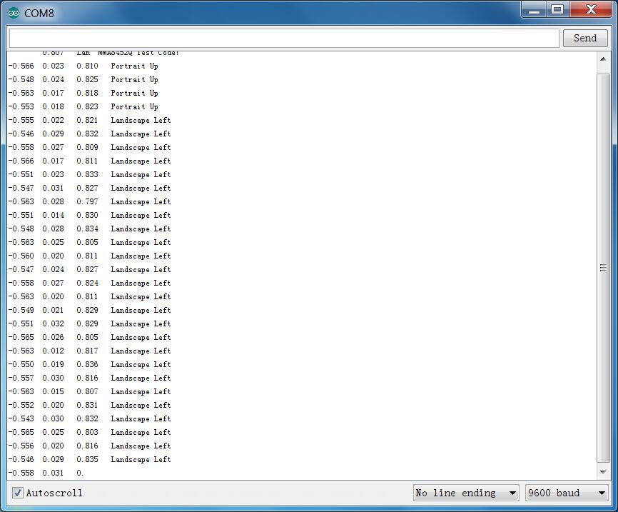

### Project 31: Attitude Sensor

**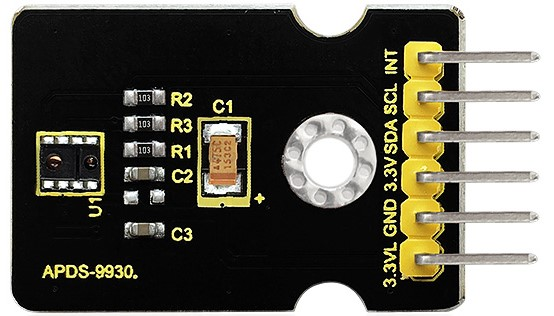**

**Introduction**

Keyestudio attitude sensor module mainly uses APDS-9930 chip. APDS-9930 in a
single 8 pin package can provide the ambient light sensor which is compatible
with I2C interface and infrared LED proximity sensor.

The ambient light sensor uses double light diode to approximate the visual
response of low lumen human under 0.01 lux illumination, and its high
sensitivity allows the device to operate in the back of dark glass.

The proximity sensor which is completely adjusted can detect 100 mm object, and
exempt the factory calibration requirements of terminal equipment as well as
sub-components. From the bright sunlight to the dark room, proximity sensor’s
proximity detection function can operate well.

This module added micro optical lens can provide infrared energy efficient
transmission and reception, which can reduce the overall power consumption. In
addition, its internal state machine can make the device into a low power mode,
bringing a very low average power consumption.

**Performance Parameters**

-   Working Voltage：DC 3.3-3.8V

-   Output Current：0-20mA

-   Temperature Range：-40℃—85℃

**Features:**

1.  Optical module integrated with ALS, infrared LED and proximity detector;

2.  Ambient Light Sensing, similar to the human eye’s visual response;

3.  Programmable interruption function with upper and lower thresholds;

4.  Up to 16-bit resolution;

5.  High sensitivity of operation in the back of dark glass;

6.  0.01lux low lumen performance;

7.  Proximity detection, fully calibrated to 100 mm detection;

8.  Integrate infrared LED and synchronous LED driver;

9.  Eliminate factory calibration for proximity sensors;

10. Programmable waiting timer, waiting state’s power consumption - 90μA
    (typical value);

11. Programmable range is from 2.7 milliseconds to 8 seconds;

12. Compatible with I2C interface, up to 400kHz (I2C fast mode);

13. Dedicated interruption pin;

14. Sleep mode power - 2.2μA (typical value).

**Connection Diagram**

Firstly you need to prepare the following parts by yourself before testing.

-   Control board \* 1

-   keyestudio Sensor Shield V5\* 1

-   USB Cable\* 1

-   Attitude sensor\*1

-   Dupont Line \*5

**For V4.0 connection:**

Stack the Sensor Shield V5 onto the V4.0 board. Connect the SCL pin of Attitude
sensor to Analog A5, SDA pin to Analog A4; Connect positive pin (+)to V pin,
negative pin(-) to GND.

**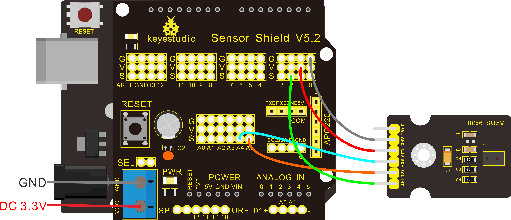**

**For 2560 R3 connection:**

Stack the Sensor Shield V1.0 onto the 2560 R3 board. Connect the SCL pin of
Attitude sensor to pin D21, SDA pin to pin D20; Connect positive pin (+)to V
pin, negative pin(-) to GND.

**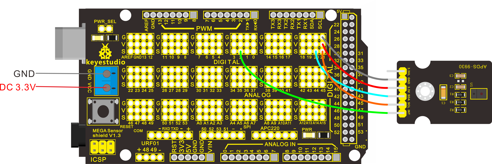**

**Note:**

1.  The analog pins rows of V on the Sensor Shield V5 is default DC 5V. The
    digital pins rows of V on the Sensor Shield V5 have been connected to the
    blue terminal block VCC. When SEL pin on the shield is connected with
    jumpers, digital pins rows of V is DC 5V; if no jumper connection, digital
    pins rows of V is external VCC voltage.

2.  In the experiment, need to supply sensor with power DC3.3V. Remove the
    jumper cap, external supply DC 3.3V

**Sample Code**

IMPORTANT: The APDS-9960 can only accept 3.3V!

**Hardware Connections:**

Arduino Pin APDS-9960 Board Function

3.3V VCC Power

GND GND Ground

A4(V4.0 R3)

D20(MEGA2560) SDA I2C Data

A5(V4.0 R3)

D21(MEGA2560) SCL I2C Data

D2 INT Interrupt

D13 - LED

Resources:

Include Wire.h and \_APDS-9960.h

**Copy and paste the code below to Arduino software.**

\*\*\*\*\*\*\*\*\*\*\*\*\*\*\*\*\*\*\*\*\*\*\*\*\*\*\*\*\*\*\*\*\*\*\*\*\*\*\*\*\*\*\*\*\*\*\*\*\*\*\*\*\*\*\*\*\*\*\*\*\*\*\*\*/

\##include \<Wire.h\>

\##include \<SparkFun_APDS9960.h\>

// Pins

\##define APDS9960_INT 2 // Needs to be an interrupt pin

\##define LED_PIN 13 // LED for showing interrupt

// Constants

\##define LIGHT_INT_HIGH 1000 // High light level for interrupt

\##define LIGHT_INT_LOW 10 // Low light level for interrupt

// Global variables

SparkFun_APDS9960 apds = SparkFun_APDS9960();

uint16_t ambient_light = 0;

uint16_t red_light = 0;

uint16_t green_light = 0;

uint16_t blue_light = 0;

int isr_flag = 0;

uint16_t threshold = 0;

void setup() {

// Set LED as output

pinMode(LED_PIN, OUTPUT);

pinMode(APDS9960_INT, INPUT);

// Initialize Serial port

Serial.begin(9600);

Serial.println();

Serial.println(F("-------------------------------------"));

Serial.println(F("SparkFun APDS-9960 - Light Interrupts"));

Serial.println(F("-------------------------------------"));

// Initialize interrupt service routine

attachInterrupt(0, interruptRoutine, FALLING);

// Initialize APDS-9960 (configure I2C and initial values)

if ( apds.init() ) {

Serial.println(F("APDS-9960 initialization complete"));

} else {

Serial.println(F("Something went wrong during APDS-9960 init!"));

}

// Set high and low interrupt thresholds

if ( !apds.setLightIntLowThreshold(LIGHT_INT_LOW) ) {

Serial.println(F("Error writing low threshold"));

}

if ( !apds.setLightIntHighThreshold(LIGHT_INT_HIGH) ) {

Serial.println(F("Error writing high threshold"));

}

// Start running the APDS-9960 light sensor (no interrupts)

if ( apds.enableLightSensor(false) ) {

Serial.println(F("Light sensor is now running"));

} else {

Serial.println(F("Something went wrong during light sensor init!"));

}

// Read high and low interrupt thresholds

if ( !apds.getLightIntLowThreshold(threshold) ) {

Serial.println(F("Error reading low threshold"));

} else {

Serial.print(F("Low Threshold: "));

Serial.println(threshold);

}

if ( !apds.getLightIntHighThreshold(threshold) ) {

Serial.println(F("Error reading high threshold"));

} else {

Serial.print(F("High Threshold: "));

Serial.println(threshold);

}

// Enable interrupts

if ( !apds.setAmbientLightIntEnable(1) ) {

Serial.println(F("Error enabling interrupts"));

}

// Wait for initialization and calibration to finish

delay(500);

}

void loop() {

// If interrupt occurs, print out the light levels

if ( isr_flag == 1 ) {

// Read the light levels (ambient, red, green, blue) and print

if ( !apds.readAmbientLight(ambient_light) \|\|

!apds.readRedLight(red_light) \|\|

!apds.readGreenLight(green_light) \|\|

!apds.readBlueLight(blue_light) ) {

Serial.println("Error reading light values");

} else {

Serial.print("Interrupt! Ambient: ");

Serial.print(ambient_light);

Serial.print(" R: ");

Serial.print(red_light);

Serial.print(" G: ");

Serial.print(green_light);

Serial.print(" B: ");

Serial.println(blue_light);

}

// Turn on LED for a half a second

digitalWrite(LED_PIN, HIGH);

delay(500);

digitalWrite(LED_PIN, LOW);

// Reset flag and clear APDS-9960 interrupt (IMPORTANT!)

isr_flag = 0;

if ( !apds.clearAmbientLightInt() ) {

Serial.println("Error clearing interrupt");

}

}

}

void interruptRoutine() {

isr_flag = 1;

}

\*\*\*\*\*\*\*\*\*\*\*\*\*\*\*\*\*\*\*\*\*\*\*\*\*\*\*\*\*\*\*\*\*\*\*\*\*\*\*\*\*\*\*\*\*\*\*\*\*\*\*\*\*\*\*\*\*\*\*

**Note:** before compiling the code, do remember to place the library into
libraries directory of Arduino IDE. Otherwise, compiling will fail.

**Example Result**

Wiring as the above diagram and burning the code, after powered-on, open the
serial monitor and set the baud rate as 9600, as the graph shown below.

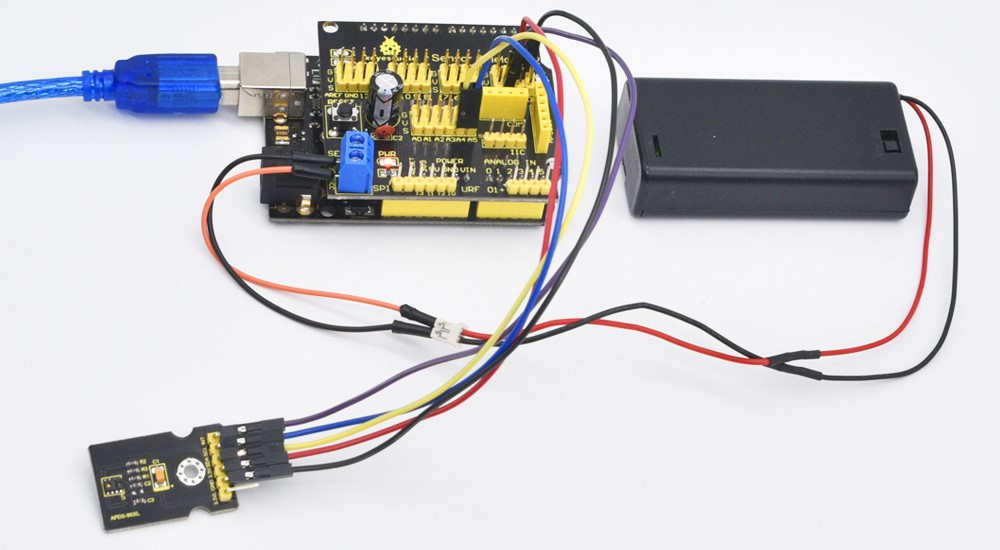

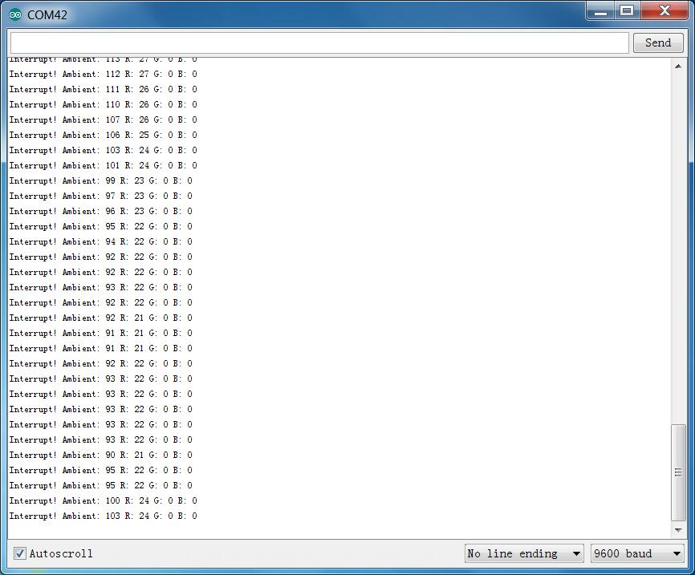

### Project 32: Optical Proximity Detection

**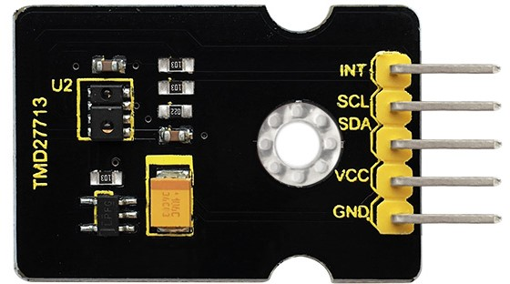**

**Introduction**

It is a triple sensor integrated with ambient light, proximity sensor and
infrared LED.

It has two functions. For one thing, it is used to detect the current ambient
brightness (ALS). It can automatically adjust the backlight brightness in
accordance with the current ambient brightness using software. This way can make
backlight brightness soft to protect your vision and to achieve the effect of
energy saving.

For another feature we are referred to as proximity sensor function (PROX).
Sensor has been integrated transmitter/receiver and minimized the design,
besides, design and installation have no more space restrictions, and for part
of a structure is relatively simple.

**Parameters**

-   Working voltage：DC 3.3V

-   Detection distance：100mm

-   Communication way：IIC communication

-   Temperature range：-30℃ to 85℃

**Connection Diagram**

Firstly you need to prepare the following parts by yourself before testing.

-   Control board \* 1

-   keyestudio Sensor Shield V5\* 1

-   USB Cable\* 1

-   TMD27713 sensor\*1

-   Dupont Line \*5

Then follow the wiring below, connect the INT pin of sensor to Digital 2, SCL
pin to Analog A5, SDA pin to Analog A4; Connect VCC pin to 3V3, GND pin to GND.

**For V4.0 connection:**

Stack the Sensor Shield V5 onto the V4.0 board.

**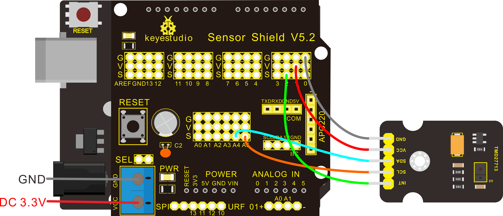**

**For 2560 R3 connection:**

Stack the Sensor Shield V1.0 onto the 2560 R3 board.

**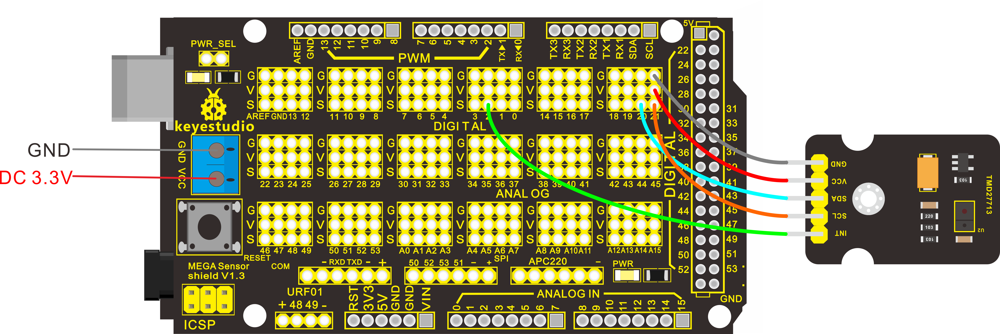**

**Sample Code**

Copy and paste the code below to Arduino software 1.8.2.

\*\*\*\*\*\*\*\*\*\*\*\*\*\*\*\*\*\*\*\*\*\*\*\*\*\*\*\*\*\*\*\*\*\*\*\*\*\*\*\*\*\*\*\*\*\*\*\*\*\*\*\*\*\*\*\*\*\*\*\*\*\*\*\*/

\##define DUMP_REGS

\##include \<Wire.h\>

\##include \<APDS9930.h\>

// Pins

\##define APDS9930_INT 2 // Needs to be an interrupt pin

\##define LED_PIN 13 // LED for showing interrupt

// Constants

\##define PROX_INT_HIGH 600 // Proximity level for interrupt

\##define PROX_INT_LOW 0 // No far interrupt

// Global variables

APDS9930 apds = APDS9930();

float ambient_light = 0; // can also be an unsigned long

uint16_t ch0 = 0;

uint16_t ch1 = 1;

uint16_t proximity_data = 0;

volatile bool isr_flag = false;

void setup() {

// Set LED as output

pinMode(LED_PIN, OUTPUT);

pinMode(APDS9930_INT, INPUT);

// Initialize Serial port

Serial.begin(9600);

Serial.println();

Serial.println(F("------------------------------"));

Serial.println(F("APDS-9930 - ProximityInterrupt"));

Serial.println(F("------------------------------"));

// Initialize interrupt service routine

attachInterrupt(digitalPinToInterrupt(APDS9930_INT), interruptRoutine, FALLING);

// Initialize APDS-9930 (configure I2C and initial values)

if (apds.init()) {

Serial.println(F("APDS-9930 initialization complete"));

}

else {

Serial.println(F("Something went wrong during APDS-9930 init!"));

}

// Adjust the Proximity sensor gain

if (!apds.setProximityGain(PGAIN_2X)) {

Serial.println(F("Something went wrong trying to set PGAIN"));

}

// Set proximity interrupt thresholds

if (!apds.setProximityIntLowThreshold(PROX_INT_LOW)) {

Serial.println(F("Error writing low threshold"));

}

if (!apds.setProximityIntHighThreshold(PROX_INT_HIGH)) {

Serial.println(F("Error writing high threshold"));

}

// Start running the APDS-9930 proximity sensor (interrupts)

if (apds.enableProximitySensor(true)) {

Serial.println(F("Proximity sensor is now running"));

}

else {

Serial.println(F("Something went wrong during sensor init!"));

}

// Start running the APDS-9930 light sensor (no interrupts)

if (apds.enableLightSensor(false)) {

Serial.println(F("Light sensor is now running"));

}

else {

Serial.println(F("Something went wrong during light sensor init!"));

}

\##ifdef DUMP_REGS

/\* Register dump \*/

uint8_t reg;

uint8_t val;

for (reg = 0x00; reg \<= 0x19; reg++) {

if ((reg != 0x10) && \\

(reg != 0x11))

{

apds.wireReadDataByte(reg, val);

Serial.print(reg, HEX);

Serial.print(": 0x");

Serial.println(val, HEX);

}

}

apds.wireReadDataByte(0x1E, val);

Serial.print(0x1E, HEX);

Serial.print(": 0x");

Serial.println(val, HEX);

\##endif

}

void loop() {

// If interrupt occurs, print out the proximity level

if (isr_flag) {

// Read proximity level and print it out

if (!apds.readProximity(proximity_data)) {

Serial.println("Error reading proximity value");

}

else {

Serial.print("Proximity detected! Level: ");

Serial.print(proximity_data);

Serial.print(" ");

}

apds.readAmbientLightLux(ambient_light);

// Read the light levels (ambient, red, green, blue)

if (!apds.readAmbientLightLux(ambient_light) \|\|

!apds.readCh0Light(ch0) \|\|

!apds.readCh1Light(ch1)) {

Serial.println(F("Error reading light values"));

}

else {

Serial.print(F("Ambient: "));

Serial.print(ambient_light);

Serial.print(F(" Ch0: "));

Serial.print(ch0);

Serial.print(F(" Ch1: "));

Serial.println(ch1);

}

// Turn on LED for a half a second

digitalWrite(LED_PIN, HIGH);

delay(300);

digitalWrite(LED_PIN, LOW);

// Reset flag and clear APDS-9930 interrupt (IMPORTANT!)

isr_flag = false;

if (!apds.clearProximityInt()) {

Serial.println("Error clearing interrupt");

}

}

}

void interruptRoutine() {

isr_flag = true;

}

\*\*\*\*\*\*\*\*\*\*\*\*\*\*\*\*\*\*\*\*\*\*\*\*\*\*\*\*\*\*\*\*\*\*\*\*\*\*\*\*\*\*\*\*\*\*\*\*\*\*\*\*\*\*\*\*\*\*\*\*\*\*\*\*\*\*

**Note:** before compiling the code, do remember to place the library into
libraries directory of Arduino IDE. Otherwise, compiling will fail.

**Example Result**

Tested by Arduino-1.8.2 version software, then open serial monitor, you can see
the data as the figure shown below.

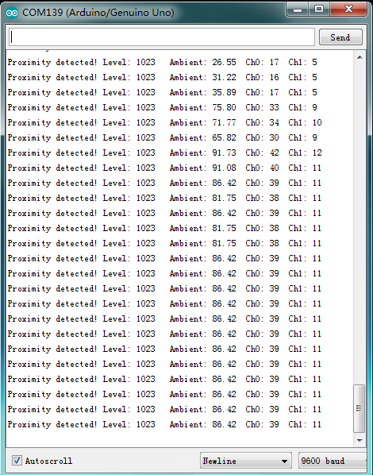

### Project 33: Potentiometer

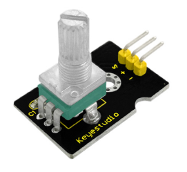

**Description**

This analog rotation sensor is Arduino compatible. It is based on a
potentiometer. Its voltage can be subdivided into 1024, easy to be connected to
Arduino with our sensor shield.

Combined with other sensors, you can use it to make interesting projects by
reading the analog value from the IO port.

**Specification**

-   Supply Voltage: 3.3V to 5V

-   Interface: Analog

**Connection Diagram**

Firstly you need to prepare the following parts by yourself before testing.

-   Control board \* 1

-   keyestudio Sensor Shield V5\* 1

-   USB Cable\* 1

-   Potentiometer sensor\*1

-   Dupont Line \*3

Connect the S pin of module to Analog A0, connect the negative pin to GND,
positive pin to 5V.

**For V4.0 connection:**

Stack the Sensor Shield V5 onto the V4.0 board.

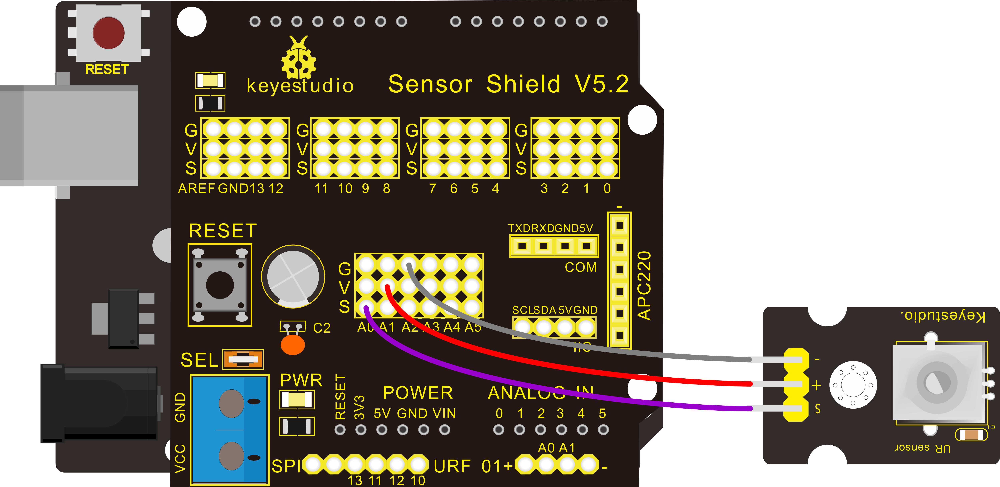

**For 2560 R3 connection:**

Stack the Sensor Shield V1.0 onto the 2560 R3 board.

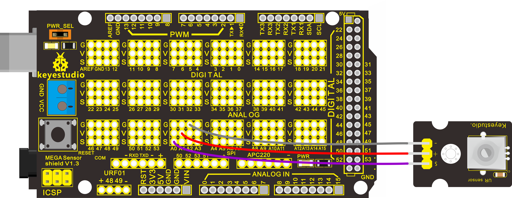

**Sample Code**

Copy and paste the below code to Arduino software.

\*\*\*\*\*\*\*\*\*\*\*\*\*\*\*\*\*\*\*\*\*\*\*\*\*\*\*\*\*\*\*\*\*\*\*\*\*\*\*\*\*\*\*\*\*\*\*\*\*\*\*\*\*\*\*\*\*\*\*\*\*\*\*\*\*\*

void setup()

{

Serial.begin(9600); //Set serial baud rate to 9600 bps

}

void loop()

{

int val;

val=analogRead(0);//Read rotation sensor value from analog 0

Serial.println(val,DEC);//Print the value to serial port

delay(100);

}

\*\*\*\*\*\*\*\*\*\*\*\*\*\*\*\*\*\*\*\*\*\*\*\*\*\*\*\*\*\*\*\*\*\*\*\*\*\*\*\*\*\*\*\*\*\*\*\*\*\*\*\*\*\*\*\*\*\*\*\*\*\*\*\*\*\*

**Example Result**

**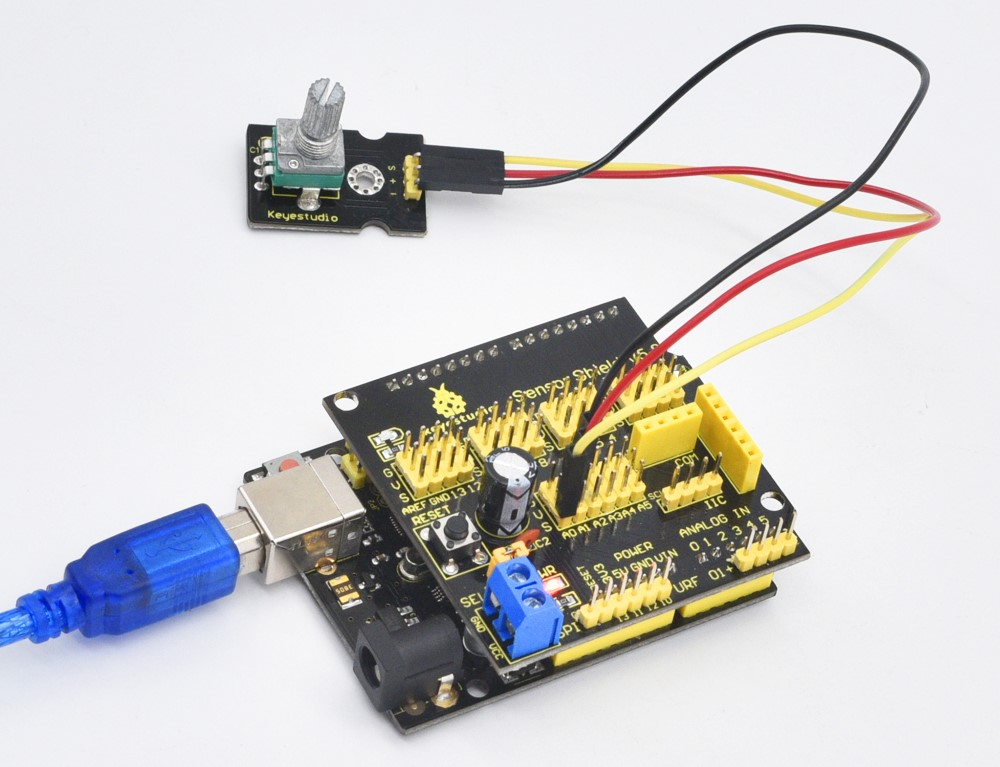**

Done wiring and powered up, upload well the code, then open the serial monitor
and set the baud rate as 9600, you will see the analog value.

If rotate the knob on the potentiometer sensor, the value will be changed within
0-1023. Shown below.

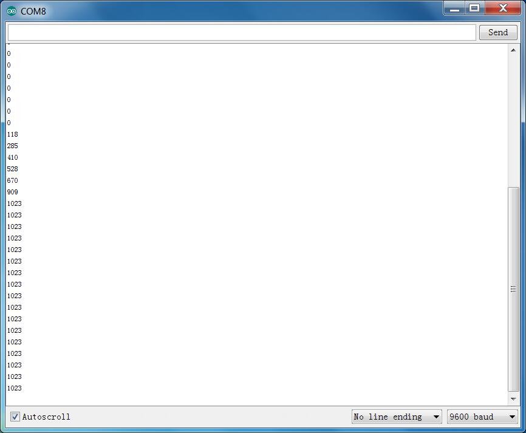

### Project 34: HC-SR04 Ultrasonic Sensor

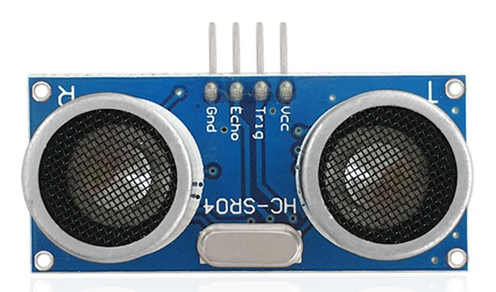

**Description**

As the ultrasonic has strong direction, slow energy consumption and far spread
distance in the media, so it is commonly used in the measurement of distance,
such as range finder and position measuring instrument.

Using ultrasonic is more rapid, convenient, simple to calculate and more easier
to achieve real-time control, so it has also been widely used in the development
of mobile robots.

Ultrasonic detector module can provide 2cm-450cm non-contact sensing distance,
and its ranging accuracy is up to 3mm, very good to meet the normal
requirements. The module includes an ultrasonic transmitter and receiver as well
as the corresponding control circuit.

**Working Schematics**

Please refer to the working
[sequence](D:/Dict/7.3.0.0807/resultui/dict/javascript:;) as below：

1\. First pull down the TRIG, and then trigger it with at least 10us high level
signal;

2\. After triggering, the module will automatically transmit eight 40KHZ square
waves, and automatically detect whether there is a signal to return.

3\. If there is a signal returned back, through the ECHO to output a high level,
the duration time of high level is actually the time from emission to reception
of ultrasonic.

Test distance = high level duration \* 340m/s \* 0.5.

**Parameters**

-   Working voltage：0.5V(DC)

-   Working current：15mA

-   Detecting range：2-450cm

-   Detecting angle：15 degrees

-   Input trigger pulse：10us TTL Level

-   Output echo signal： output TTL level signal(HIGH)，proportional to range.

**PINOUT Diagram**

**Connection Diagram**

First, you need to prepare the following components:

-   Control board \* 1

-   keyestudio Sensor Shield V5\* 1

-   USB Cable\* 1

-   Ultrasonic sensor\*1

-   Dupont Line \*4

You can refer to the connection diagram shown below:

**For V4.0 connection:**

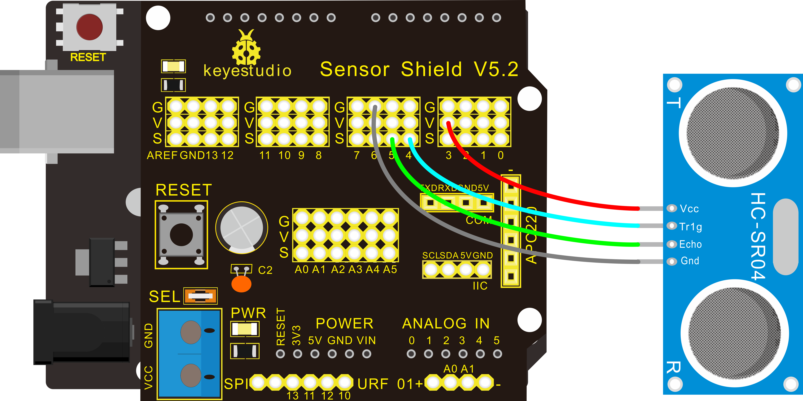

**For 2560 R3 connection:**

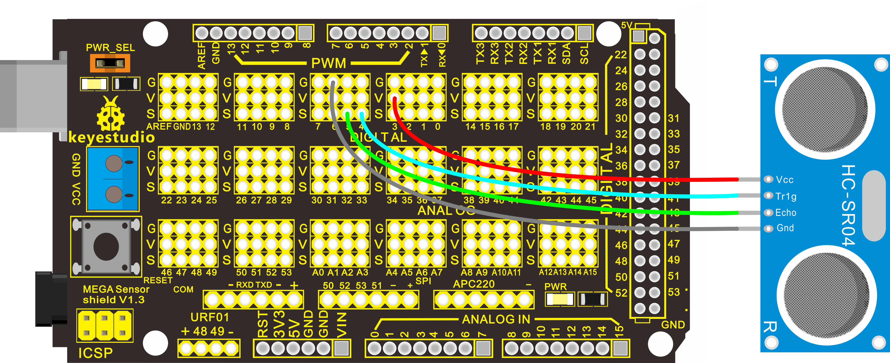

After connecting well, you can use it to measure the distance, displaying the
distance value on the monitor.

**Test Code**

Finally, copy and paste the test code below to Arduino software

\*\*\*\*\*\*\*\*\*\*\*\*\*\*\*\*\*\*\*\*\*\*\*\*\*\*\*\*\*\*\*\*\*\*\*\*\*\*\*\*\*\*\*\*\*\*\*\*\*\*\*\*\*\*\*\*\*

int inputPin=5; // define ultrasonic signal receiver pin ECHO to D5

int outputPin=4; // define ultrasonic signal transmitter pin TRIG to D4

void setup()

{

Serial.begin(9600);

pinMode(inputPin, INPUT);

pinMode(outputPin, OUTPUT);

}

void loop()

{

digitalWrite(outputPin, LOW); delayMicroseconds(2);

digitalWrite(outputPin, HIGH); // Pulse for 10μ s to trigger ultrasonic
detection

delayMicroseconds(10);

digitalWrite(outputPin, LOW);

int distance = pulseIn(inputPin, HIGH); // Read receiver pulse time

distance= distance/58; // Transform pulse time to distance

Serial.println(distance); //Output distance

delay(50);

}

\*\*\*\*\*\*\*\*\*\*\*\*\*\*\*\*\*\*\*\*\*\*\*\*\*\*\*\*\*\*\*\*\*\*\*\*\*\*\*\*\*\*\*\*\*\*\*\*\*\*\*\*\*\*\*\*\*\*\*\*\*\*\*\*\*\*

**Example Result**

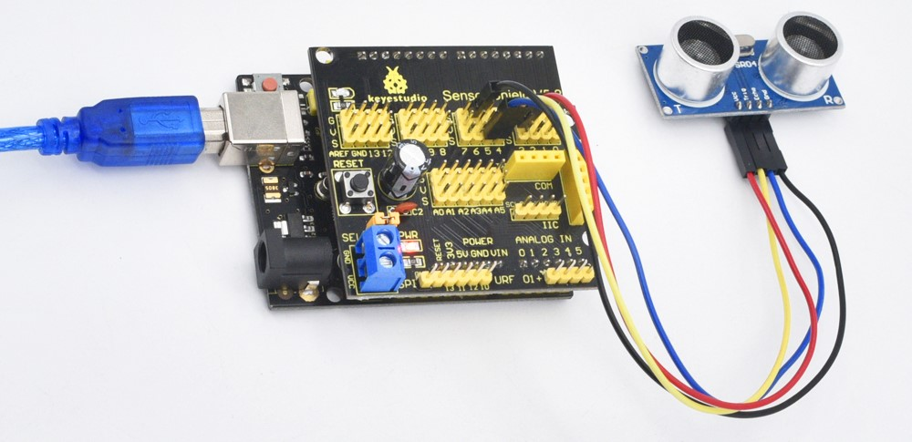

After upload well the code to V4.0 board, then open the serial monitor.

When place an object in front of the ultrasonic sensor (from near and far), it
will detect the distance of object. Thus the value will be displayed on the
monitor shown below.

### Project 35: Joystick Module

**Introduction:**

Lots of robot projects need joystick. This module provides an affordable
solution. By simply connecting to two analog inputs, the robot is at your
commands with X, Y control. It also has a switch that is connected to a digital
pin.

This joystick module can be easily connected to Arduino by IO Shield. This
module is for Arduino(V5) with cables supplied.

**Specification:**

-   Supply Voltage: 3.3V to 5V

-   Interface: Analog x2, Digital x1

**Connection Diagram:**

Firstly you need to prepare the following parts by yourself before testing.

-   Control board \* 1

-   keyestudio Sensor Shield V5\* 1

-   USB Cable\* 1

-   Joystick module\*1

-   Dupont Line \*5

**For V4.0 R3 connection:**

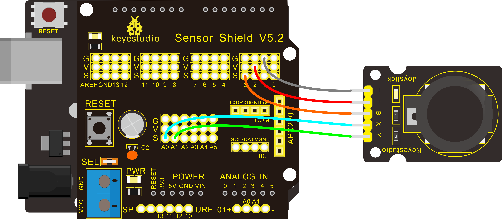

**For 2560 R3 connection:**

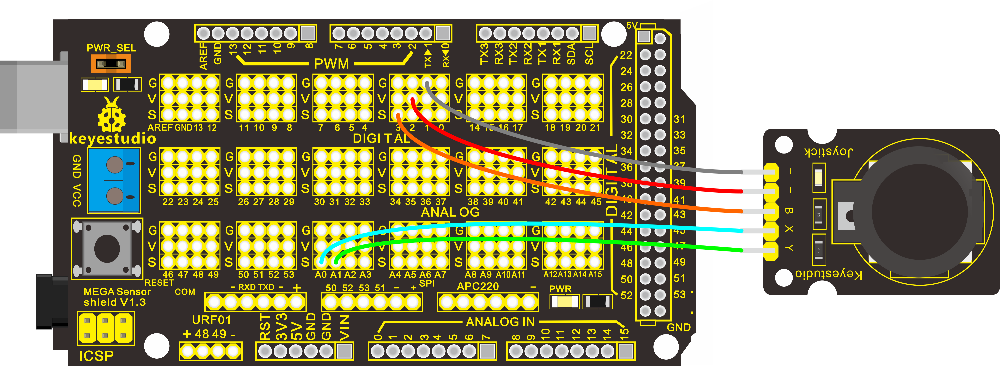

**Sample Code:**

\*\*\*\*\*\*\*\*\*\*\*\*\*\*\*\*\*\*\*\*\*\*\*\*\*\*\*\*\*\*\*\*\*\*\*\*\*\*\*\*\*\*\*\*\*\*\*\*\*\*\*\*\*\*\*\*\*\*\*\*\*\*\*\*\*\*

int JoyStick_X = 0; //x

int JoyStick_Y = 1; //y

int JoyStick_Z = 3; //key

void setup()

{

pinMode(JoyStick_Z, INPUT);

Serial.begin(9600); // 9600 bps

}

void loop()

{

int x,y,z;

x=analogRead(JoyStick_X);

y=analogRead(JoyStick_Y);

z=digitalRead(JoyStick_Z);

Serial.print(x ,DEC);

Serial.print(",");

Serial.print(y ,DEC);

Serial.print(",");

Serial.println(z ,DEC);

delay(100);

}

\*\*\*\*\*\*\*\*\*\*\*\*\*\*\*\*\*\*\*\*\*\*\*\*\*\*\*\*\*\*\*\*\*\*\*\*\*\*\*\*\*\*\*\*\*\*\*\*\*\*\*\*\*\*\*\*\*\*\*\*\*\*\*\*\*\*

**Example Result**

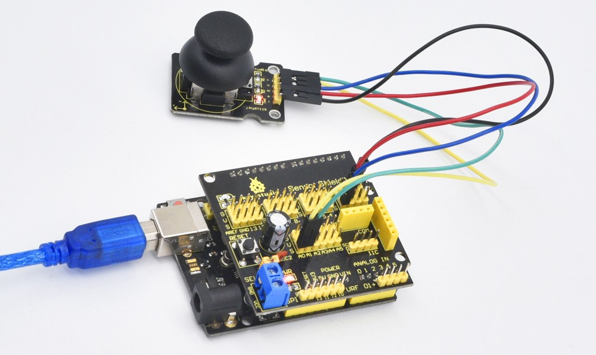

Wiring well and uploading the code, open the serial monitor and set the baud
rate to 9600, push the joystick, you will see the value shown below.

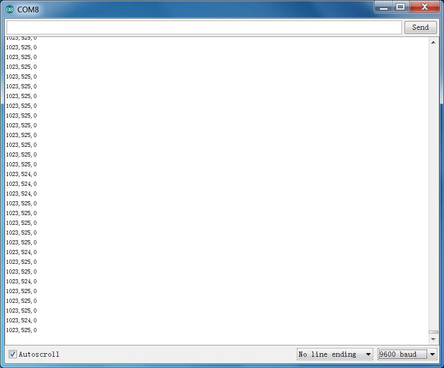

### Project 36: DS3231 Clock Module

**Introduction:**

DS3231 is equipped with integrated TCXO and crystal, which make it a
cost-effective I2C real time clock with high precision.

The device carries a battery input, so if you disconnect the main power supply,
it can still maintain accurate timing. The integrated oscillator ensures the
long-term accuracy of the device and reduces the number of components.

DS3231 provides both commercial and industrial temperature range and supports 16
pins small-outline package (300mil).

The module itself can adapt to the system of 3.3V and 5V without level switch,
which is quite convenient!

**Specification:**

1.  Temperature range: -40 to +85; Timing accuracy : ± 5ppm (±0.432 seconds /
    day)

2.  Provide battery backup for continuous timing

3.  Low power consumption

4.  Device package and function compatible with DS3231

5.  Complete clock calendar function contains seconds and minutes, hour, week,
    date, month, and year timing and provides leap year compensation until 2100.

6.  Two calendar clocks

7.  Output: 1Hz and 32.768kHz

8.  Reset output and Input Debounce of Pushbutton

9.  High speed (400kHz), I2C serial bus

10)Supply voltage: +3.3V to +5.5V

1.  Digital temperature sensor with a precision of±3℃

2.  Working temperature: -40 \~ C to +85 \~ C

3.  16 pins Small Outline Package (300mil)

**Connection Diagram:**

Firstly you need to prepare the following parts by yourself before testing.

-   Control board \* 1

-   Keyestudio Sensor Shield V5\* 1

-   USB Cable\* 1

-   DS3231 Clock module\*1

-   Dupont Line \*4

**V4.0 Connection:**

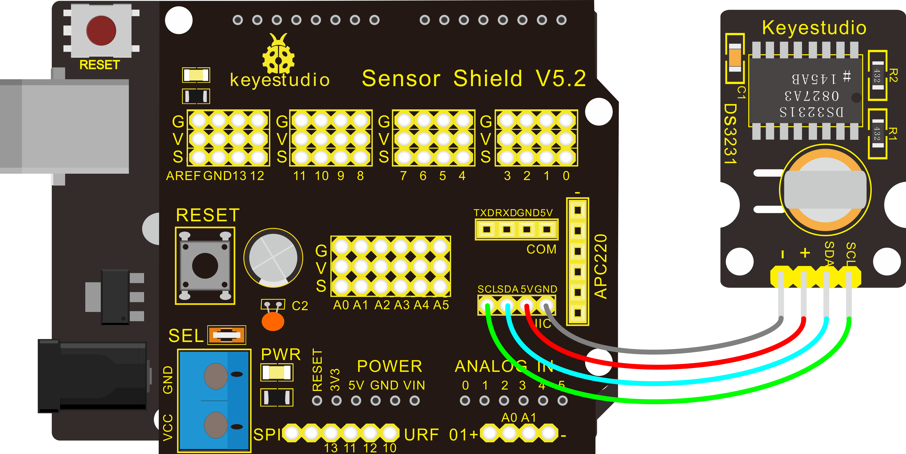

**2560 R3 Connection:**

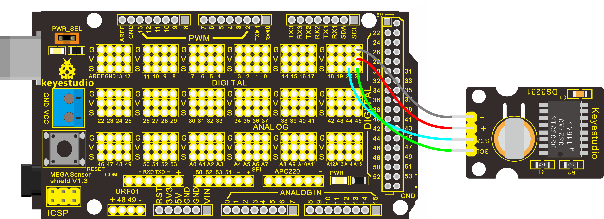

**Sample Code:**

\*\*\*\*\*\*\*\*\*\*\*\*\*\*\*\*\*\*\*\*\*\*\*\*\*\*\*\*\*\*\*\*\*\*\*\*\*\*\*\*\*\*\*\*\*\*\*\*\*\*\*\*\*\*\*\*\*

\##include \<Wire.h\>

\##include "DS3231.h"

DS3231 RTC; //Create the DS3231 object

char weekDay[][4] = {"Sun", "Mon", "Tue", "Wed", "Thu", "Fri", "Sat" };

//year, month, date, hour, min, sec and week-day(starts from 0 and goes to 6)

//writing any non-existent time-data may interfere with normal operation of the
RTC.

//Take care of week-day also.

DateTime dt(2011, 11, 10, 15, 18, 0, 5);//open the series port and you can check
time here or make a change to the time as needed.

void setup ()

{ Serial.begin(57600);//set baud rate to 57600

Wire.begin();

RTC.begin();

RTC.adjust(dt); //Adjust date-time as defined 'dt' above

}

void loop ()

{

DateTime now = RTC.now(); //get the current date-time

Serial.print(now.year(), DEC);

Serial.print('/');

Serial.print(now.month(), DEC);

Serial.print('/');

Serial.print(now.date(), DEC);

Serial.print(' ');

Serial.print(now.hour(), DEC);

Serial.print(':');

Serial.print(now.minute(), DEC);

Serial.print(':');

Serial.print(now.second(), DEC);

Serial.println();

Serial.print(weekDay[now.dayOfWeek()]);

Serial.println();

delay(1000);

}

\*\*\*\*\*\*\*\*\*\*\*\*\*\*\*\*\*\*\*\*\*\*\*\*\*\*\*\*\*\*\*\*\*\*\*\*\*\*\*\*\*\*\*\*\*\*\*\*\*\*\*\*\*\*\*\*\*Before
compiling the code, you’d better put [DS3231
library](https://github.com/rodan/ds3231) under file into Arduino catalogue.

**Result:**

When the above steps are done, you can upload the code to arduino and open the
serial monitor and get the following results:

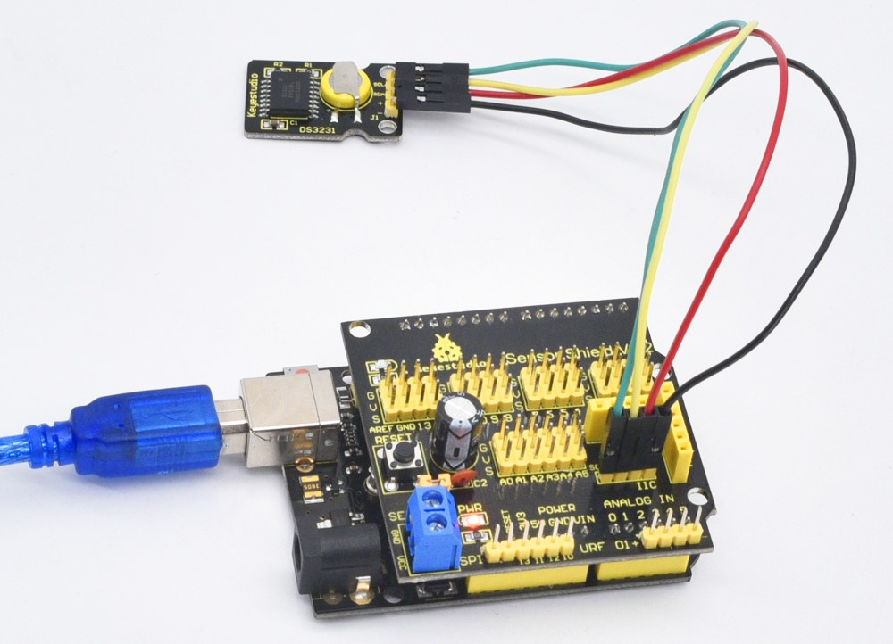

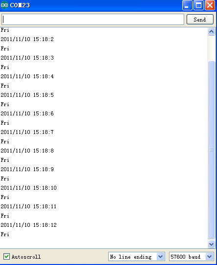

### Project 37: Relay Module

****

**Introduction:**

This single relay module can be used in interactive projects. This module uses
SONGLE 5v high-quality relay. It can also be used to control lighting,
electrical and other equipment.

The modular design makes it easy to expand with the Arduino board (not
included). The Relay output is by a light-emitting diode. It can be controlled
through digital IO port, such as solenoid valves, lamps, motors and other high
current or high voltage devices.

**Specification:**

-   Type: Digital

-   Rated current: 10A (NO) 5A (NC)

-   Maximum switching voltage: 150VAC 24VDC

-   Digital interface

-   Control signal: TTL level

-   Rated load: 8A 150VAC (NO) 10A 24VDC (NO), 5A 250VAC (NO/NC) 5A 24VDC
    (NO/NC)

-   Maximum switching power: AC1200VA DC240W (NO) AC625VA DC120W (NC)

-   Contact action time: 10ms

**Connection Diagram**

Firstly you need to prepare the following parts by yourself before testing.

-   Control board \* 1

-   keyestudio Sensor Shield V5\* 1

-   USB Cable\* 1

-   Single relay module\*1

-   LED module\*1

-   Dupont Line \*7

**For V4.0 R3 connection:**

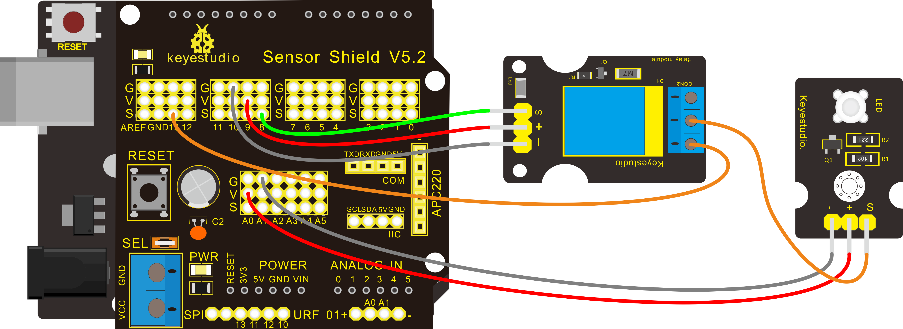

**For 2560 R3 connection:**

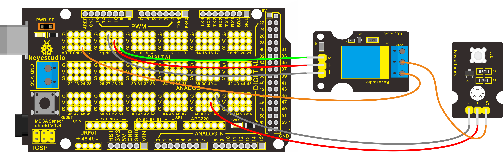

**Sample Code**

Copy and paste the code below to Arduino software.

\*\*\*\*\*\*\*\*\*\*\*\*\*\*\*\*\*\*\*\*\*\*\*\*\*\*\*\*\*\*\*\*\*\*\*\*\*\*\*\*\*\*\*\*\*\*\*\*\*\*\*\*\*\*\*\*\*

int Relay = 8;

void setup()

{

pinMode(13, OUTPUT); //Set Pin13 as output

digitalWrite(13, HIGH); //Set Pin13 High

pinMode(Relay, OUTPUT); //Set Pin3 as output

}

void loop()

{

digitalWrite(Relay, HIGH); //Turn off relay

delay(2000);

digitalWrite(Relay, LOW); //Turn on relay

delay(2000);

}

\*\*\*\*\*\*\*\*\*\*\*\*\*\*\*\*\*\*\*\*\*\*\*\*\*\*\*\*\*\*\*\*\*\*\*\*\*\*\*\*\*\*\*\*\*\*\*\*\*\*\*\*\*\*\*\*\*

**Example Result**

This relay module is active HIGH level.

Wire it up well, powered up, then upload the above code to the board.

You will see the relay is turned on（ON connected, NC disconnected）for two
seconds, then turned off for two seconds（NC closed,ON disconnected）,
repeatedly and circularly.

When the relay is turned on, external LED is on. If relay is turned off,
external LED is off.

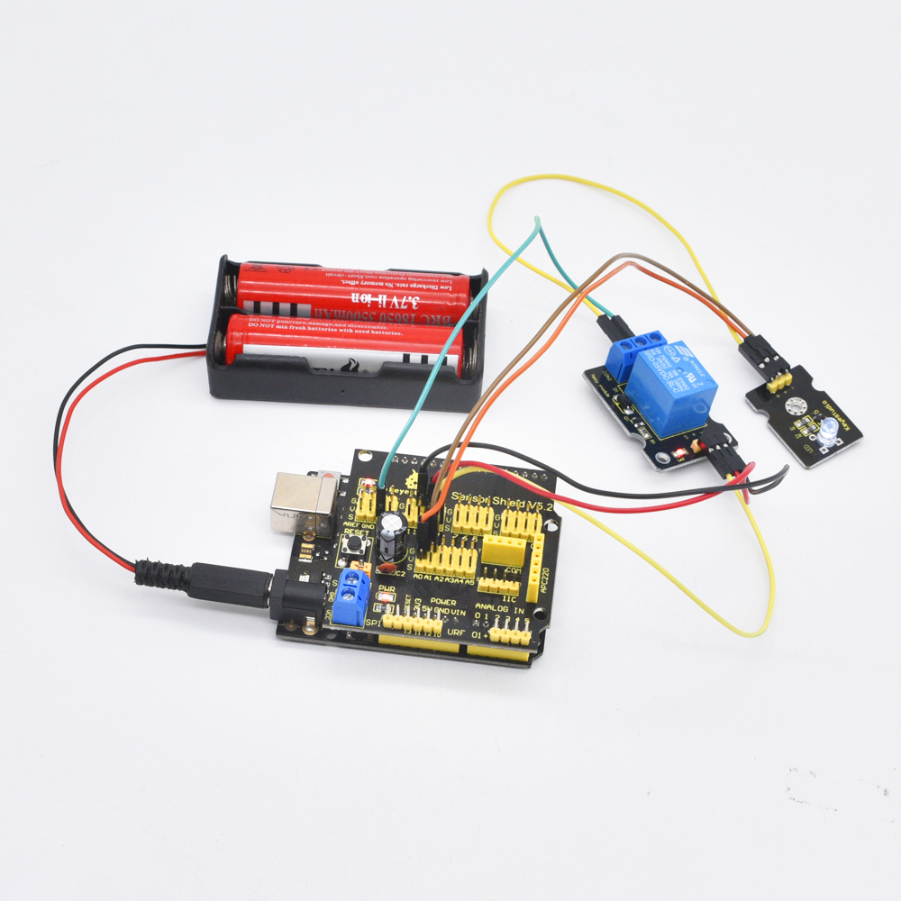

## 6. Resources Download

[**https://fs.keyestudio.com/KS0399-0401**](https://fs.keyestudio.com/KS0399-0401)

Wiki page: <https://wiki.keyestudio.com/Main_Page>

Official website: <https://keyestudio.com/>
